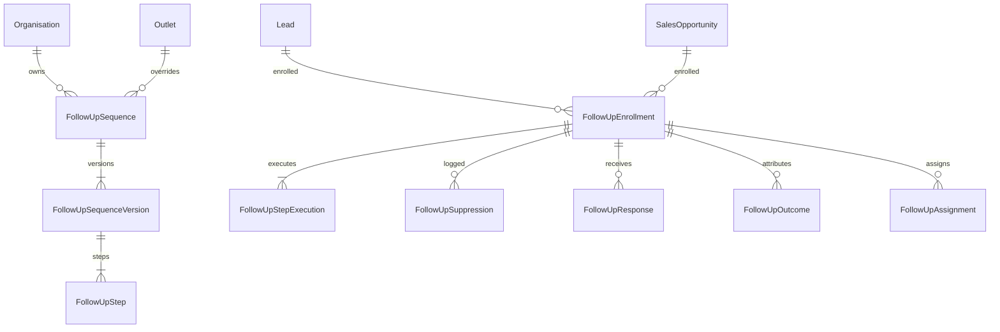

# Follow-Up Domain Data Model

## 1. Entity-Relationship Overview

---

## 2. Model Specifications

### 2.1 FollowUpSequence
Represents an organization- or outlet-level follow-up blueprint.
- `id`: UUID (Primary Key)
- `organisationId`: Foreign Key -> `Organisation.id`
- `outletId`: Nullable Foreign Key -> `Outlet.id`
- `name`: String
- `description`: Nullable String
- `type`: String (`LEAD_FOLLOW_UP`, `MISSED_CALL`, `TRIAL_FOLLOW_UP`, `TOUR_FOLLOW_UP`, `QUALIFIED_LEAD`, `OFFER_FOLLOW_UP`, `CUSTOM`)
- `triggerEvent`: String (`LEAD_CAPTURED`, `MISSED_CALL_LOGGED`, `TRIAL_ATTENDED`, `TOUR_COMPLETED`, `LEAD_QUALIFIED`, `OFFER_SENT`, `MANUAL_TRIGGER`)
- `targetAudience`: String (`NEW_LEAD`, `QUALIFIED_LEAD`, `TOUR_ATTENDED`, `TRIAL_ATTENDED`, `OFFER_RECIPIENT`, `STALLED_DEAL`)
- `status`: String (`DRAFT`, `ACTIVE`, `PAUSED`, `ARCHIVED`)
- `currentVersion`: Int (default: 1)
- `createdAt`, `updatedAt`: Timestamps

### 2.2 FollowUpSequenceVersion
Immutable version snapshot preserving step definitions and operational parameters.
- `id`: UUID (Primary Key)
- `sequenceId`: Foreign Key -> `FollowUpSequence.id`
- `versionNumber`: Int
- `status`: String (`DRAFT`, `ACTIVE`, `DEPRECATED`)
- `stopOnReply`: Boolean (default: true)
- `stopOnBooking`: Boolean (default: true)
- `stopOnConversion`: Boolean (default: true)
- `stopOnStaffHandoff`: Boolean (default: true)
- `cooldownHours`: Int (default: 24)
- `quietHoursStart`: Nullable String (e.g. '22:00')
- `quietHoursEnd`: Nullable String (e.g. '07:00')
- `maxTouchpoints`: Int (default: 5)
- `createdAt`, `updatedAt`: Timestamps

### 2.3 FollowUpStep
Choreographed communication step within a sequence version.
- `id`: UUID (Primary Key)
- `versionId`: Foreign Key -> `FollowUpSequenceVersion.id`
- `stepOrder`: Int
- `channel`: String (`EMAIL`, `SMS`, `WHATSAPP`, `PUSH`, `IN_APP`, `VOICE`)
- `delayMinutes`: Int (e.g. 0, 1440, 4320, 10080)
- `requiresApproval`: Boolean (default: false)
- `conditionRules`: JSON (e.g. `{ "minScore": 50 }`)
- `contentTemplate`: String
- `aiDraftingEnabled`: Boolean (default: false)
- `promptTemplateId`: Nullable String
- `fallbackChannel`: Nullable String (`SMS`, `EMAIL`)

### 2.4 FollowUpEnrollment
Active execution lifecycle tracker per lead or sales opportunity.
- `id`: UUID (Primary Key)
- `organisationId`: Foreign Key -> `Organisation.id`
- `outletId`: Nullable Foreign Key -> `Outlet.id`
- `sequenceId`: Foreign Key -> `FollowUpSequence.id`
- `versionId`: Foreign Key -> `FollowUpSequenceVersion.id`
- `leadId`: Nullable Foreign Key -> `Lead.id`
- `opportunityId`: Nullable Foreign Key -> `SalesOpportunity.id`
- `status`: String (`ENROLLED`, `ACTIVE`, `WAITING`, `PAUSED`, `COMPLETED`, `STOPPED`, `CANCELLED`)
- `currentStepIndex`: Int (default: 0)
- `enrolledAt`: DateTime
- `stoppedAt`: Nullable DateTime
- `stopReason`: Nullable String (`REPLY_RECEIVED`, `BOOKING_CONFIRMED`, `CONVERTED`, `STAFF_TAKEOVER`, `OPTED_OUT`, `MANUAL_STOP`)
- `completedAt`: Nullable DateTime

### 2.5 FollowUpStepExecution
Step execution and dispatch audit log.
- `id`: UUID (Primary Key)
- `enrollmentId`: Foreign Key -> `FollowUpEnrollment.id`
- `stepId`: Foreign Key -> `FollowUpStep.id`
- `channel`: String
- `status`: String (`SCHEDULED`, `PENDING_APPROVAL`, `APPROVED`, `REJECTED`, `SENT`, `DELIVERED`, `FAILED`, `CANCELLED`, `SUPPRESSED`)
- `scheduledAt`: DateTime
- `executedAt`: Nullable DateTime
- `draftMessage`: Nullable String
- `finalMessage`: Nullable String
- `approvedById`: Nullable String
- `approvedAt`: Nullable DateTime
- `suppressionReason`: Nullable String
- `communicationId`: Nullable Foreign Key -> `Communication.id`
- `deliveryStatus`: Nullable String

### 2.6 FollowUpSuppression
Audit record capturing exact suppression reasons.
- `id`: UUID (Primary Key)
- `enrollmentId`: Foreign Key -> `FollowUpEnrollment.id`
- `stepExecutionId`: Nullable String
- `reason`: String (`CONSENT_MISSING`, `QUIET_HOURS`, `COOLDOWN_ACTIVE`, `FREQUENCY_CAP_EXCEEDED`, `ACTIVE_STAFF_CONVERSATION`, etc.)
- `policy`: String
- `createdAt`: DateTime

### 2.7 FollowUpResponse
Captured inbound replies from prospects.
- `id`: UUID (Primary Key)
- `enrollmentId`: Foreign Key -> `FollowUpEnrollment.id`
- `responseType`: String (`REPLY_MESSAGE`, `CALL_ANSWERED`, `LINK_CLICKED`, `BOOKING_EVENT`)
- `channel`: String
- `responseText`: Nullable String
- `sentiment`: Nullable String (`POSITIVE`, `NEUTRAL`, `NEGATIVE`, `OBJECTION`)
- `intent`: Nullable String
- `actionTaken`: Nullable String (`STOP_SEQUENCE`, `STAFF_HANDOFF`, `QUALIFICATION_UPDATE`)

### 2.8 FollowUpOutcome
Observational business outcome attribution.
- `id`: UUID (Primary Key)
- `enrollmentId`: Foreign Key -> `FollowUpEnrollment.id`
- `outcomeType`: String (`BOOKING_COMPLETED`, `TRIAL_ATTENDED`, `TOUR_COMPLETED`, `MEMBERSHIP_PURCHASED`, `OPPORTUNITY_WON`)
- `value`: Nullable Decimal
- `attributedDelayHours`: Nullable Decimal
- `metadata`: JSON (contains conservative wording `conversion_following_follow_up`)
- `recordedAt`: DateTime

### 2.9 FollowUpAssignment
Staff routing and ownership records.
- `id`: UUID (Primary Key)
- `enrollmentId`: Foreign Key -> `FollowUpEnrollment.id`
- `assignedStaffId`: String
- `assignedAt`: DateTime
- `active`: Boolean
