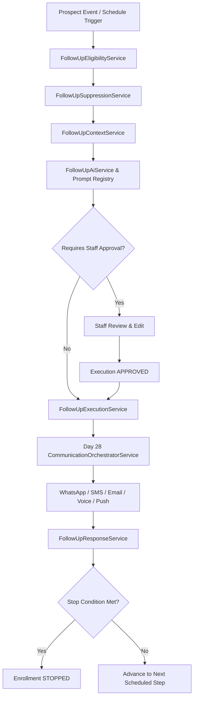

# AI Follow-Up Engine Architecture

## 1. Overview
The FitCore **AI Follow-Up Engine** orchestrates intelligent, multi-channel lead nurturing and sales progression. It sits at the convergence of Lead Capture (Day 33), AI Receptionist (Day 35), AI Sales Agent (Day 36), Sales Pipeline (Day 37), and AI Lead Qualification (Day 38), executing delivery strictly through the central Day 28 Communication Engine.

---

## 2. Core Service Responsibilities

### 2.1 FollowUpSequenceService
- Manages lifecycle of follow-up sequences (`DRAFT` -> `ACTIVE` -> `PAUSED` -> `ARCHIVED`).
- Handles sequence version immutability (`FollowUpSequenceVersion`) with automated version incrementing.
- Seeds canonical production templates (`LEAD_FOLLOW_UP`, `MISSED_CALL`, `TRIAL_FOLLOW_UP`, `TOUR_FOLLOW_UP`, `QUALIFIED_LEAD`, `OFFER_FOLLOW_UP`).

### 2.2 FollowUpEligibilityService
- Verifies lead qualification state, opportunity stage, and enrollment uniqueness.
- Prevents re-enrolling prospects who already converted (`CONVERTED`), joined, or won (`WON`, `CLOSED_WON`).
- Checks whether a prospect has an active enrollment in the same sequence type.

### 2.3 FollowUpSuppressionService
- Evaluates 14+ suppression conditions in real time:
  - Central communication consent (Day 28 / Day 4)
  - Quiet hours window (e.g. 21:00 to 08:00 based on outlet timezone)
  - Sequence cooldown period
  - Active human staff conversation or takeover
  - Active tour / trial / appointment booking
  - Known medical safety flag requiring human review
- Records detailed suppression audit records in `FollowUpSuppression`.

### 2.4 FollowUpContextService
- Builds complete, grounded context for every follow-up message:
  - Lead contact info & outlet metadata
  - Day 38 qualification profile (primary goal, experience, budget, schedule preferences)
  - Open and resolved objections
  - Day 37 opportunity stage, value, and probability
  - Recent interactions and previous touchpoint history
- **Anti-Redundancy Rule**: Forbids asking any discovery questions already recorded in the qualification profile.

### 2.5 FollowUpAiService
- Uses prompt template `follow_up_message.v1` registered in Day 19 `PromptRegistryService`.
- Formulates contextual system and user instructions enforcing brand tone, concise messaging, and clear CTAs.
- Parses and validates structured JSON output (`messageText`, `suggestedChannel`, `tone`, `safetyFlags`, `containsMedicalAdvice`, `containsPricePromise`).
- Disallows medical diagnosis and unauthorized price discounts.
- Records token usage and latency in `AIUsageService` under feature `'FOLLOW_UP_MESSAGE'`.

### 2.6 FollowUpExecutionService
- Schedules steps deterministically based on step delays (Day 0, Day 1, Day 3, Day 7, or custom minutes).
- Checks approval requirements: marks steps `PENDING_APPROVAL` or proceeds immediately.
- Dispatches communications exclusively through Day 28 `CommunicationOrchestratorService` with fallback channels.
- Links resulting `communicationId` to `FollowUpStepExecution`.

### 2.7 FollowUpResponseService
- Ingests inbound responses across all channels.
- Evaluates stop triggers (`stopOnReply`, `stopOnBooking`, `stopOnConversion`, `stopOnStaffHandoff`).
- Terminates enrollments (`STOPPED`) when conditions are satisfied, canceling pending future steps.
- Handles staff handoff escalation and assigns human staff members.

### 2.8 FollowUpSchedulerService & QueueService
- Runs background cron polling to execute due scheduled step executions.
- Dispatches execution tasks to BullMQ queues (`FOLLOW_UP_QUEUE`) for reliable asynchronous processing.

---

## 3. Observational Attribution Engine
When business events occur (tour booked, trial attended, membership purchased, deal won), `FollowUpOutcome` records an observational linkage:
- Tracks `outcomeType`, `value`, `attributedDelayHours`, and `metadata`.
- Strictly maintains conservative wording (`conversion_following_follow_up`) with **zero causal overclaims**.
- Preserves multi-touch auditability across the sales lifecycle.
