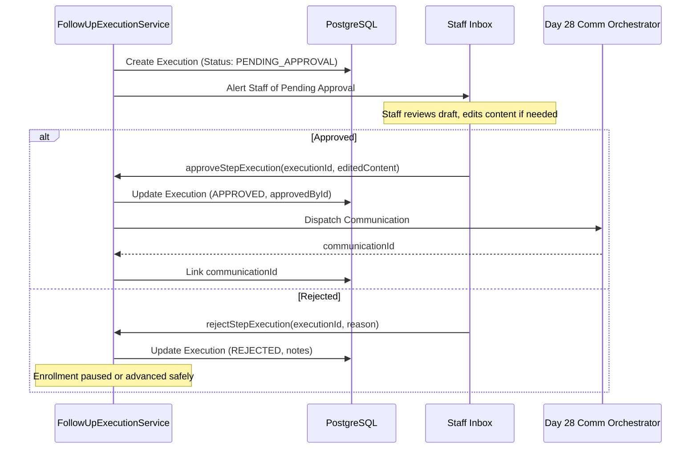

# Follow-Up Safety, Compliance & Governance

## 1. Safety Principles & Invariants

The FitCore Follow-Up system adheres to non-negotiable safety and compliance boundaries across all automated communication touchpoints:

### 1.1 Clinical Safety Boundary
- **Never Diagnose**: The AI follow-up engine must never diagnose medical conditions, prescribe rehabilitation protocols, or claim clinical efficacy.
- **Medical Mention Detection**: Any inbound or draft message mentioning injuries, chronic illnesses, pregnancy, surgery, or medical flags automatically suppresses automated outreach (`MEDICAL_SAFETY_SUPPRESSION`) and alerts staff for human review.
- **Mandatory Safety Disclaimer**: Outbound messages discussing fitness readiness remind prospects that programs are for general wellness and medical clearance is advised for health conditions.

### 1.2 Marketing Consent & Anti-Spam (TCPA / GDPR)
- Every outbound message evaluates recipient consent in Day 28 `CommunicationOrchestratorService`.
- If the prospect has not consented to marketing communications (`consentStatus != GRANTED`), automated promotional sequences are suppressed (`RESTRICTED_BY_CONSENT`).
- Unsubscribe and stop keywords ("STOP", "UNSUBSCRIBE", "CANCEL", "LEAVE ME ALONE") immediately trigger `optOut()` and permanently halt all active sequences.

### 1.3 Quiet Hours Enforcement
- The system evaluates quiet hours against the target outlet's local timezone (e.g. 21:00 to 08:00 local time).
- Steps scheduled to fire during quiet hours are either deferred until the quiet hours window closes or safely suppressed (`QUIET_HOURS_ACTIVE`).
- Cross-midnight quiet hour calculations (e.g. 21:00 to 06:00) are evaluated with strict mathematical boundary checks.

### 1.4 Cooldown Windows & Frequency Caps
- **Sequence Cooldown**: Configurable cooldown (e.g. 24–72 hours) between distinct sequence enrollments to prevent overlapping sequence chaos.
- **Recipient Frequency Caps**: Strict ceiling on outbound contacts across all channels within any rolling 24-hour and 7-day window.

### 1.5 Active Staff Conversation & Takeover Protection
- If an active conversation exists with human staff (`STAFF_ACTIVE` or interaction in progress), automated outbound steps are suppressed (`ACTIVE_STAFF_CONVERSATION`).
- If a staff member marks an opportunity or lead as handed-off or taken over, automated sequences immediately stop (`ACTIVE_STAFF_TAKEOVER`).

---

## 2. Human Approval Workflow (Human-in-the-Loop)

Steps requiring approval (`requiresApproval: true`) enforce a strict gate:

---

## 3. Attribution Safety (Zero Causal Overclaims)

When analyzing sales conversions and membership purchases:
- **Observational Only**: All recorded outcomes (`FollowUpOutcome`) use the invariant description `conversion_following_follow_up`.
- **Zero Solo Attribution**: The engine records the sequence enrollment, delay hours, and touchpoints, but never asserts that the follow-up message alone caused the membership purchase.
- Multi-touch context (in-person tours, receptionist interactions, promotional offers) is acknowledged in the observational model.
