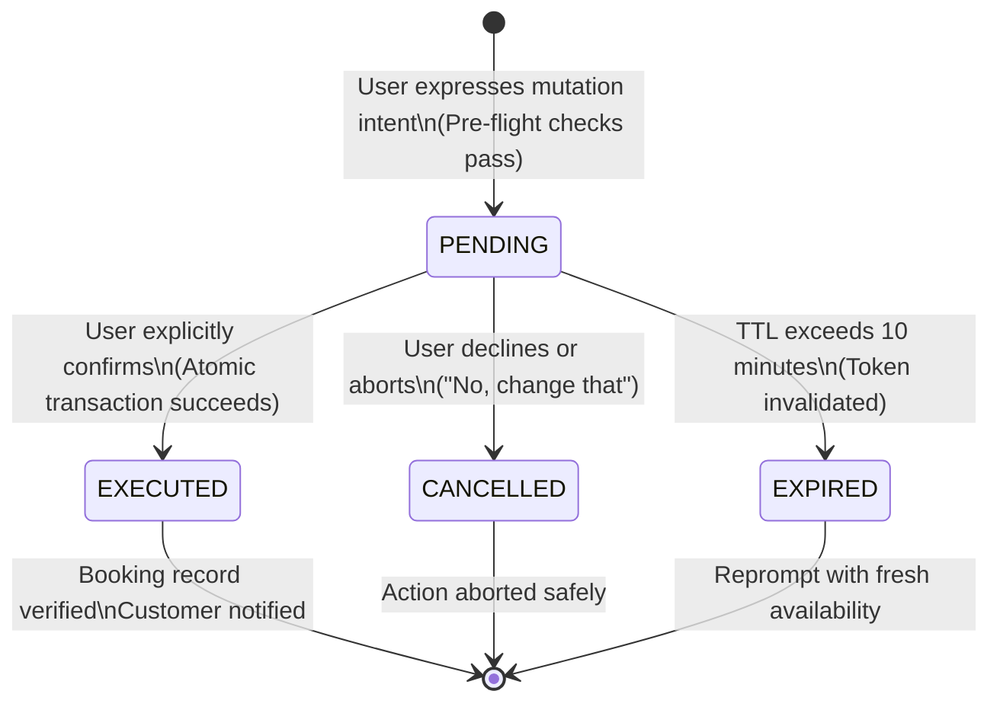

# Day 32 — AI Receptionist Two-Step Booking Confirmation Architecture

This document details the Two-Step Confirmation State Machine implemented for all state-mutating operations in the FitCore AI Receptionist.

---

## 1. Why Two-Step Confirmation?

In a conversational interface, LLMs can misunderstand nuances or infer user intent prematurely. To ensure members are never booked, cancelled, or rescheduled unintentionally:

1. The AI Receptionist **never executes mutations in a single conversational turn**.
2. An intent to mutate creates an explicit, persisted, single-use `BookingConfirmationState` token.
3. The AI clearly repeats the action, session time, class name, outlet, and policy conditions to the user.
4. Only when the customer explicitly provides consent (e.g., "Yes, confirm", "Go ahead") is the confirmation token submitted to execute the operation.

---

## 2. Confirmation State Machine Lifecycle



---

## 3. Five-Phase Confirmation Execution Pipeline

### Phase 1: Intent & Pre-Flight Validation
- The receptionist parses the user's intent (`BOOK_CLASS`, `CANCEL_BOOKING`, `RESCHEDULE_BOOKING`, `WAITLIST_JOIN`).
- Authenticated member identity is resolved via `ReceptionistMemberIdentityService`.
- Canonical eligibility is checked via `BookingEligibilityService` (active membership, class entitlements, advance booking window).
- Capacity and schedule constraints are verified.

### Phase 2: State Creation & Token Generation
- `ConfirmationStateService.createConfirmationState` creates a database record in `booking_confirmation_states`.
- Cryptographically generates a 64-character hex string (`crypto.randomBytes(32)`).
- Sets `expiresAt` = `now() + 10 minutes`.
- Attaches contextual metadata: `classSessionId`, `outletId`, `displayedDetails` (class name, time, trainer), and `existingBookingId` (if reschedule or cancellation).

### Phase 3: Conversational Prompt
- The receptionist presents a clear summary to the customer:
  > *"I can book you for **Morning HIIT** tomorrow at 7:00 AM at the Downtown Club with Sarah Trainer. Would you like me to confirm this booking?"*

### Phase 4: Token Submission & Atomic Execution
- Upon affirmative response, the client/chat runner invokes `executeConfirmedBooking` passing `confirmationToken`.
- In a single database transaction (`prisma.$transaction`):
  1. Validates that token is `PENDING` and not expired (`now() < expiresAt`).
  2. Marks the token `EXECUTED` with timestamp `executedAt = now()`.
  3. Re-verifies live session capacity.
  4. Creates the `Booking` record with status `CONFIRMED`.

### Phase 5: Database State Verification & Response
- `BookingVerificationService.verifyBookingCreated` performs an immediate database query to assert:
  - Booking exists in database.
  - Status is `CONFIRMED`.
  - `memberProfileId`, `organisationId`, and `classSessionId` match.
- Only upon verification is a success message returned to the customer.

---

## 4. State Replay & Security Properties

| Property | Implementation Defense |
| :--- | :--- |
| **Replay Protection** | Token is marked `EXECUTED` inside the same transaction as the booking. Subsequent calls throw `ConflictException`. |
| **Token Tampering** | 256 bits of entropy prevents guessing or brute forcing. |
| **Cross-Tenant Attack** | Token validation verifies `token.organisationId === request.organisationId`. |
| **Cross-Member Attack** | Token validation verifies `token.memberProfileId === caller.memberProfileId`. |
| **Action Mismatch** | Token created for `CANCEL_BOOKING` cannot be executed as `CREATE_BOOKING`. |
| **Stale Data Window** | 10-minute TTL prevents execution against outdated schedules or altered policies. |

---

## 5. Database Model Reference

```prisma
model BookingConfirmationState {
  id                String       @id @default(cuid())
  organisationId    String
  outletId          String
  memberProfileId   String
  conversationId    String
  classSessionId    String
  action            String       // CREATE_BOOKING, CANCEL_BOOKING, RESCHEDULE_BOOKING, WAITLIST_JOIN
  status            String       @default("PENDING") // PENDING, EXECUTED, CANCELLED, EXPIRED
  confirmationToken String       @unique
  displayedDetails  Json?
  existingBookingId String?
  expiresAt         DateTime
  executedAt        DateTime?
  cancelledAt       DateTime?
  createdAt         DateTime     @default(now())
  updatedAt         DateTime     @updatedAt

  organisation      Organisation @relation(fields: [organisationId], references: [id], onDelete: Cascade)
  outlet            Outlet       @relation(fields: [outletId], references: [id], onDelete: Cascade)
  memberProfile     MemberProfile @relation(fields: [memberProfileId], references: [id], onDelete: Cascade)
  conversation      ReceptionistConversation @relation(fields: [conversationId], references: [id], onDelete: Cascade)
  classSession      ClassSession @relation(fields: [classSessionId], references: [id], onDelete: Cascade)
}
```
