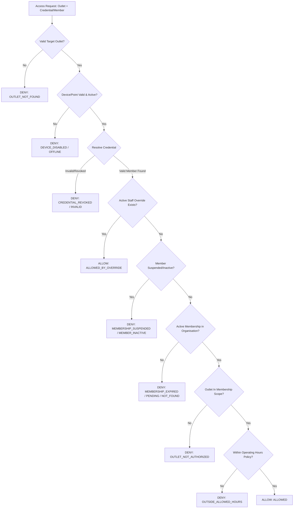

# FitCore Physical Access, Check-In & Door Control Architecture (Day 7)

## 1. Domain Overview & Invariants

The FitCore Physical Access Control foundation manages the bridge between commercial membership rights and physical entrance to gyms, turnstiles, smart doors, and studios across multi-tenant, multi-outlet networks.

### Core Architectural Invariants:
1. **`MemberOutlet ≠ Physical Access Authorization`**:
   - `MemberOutlet` is purely relational, representing where a member was onboarded or prefers to train.
   - `MemberOutlet` NEVER grants physical door access or check-in authority.
2. **`MemberMembership` Owns Physical Access**:
   - Physical entry is governed solely by an `ACTIVE` (or `TRIAL`) `MemberMembership` evaluated against its `MembershipAccessScope`:
     - `ALL_ORGANISATION_OUTLETS`: Grants entry to all outlets within the owning organisation.
     - `SINGLE_OUTLET` / `MULTI_OUTLET`: Grants entry strictly to outlets explicitly linked via `MemberMembershipOutlet`.
3. **`Payment ≠ Physical Access`**:
   - `PaymentTransaction == SUCCEEDED` does not directly open doors; only the resulting active membership state does.
4. **Single Decision Authority**:
   - `AccessDecisionService.canAccess()` is the single, centralized, auditable engine for all entry and exit authorizations.
5. **Fail-Safe Defaults**:
   - Unknown authorization states, offline devices, and unrecognized credentials strictly default to `DENY`.

---

## 2. Decision Evaluation Flow (`AccessDecisionService`)

When an access check is initiated (from mobile QR, RFID scan, turnstile webhook, or staff override):



---

## 3. Provider-Agnostic Hardware Abstraction

FitCore abstracts all hardware interaction behind `IAccessDeviceProvider`:

```typescript
export interface IAccessDeviceProvider {
  readonly providerName: string;
  unlockDoor(deviceId: string, durationMs?: number, accessEventId?: string): Promise<DeviceUnlockResult>;
  lockDoor(deviceId: string): Promise<DeviceLockResult>;
  getDeviceStatus(deviceId: string): Promise<DeviceStatusResult>;
  pingDevice(deviceId: string): Promise<boolean>;
}
```

- **`MockAccessDeviceProvider`**: Used in testing and development environments to simulate hardware signals, verify unlock commands, and simulate door relays.
- **Future Vendor Integrations**: Axis A1001, Hikvision, Paxton Net2, Salto KS, Gallagher, STid, and Tuya IoT connect directly via this interface without any modifications to domain business logic.

---

## 4. Dynamic Rotating QR Credentials

To prevent credential sharing, screenshots, and pass replay attacks:
1. The mobile client queries `POST /api/v1/access/credentials/dynamic-qr`.
2. The server signs an HMAC payload containing:
   - `credentialId`
   - `memberProfileId`
   - `organisationId`
   - `nonce` (crypto random)
   - `expiresAt` (60-second TTL)
3. The client displays the QR code alongside an animated 60-second countdown timer.
4. If expired, the mobile app automatically polls for the next rotating credential.
5. Scanners verify the HMAC signature and timestamp; expired or replayed nonces are rejected.

---

## 5. Idempotency & Visit Lifecycle

1. **Check-In Idempotency**:
   - `CheckInService.checkIn()` accepts an optional `deviceEventId`.
   - Subsequent requests with the same `deviceId + deviceEventId` or duplicate scans within 5 seconds return the existing check-in result without generating duplicate rows.
2. **Active Visit Tracking**:
   - Only 1 active visit per member per organisation is permitted at any time.
   - When a member checks in, an `ACTIVE` `CheckIn` record is created.
   - When checking out (`CheckOutService.checkOut()`), the visit is marked `COMPLETED` and `durationMinutes` is calculated.
   - Mobile displays an **Active Visit Banner** with elapsed duration timer and a one-tap check-out action.

---

## 6. Staff Access Overrides

Staff members with `access:OVERRIDE` permissions (e.g. `OUTLET_MANAGER`, `RECEPTION`) can issue temporary facility passes:
- **Maximum Duration**: Capped at 24 hours.
- **Mandatory Justification**: Requires an `AccessOverrideReason` (`MANAGER_APPROVAL`, `FORGOT_PASS`, `SYSTEM_FAILURE`, `VIP_GUEST`, `TRIAL_PROSPECT`, `MAINTENANCE_CONTRACTOR`).
- **Precedence**: Bypasses member account suspension or pending status while maintaining a non-repudiable audit log in `AccessOverride` and `AccessEvent`.
