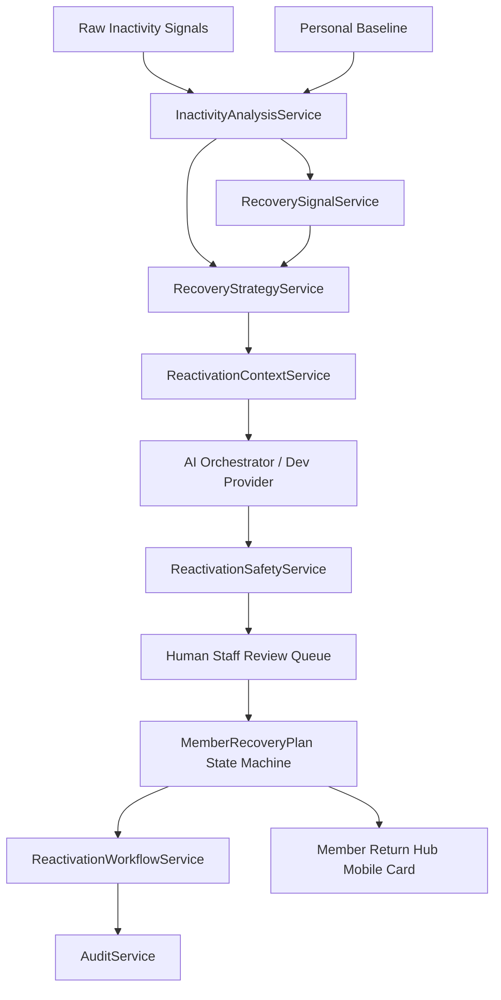

# Architecture: AI Reactivation & Member Recovery Engine

## 1. Architectural Placement in FitCore AI Stack

```text
Day 19: AI Platform Foundation (Orchestrator, Tool Registry, Context Builder)
   │
Day 25: Member Engagement Intelligence (Deterministic Signals, Risk Foundation)
   │
Day 26: AI Retention Intelligence (Explainable Risk, Intervention Selection)
   │
Day 27: AI Reactivation & Member Recovery
   ├── Inactivity & Touchpoint Aggregator (Physical & Digital)
   ├── Personal Baseline Evaluator (28-day self-comparison)
   ├── Recovery Signal & Positive Indicator Detector
   ├── Controlled 13-Strategy Recommendation Taxonomy
   ├── Strict Human-in-the-Loop State Machine (MemberRecoveryPlan)
   ├── Batch Expiration & Sweep Schedulers
   └── Safe Member Return Hub (Zero-risk-exposure UI)
```

---

## 2. Component Diagram



---

## 3. Data Flow & Security Boundaries

1. **Telemetry Ingestion:**
   Turnstiles, class attendances, PT bookings, workout completions, and daily check-ins are ingested. Days inactive is computed against the timestamp of the latest meaningful activity.
2. **Deterministic Baseline Delta:**
   Current 14-day frequency is evaluated against the member's individual 28-day baseline frequency. Cohort or population-level averages are strictly discarded.
3. **Safety & Policy Guardrails:**
   `ReactivationSafetyService` parses AI outputs to ensure:
   - No clinical diagnoses (depression, bipolar, injury diagnosis).
   - No commercial concessions (free months, % discount, waived fees).
   - Strict adherence to the 13 approved strategies.
4. **Human Execution:**
   All recommendations originate as `PENDING_APPROVAL` (or `DRAFT`). No message is dispatched until an authorized staff member (trainer or club manager) explicitly reviews and approves the plan.
