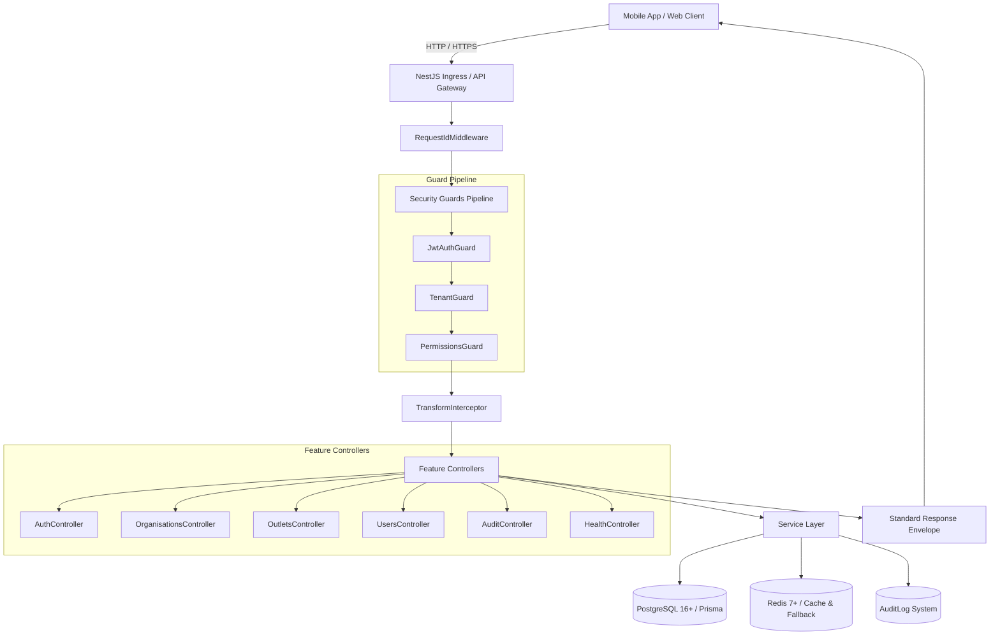

# FitCore Backend Architecture — Day 2 Foundation

## Overview

The FitCore backend is a production-grade, multi-tenant enterprise API built on NestJS 10, TypeScript 5.5, PostgreSQL 16+, Prisma ORM 5, and Redis 7. It enforces zero-trust multi-tenancy, granular Role-Based Access Control (RBAC), token rotation with reuse detection, and standardized request/response envelopes compatible with the FitCore Mobile client (`@fitcore/api-client`).



---

## Request & Security Lifecycle

Every incoming HTTP request traverses a strictly ordered security and observability pipeline:

1. **Correlation Tracking (`RequestIdMiddleware`)**:
   - Inspects `x-request-id` header from incoming client requests.
   - If missing, generates a cryptographically random UUID v4.
   - Attaches `requestId` to `req.requestId` and adds header `x-request-id` to the HTTP response.
2. **Authentication (`JwtAuthGuard`)**:
   - Verifies JWT Bearer token using HMAC-SHA256.
   - Resolves user identity from PostgreSQL and hydrates `req.user` with assigned roles, outlet associations, and granular permissions.
   - Bypasses routes decorated with `@Public()`.
3. **Tenant Boundary Enforcement (`TenantGuard` & `TenantContextService`)**:
   - Extracts tenant organization and outlet indicators from URL route parameters (`:organisationId`, `:outletId`) and headers (`x-organisation-id`, `x-outlet-id`).
   - Verifies that the authenticated user belongs to the target organization.
   - **Cross-Tenant Prevention**: If an organization mismatch is detected, execution halts immediately with `403 Forbidden` (`Cross-tenant access forbidden`).
   - Platform `SUPERADMIN` accounts with `PLATFORM` scope are permitted across tenant boundaries.
4. **RBAC & Granular Permissions (`PermissionsGuard`)**:
   - Evaluates required permissions declared via `@RequirePermission(resource, action, scope)`.
   - Matches against the user's role-permission matrix.
5. **Execution & Auditing**:
   - Controllers remain thin, delegating business logic to domain services.
   - Security-relevant operations write to `AuditLog` asynchronously without blocking user responses.
6. **Standardized Response Formatting (`TransformInterceptor` & `HttpExceptionFilter`)**:
   - Success: `{ "success": true, "data": T, "requestId": "..." }`
   - Errors: `{ "success": false, "error": { "code": "...", "message": "...", "details": ... }, "requestId": "..." }`
   - Preserves 100% type safety and contract compatibility with `@fitcore/api-client` and `@fitcore/types`.

---

## Module Directory Structure

```text
services/api/
├── prisma/
│   ├── schema.prisma       # 11 core multi-tenant schema models
│   └── seed.ts             # Dev seeding for Second Wind & Apex Strength
├── src/
│   ├── app.module.ts       # Root module with global guards, filters, interceptors
│   ├── main.ts             # Application entrypoint, Swagger, CORS, validation
│   ├── config/             # Typed environment configuration
│   ├── database/           # PrismaService & DatabaseModule
│   ├── redis/              # RedisService (with in-memory fallback for test resilience)
│   ├── common/             # Interceptors, filters, decorators, logger, interfaces
│   ├── tenancy/            # TenantContextService & TenantGuard
│   ├── auth/               # AuthService, JWT Strategy, DTOs, Guards
│   ├── organisations/      # Tenant-scoped organisation queries
│   ├── outlets/            # Branch / outlet queries with outlet-level scoping
│   ├── users/              # User profile & member queries
│   ├── audit/              # Compliance and security audit logger
│   └── health/             # Health, liveness, and readiness probes
└── test/                   # Comprehensive E2E test suite
```
