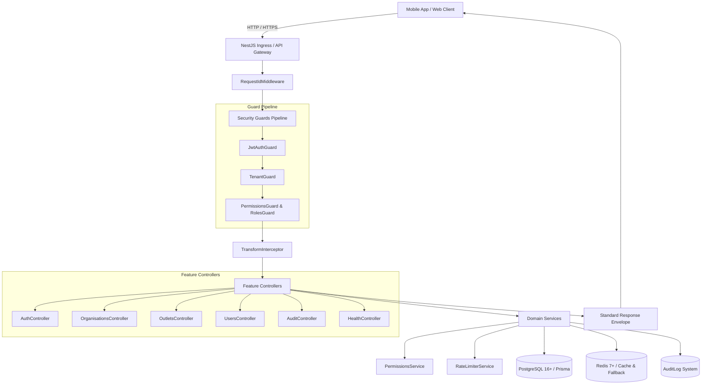

# FitCore Backend Architecture — Day 3 Identity & Tenancy

## Overview

The FitCore backend is a production-grade, multi-tenant enterprise API built on NestJS 10, TypeScript 5.5, PostgreSQL 16+, Prisma ORM 5, and Redis 7. It enforces zero-trust multi-tenancy, granular Role-Based Access Control (RBAC), token rotation with reuse detection, privilege escalation protection, brute-force rate limiting, and standardized request/response envelopes compatible with the FitCore Mobile client (`@fitcore/api-client`).



---

## Request & Security Lifecycle

Every incoming HTTP request traverses a strictly ordered security and observability pipeline:

1. **Correlation Tracking (`RequestIdMiddleware`)**:
   - Inspects `x-request-id` header from incoming client requests.
   - If missing, generates a cryptographically random UUID v4.
   - Attaches `requestId` to `req.requestId` and adds header `x-request-id` to the HTTP response.
2. **Authentication (`JwtAuthGuard`)**:
   - Verifies JWT Bearer token using HMAC-SHA256.
   - Resolves user identity from PostgreSQL and hydrates `req.user` with assigned roles, outlet associations, and granular permissions.
   - Bypasses routes decorated with `@Public()`.
3. **Tenant Boundary Enforcement (`TenantGuard` & `TenantContextService`)**:
   - Extracts tenant organization and outlet indicators from URL route parameters (`:organisationId`, `:orgId`, `:outletId`) and headers (`x-organisation-id`, `x-outlet-id`).
   - Verifies that the authenticated user belongs to the target organization.
   - **Cross-Tenant Prevention**: If an organization mismatch is detected, execution halts immediately with `403 Forbidden` (`Cross-tenant access forbidden`).
   - Platform `SUPERADMIN` accounts with `PLATFORM` scope are permitted across tenant boundaries.
4. **RBAC & Privilege Escalation Protection (`RolesGuard`, `PermissionsGuard`, `PermissionsService`)**:
   - Evaluates required roles or permissions declared via `@Roles(...)` or `@RequirePermission(...)`.
   - Prevents privilege escalation during user updates and role assignments via hierarchical rank checks (`SUPERADMIN > OWNER > MANAGER > STAFF > MEMBER`).
5. **Execution & Auditing**:
   - Controllers remain thin, delegating business logic to domain services.
   - Security-relevant operations write to `AuditLog` asynchronously without blocking user responses.
6. **Standardized Response Formatting (`TransformInterceptor` & `HttpExceptionFilter`)**:
   - Success: `{ "success": true, "data": T, "meta": ..., "requestId": "..." }`
   - Errors: `{ "success": false, "error": { "code": "...", "message": "...", "details": ... }, "requestId": "..." }`
   - Preserves 100% type safety and contract compatibility with `@fitcore/api-client` and `@fitcore/types`.

---

## API Endpoints Inventory (Day 3 Active)

### Authentication (`/api/v1/auth`)
- `POST /auth/register` — Public user registration (assigns `MEMBER` role).
- `POST /auth/login` — Public user authentication with brute-force protection.
- `POST /auth/refresh` — Public refresh token exchange with token rotation & reuse detection.
- `POST /auth/logout` — Authenticated single session revocation.
- `POST /auth/logout-all` — Authenticated multi-device session revocation.
- `GET /auth/me` — Current user profile, roles, outlets, and effective permissions.
- `POST /auth/context` — Switch active tenant/outlet context.
- `POST /auth/invitations/accept` — Accept staff invitation with single-use token.

### Organisations (`/api/v1/organisations`)
- `POST /organisations` — Superadmin: Create organisation & owner atomically.
- `GET /organisations` — Authenticated: Paginated list of user's organisations (or all for Superadmin).
- `GET /organisations/:id` — Tenant-isolated organisation detail.
- `PATCH /organisations/:id` — Owner/Superadmin update organisation profile.
- `DELETE /organisations/:id` — Superadmin soft delete organisation.

### Outlets (`/api/v1/organisations/:orgId/outlets` & `/api/v1/outlets`)
- `POST /organisations/:orgId/outlets` — Owner/Superadmin create outlet.
- `GET /organisations/:orgId/outlets` — Tenant-isolated paginated outlet listing.
- `GET /organisations/:orgId/outlets/:id` — Scoped outlet detail.
- `PATCH /organisations/:orgId/outlets/:id` — Scoped outlet update.
- `DELETE /organisations/:orgId/outlets/:id` — Scoped outlet soft delete.
- `GET /outlets` — List permitted outlets.
- `GET /outlets/:id` — IDOR-protected flat outlet detail.
- `PATCH /outlets/:id` — IDOR-protected flat outlet update.

### Users & Staff Management (`/api/v1`)
- `GET /organisations/:orgId/users` — Paginated tenant user listing.
- `GET /users/me` — Current authenticated user profile.
- `GET /users/:userId` — IDOR-protected user detail.
- `PATCH /users/:userId` — IDOR-protected user profile update.
- `POST /organisations/:orgId/invitations` — Send staff invitation.
- `GET /organisations/:orgId/invitations` — List pending tenant invitations.
- `POST /organisations/:orgId/users/:userId/roles` — Assign role with anti-escalation validation.
- `DELETE /organisations/:orgId/users/:userId/roles/:roleId` — Revoke role with anti-escalation validation.
- `GET /organisations/:orgId/users/:userId/roles` — View user's assigned roles in tenant.

---

## Module Directory Structure

```text
services/api/
├── prisma/
│   ├── schema.prisma       # 12 multi-tenant schema models (inc. Invitation)
│   └── seed.ts             # Dev seeding for Second Wind, Apex Strength & test accounts
├── src/
│   ├── app.module.ts       # Root module with global guards, filters, interceptors
│   ├── main.ts             # Application entrypoint, Swagger, CORS, validation
│   ├── config/             # Typed environment configuration
│   ├── database/           # PrismaService & DatabaseModule
│   ├── redis/              # RedisService (with in-memory fallback for test resilience)
│   ├── common/             # Interceptors, filters, decorators, logger, rate-limiter, pagination
│   ├── permissions/        # PermissionsService & PermissionsModule (hierarchical RBAC)
│   ├── tenancy/            # TenantContextService & TenantGuard
│   ├── auth/               # AuthService, AuthController, JWT Strategy, DTOs
│   ├── organisations/      # OrganisationsService, OrganisationsController, DTOs
│   ├── outlets/            # OutletsService, OutletsController, DTOs
│   ├── users/              # UsersService, UsersController, DTOs
│   ├── audit/              # Compliance and security audit logger
│   └── health/             # Health, liveness, and readiness probes
└── test/                   # Comprehensive E2E test suites (46 passing tests)
```
