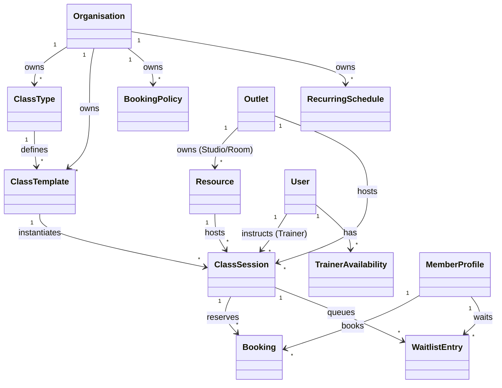
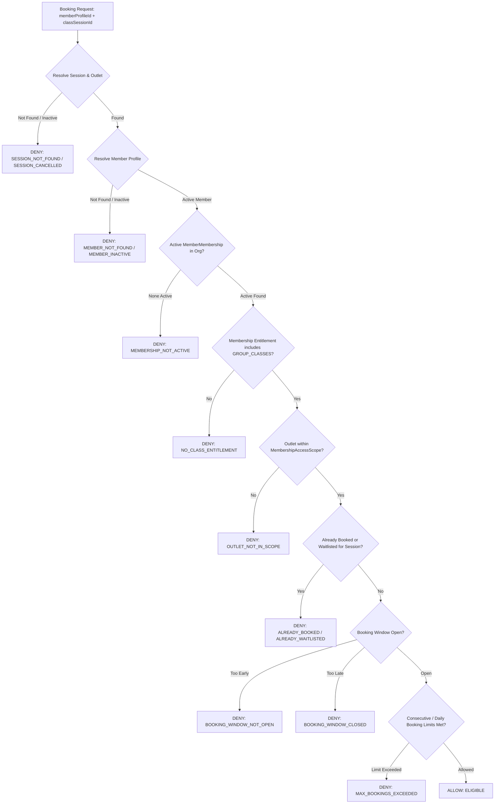
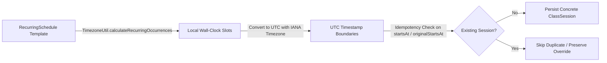

# FitCore Booking & Scheduling Architecture (Day 8)

## 1. Domain Overview & Invariants

The FitCore Booking & Scheduling foundation manages class definitions, physical resources, trainer availability, recurring schedules, real-time capacity management, FIFO waitlists, and member bookings across multi-tenant, multi-outlet networks.

### Core Architectural Invariants:
1. **`Organisation` Owns Definitions**:
   - `ClassType`, `ClassTemplate`, `BookingPolicy`, and `RecurringSchedule` are owned strictly at the `Organisation` level.
   - Standard workout programming and cancellation policies are uniform or customizable across all outlets in an organisation.
2. **`Outlet` Owns Physical Execution & Spaces**:
   - `Outlet` owns physical `Resource` (studios, rooms, lanes, courts) and scheduled `ClassSession`.
   - A `ClassSession` executes at a specific physical outlet and room, led by a trainer.
3. **`MemberOutlet ≠ Booking Eligibility`**:
   - `MemberOutlet` is purely relational, recording where a member originally joined or prefers to train.
   - It NEVER grants booking rights.
   - Booking eligibility is derived strictly via:
     `Member -> Active MemberMembership -> MembershipPlan -> Entitlements (GROUP_CLASSES) -> MembershipAccessScope -> Requested Outlet`.
4. **Strict Concurrency & Capacity Protection**:
   - Capacity is verified and consumed using row-level pessimistic locking (`SELECT ... FOR UPDATE`) inside an isolated database transaction.
   - Active bookings can never exceed session capacity.
   - Overflow requests transition atomically to FIFO `WaitlistEntry`.
5. **Separation of Concerns (Booking vs. Physical Door Access)**:
   - Having a booking does NOT automatically unlock gym turnstiles or doors; door access is governed exclusively by `AccessDecisionService`.
   - Having door access does NOT grant a class spot; only an active, confirmed booking guarantees reservation.
6. **FIFO Waitlist Promotion with Dynamic Re-Verification**:
   - When a booking is cancelled, candidate #1 on the waitlist is evaluated.
   - Candidate eligibility is dynamically re-checked; if their membership lapsed, expired, or changed, they are skipped (`EXPIRED`) and candidate #2 is promoted.

---

## 2. Entity Hierarchy & Ownership Model



---

## 3. Booking Eligibility Evaluation Pipeline

When a member attempts to book or join a waitlist for a `ClassSession`:



---

## 4. Concurrency Locking & Waitlist Engine

To prevent race conditions during high-demand class releases:

```typescript
return await this.prisma.$transaction(async (tx) => {
  // 1. Pessimistic lock on ClassSession
  const session = await tx.$queryRaw<Array<ClassSession>>`
    SELECT * FROM "ClassSession"
    WHERE "id" = ${sessionId}
    FOR UPDATE
  `;

  // 2. Count active confirmed bookings
  const confirmedCount = await tx.booking.count({
    where: { classSessionId: sessionId, status: BookingStatus.CONFIRMED },
  });

  const spotsRemaining = session.capacity - confirmedCount;

  if (spotsRemaining > 0) {
    // 3A. Confirm spot
    return tx.booking.create({
      data: {
        classSessionId: sessionId,
        memberProfileId,
        status: BookingStatus.CONFIRMED,
        confirmedAt: new Date(),
        idempotencyKey,
      },
    });
  }

  // 3B. Waitlist overflow
  const waitlistCount = await tx.waitlistEntry.count({
    where: { classSessionId: sessionId, status: WaitlistStatus.PENDING },
  });

  if (session.waitlistCapacity > 0 && waitlistCount < session.waitlistCapacity) {
    const nextPosition = waitlistCount + 1;
    // Create booking as WAITLISTED + create WaitlistEntry with position
  } else {
    throw new ConflictException({ code: 'SESSION_FULL' });
  }
});
```

---

## 5. Waitlist Promotion & Lifecycle

When a member cancels their confirmed booking:
1. The cancelling booking is updated to `CANCELLED` and `cancelledAt` is stamped.
2. Inside an exclusive transaction, the `WaitlistService.promoteNext(classSessionId, tx)` is triggered.
3. The query selects candidate with `status: PENDING` ordered by `position ASC LIMIT 1`.
4. The candidate's eligibility is re-verified:
   - If membership is expired or suspended, entry is marked `EXPIRED` and the loop advances to candidate #2.
   - If eligible, entry is marked `PROMOTED`, associated `Booking` is set to `CONFIRMED`, and all subsequent waitlist entries have their `position` decremented by 1.

---

## 6. Staff Scheduling & Attendance Lifecycle

Staff and managers can manage the session roster:
- **`manual-booking`**: Allows reception staff to book a member directly into a session, recording `bookedByStaffId`.
- **`check-in`**: When a member arrives at the studio, staff marks attendance (`status: ATTENDED`, `attendedAt: now()`).
- **`no-show`**: If a member fails to arrive, staff marks `status: NO_SHOW`.
- **`cancel-session`**: If a trainer is unavailable or room is out of service, the session is marked `CANCELLED`. All confirmed and waitlisted bookings are cancelled automatically.

---

## 7. Advanced Recurring Schedules & Timezone Engine (Day 9)

FitCore utilizes a deterministic, timezone-aware scheduling engine designed for multi-frequency group programming (`DAILY`, `WEEKLY`, `BIWEEKLY`, `MONTHLY`).

### Key Invariants:
1. **Concrete Session Materialization**:
   - `ClassSession` records are generated and persisted from `RecurringSchedule` templates, never computed on the fly. This enables discrete booking records, attendance tracking, and localized auditing.
2. **UTC Storage with Local Wall-Clock Evaluation**:
   - All session timestamps (`startsAt`, `endsAt`) are stored strictly in UTC.
   - Recurrence rules are evaluated in the outlet's IANA timezone (`TimezoneUtil`), deterministically accounting for Daylight Saving Time (DST) shifts.
3. **Generation Idempotency**:
   - Running generation multiple times produces zero duplicates. Existing sessions and overridden sessions (`originalStartsAt`) are detected and preserved.



---

## 8. Single-Session Overrides & Capacity Floors (Day 9)

Staff can customize individual occurrences without modifying the parent recurring template:
- **`isOverride: true`**: Tagged automatically whenever an occurrence's time, trainer, room, or capacity deviates from its template.
- **`originalStartsAt`**: Preserves original slot timestamp to prevent background generator re-duplication.
- **Capacity Floor Enforcement**:
  - Staff cannot reduce an occurrence's capacity below currently confirmed bookings (`CAPACITY_BELOW_CONFIRMED_BOOKINGS`), preventing phantom overbooking.

---

## 9. Advanced Cancellation Policies, Daily Limits & Conflict Engine (Day 9)

1. **Late Cancellation Window**:
   - Enforces `policy.allowLateCancellation`. If disallowed, late cancellations are rejected with `CANCELLATION_WINDOW_CLOSED`.
   - If permitted, booking is marked `isLateCancellation: true` for late fee / penalty accounting, and the spot is immediately released for FIFO waitlist promotion.
2. **Daily Booking Quota**:
   - Enforces `policy.maxBookingsPerDay` across an organisation per member.
3. **Overlapping Session Conflict**:
   - Prevents members from booking simultaneous overlapping sessions (`BOOKING_TIME_CONFLICT`).
4. **Physical Resource Conflict**:
   - Rooms/studios enforce exclusive time slots (`RESOURCE_SCHEDULE_CONFLICT`).
5. **Trainer Availability & Unavailability**:
   - Trainer leaves, vacations, and regular off-days block session assignment unless authorized staff explicitly override with an immutable audit log.

