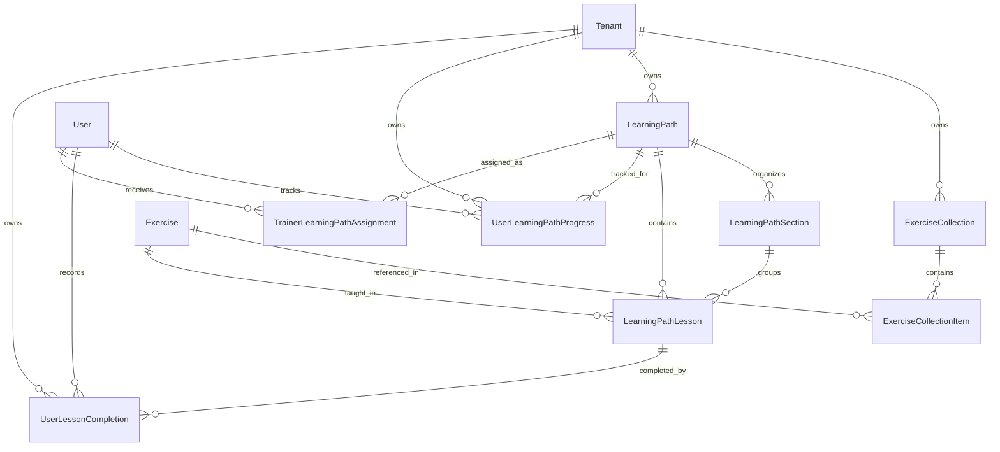

# FitBeat Architecture: Exercise Collections, Programs & Guided Learning Paths (Day 70)

## 1. Executive Summary

Day 70 establishes the structured curriculum and educational layer on top of FitBeat's comprehensive visual exercise foundation (Days 61–69). 

Prior to Day 70, members could explore:
> *"What exercises exist?"* (Library, Filter, Visual Discovery, Body Map)
> *"How do I perform this specific exercise?"* (Detail Screen, Biomechanical Phases, Checkpoints)

Day 70 elevates the system to answer:
> *"What should I learn next?"*
> *"How do I master a complete skill, movement family, or lifting category from fundamentals to advanced execution?"*

This architecture introduces two primary domain concepts:
1. **Exercise Collections**: Curated groupings and workout-ready packs of exercises organized by theme, goal, muscle focus, or equipment.
2. **Guided Learning Paths**: Sequenced educational masterclasses structured into modules, sections, and lessons that guide members step-by-step with progressive checkpoints, practice cues, and completion tracking.

---

## 2. Core Architectural Principles & Boundaries

### 2.1 Strict Decoupling: Learning vs. Workout Execution
A fundamental architectural boundary is maintained between **Learning/Education** and **Workout Execution**:
- **Learning Paths & Lessons** teach technique, biomechanics, joint angles, setup cues, and safety guidelines. Lessons can link to exercises and feature interactive practice checks.
- **Physical Workouts** (Days 20–35) log actual sets, reps, load, RPE, and heart rate exertion.
- **Rule**: Completing a lesson **NEVER** logs or completes a physical workout or alters active training logs. Educational mastery tracks intellectual and technical proficiency, distinct from workout volume.

### 2.2 Pedagogical Hierarchy
The curriculum domain is structured hierarchically:
```
LearningPath (Masterclass: e.g. "Barbell Squat Mastery")
  │
  ├── LearningPathSection (e.g. "Section 1: Setup & Ankle Mobility")
  │     ├── LearningPathLesson (e.g. "Lesson 1: Foot Placement & Arch Activation")
  │     └── LearningPathLesson (e.g. "Lesson 2: Thoracic Extension & Bar Placement")
  │
  └── LearningPathSection (e.g. "Section 2: The Eccentric Descent")
        ├── LearningPathLesson (e.g. "Lesson 3: Hip Hinge vs Knee Break Mechanics")
        └── LearningPathLesson (e.g. "Lesson 4: Bottom Depth & Dynamic Checkpoints")
```

### 2.3 Progress State Machine
Member progress through a Guided Learning Path follows a clean deterministic state machine:
- **`NOT_STARTED`**: Member has not engaged with any lesson in the path.
- **`IN_PROGRESS`**: Member has completed at least one lesson, or explicitly started the path. `lastLessonId`, `startedAt`, `percentComplete`, and `completedLessons` are continuously tracked.
- **`COMPLETED`**: Member has completed 100% of lessons in the path (`completedLessons === totalLessons`). `completedAt` timestamp is recorded.
- **Idempotency & Reversibility**: Re-completing a completed lesson updates the timestamp without incrementing duplicate counters. The member can reset progress anytime to restart the masterclass fresh.

---

## 3. Data Model Architecture (Prisma)

The relational schema implements 8 models with strict multi-tenancy and referential integrity:



### Models Overview
1. **`ExerciseCollection`**: Curated grouping of movements (`COLLECTION`, `PROGRAM_PREVIEW`, `WARMUP_ROUTINE`, `MOBILITY_SERIES`, `EQUIPMENT_PACK`, `SKILL_BUILDER`).
2. **`ExerciseCollectionItem`**: Join table binding exercises to collections with `sortOrder`, `customTitle`, `learningObjective`, and `notes`.
3. **`LearningPath`**: Guided masterclass course with difficulty, estimated duration, category, and prerequisites.
4. **`LearningPathSection`**: Ordered organizational units within a path.
5. **`LearningPathLesson`**: Atomic educational units with rich markdown/text theory, cues, checklist, and optional linked `exerciseId`.
6. **`UserLearningPathProgress`**: Aggregated state per member per path (`status`, `completedLessons`, `percentComplete`, `lastLessonId`, `startedAt`, `completedAt`).
7. **`UserLessonCompletion`**: Audit log of every lesson finished by a member with optional notes and rating.
8. **`TrainerLearningPathAssignment`**: Trainer-assigned curriculum paths with target completion dates and coaching notes.

---

## 4. API Endpoints

### 4.1 Exercise Collections (`/exercises/collections`)
- `GET /exercises/collections`: Filterable list of curated collections (by category, difficulty, muscle, equipment, search).
- `GET /exercises/collections/:id`: Detailed collection syllabus with all exercises, cues, objectives, and order.

### 4.2 Guided Learning Paths (`/exercises/learning-paths`)
- `GET /exercises/learning-paths`: Paginated list of paths with user progress attached (`percentComplete`, `status`, `lastLessonId`).
- `GET /exercises/learning-paths/:id`: Path detail including structured sections, lesson syllabi, and completion badges.
- `GET /exercises/learning-paths/:pathId/lessons/:lessonId`: Detailed lesson player data, theory, checkpoints, and navigation links (`nextLessonId`, `previousLessonId`).
- `POST /exercises/learning-paths/:pathId/lessons/:lessonId/complete`: Mark lesson complete, recalculate overall path progress, and return the next lesson ID.
- `POST /exercises/learning-paths/:pathId/reset`: Reset path progress back to 0% for review.
- `GET /exercises/:exerciseId/related-curriculum`: Bidirectional discovery — retrieves all collections and learning paths that feature or teach a specific exercise.

---

## 5. Mobile User Experience

### 5.1 Screens & Flows
1. **Exercise Collections Screen (`ExerciseCollectionsScreen.tsx`)**:
   - Filter chips: All, Curated, Program Previews, Warmups, Mobility, Skill Builders.
   - Quick navigation into collection curriculum.
2. **Collection Curriculum Detail (`ExerciseCollectionDetailScreen.tsx`)**:
   - Comprehensive hero with metadata, coaching verification, and exercise count.
   - Sectioned breakdown of exercises with learning objectives and tips.
   - 1-tap launcher to start movement 1 in full exercise player.
3. **Learning Paths Catalog (`LearningPathsScreen.tsx`)**:
   - Filter by status (`IN_PROGRESS`), skill type (`FUNDAMENTALS`, `SKILL_MASTERY`, `MOBILITY`, `POSTURE`, `HYPERTROPHY`).
   - "Continue Your Active Paths" shelf for quick resumption.
   - Cross-link banner to Exercise Collections.
4. **Learning Path Overview Screen (`LearningPathOverviewScreen.tsx`)**:
   - Masterclass hero with visual progress bar (`% complete`, lessons remaining).
   - Structured syllabus broken down by section with status icons (`check`, `active`, `pending`).
   - Reset progress confirmation modal.
   - Dynamic floating CTA ("Start Guided Masterclass", "Continue Learning", or "Review From Beginning").
5. **Interactive Lesson Player (`LearningLessonScreen.tsx` & `LearningPathPlayer.tsx`)**:
   - Full pedagogical breakdown: Theory & Biomechanics, Core Technique Cues, Practice Checkpoints, Common Faults.
   - Direct shortcut button into Exercise Detail view.
   - Checkpoint completion and transition to next lesson.
   - Celebration alert upon path completion.

---

## 6. Multi-Tenant Isolation & Security

1. **Strict Multi-Tenancy**:
   - System-wide collections and paths have `tenantId: null` (available to all gyms).
   - Gym-custom collections and paths have `tenantId: member.tenantId`.
   - All database queries enforce an `AND: [{ OR: [{ tenantId: userTenantId }, { tenantId: null }] }]` filter wrapped properly to prevent JS key collisions.
2. **Published Status**:
   - Draft collections and paths are visible only to trainers/admins, hidden from standard members.
3. **IDOR Prevention**:
   - Progress records are scoped to `(userId, tenantId, pathId)`. Members can only view and mutate their own learning progress.
