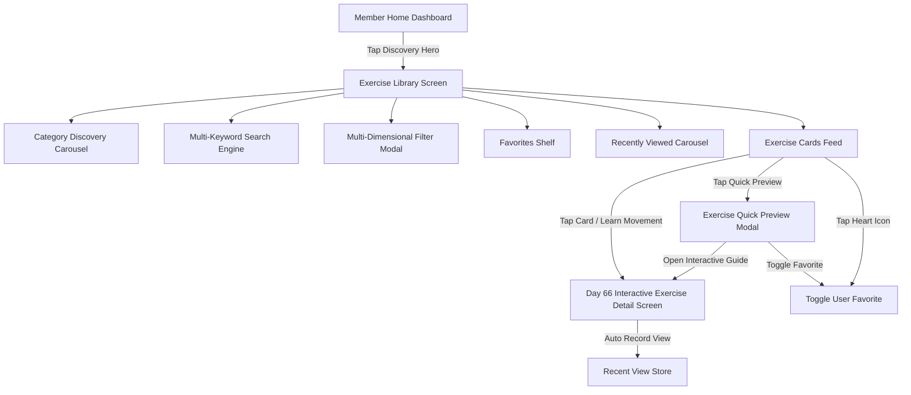

# Architecture Specification: Exercise Discovery and Visual Library System

## 1. Overview & Business Intent
FitBeat Day 67 establishes the **Member Visual Exercise Library & Discovery Experience**, connecting the underlying database entities, visual assets (media, videos, 3D models), biomechanical phases, step cues, and metadata taxonomy established in Days 61–66 into a unified, member-facing discovery flow.

Members can search, filter, preview, bookmark favorites, review recently viewed movements, and dive directly into interactive visual learning guides.

---

## 2. Architecture & Domain Flow

---

## 3. Key Components & Responsibilities

### 3.1 Backend Architecture (`services/api/src/exercises/`)
* **`ExercisesService.findAll`**:
  * Enhanced with `sortBy` ('RECOMMENDED' | 'ALPHABETICAL' | 'DIFFICULTY' | 'NEWEST') and `isFavorite` filter.
  * Resolves signed media URLs for private assets (S3/MinIO compatible).
  * Automatically joins `UserExerciseFavorite` to return an `isFavorite: boolean` indicator for authenticated members.
* **`ExercisesService.getFilterMetadata`**:
  * Provides single-source dynamic aggregation for categories, muscle groups, equipment items, difficulties, and movement patterns with live exercise counts.
  * Eliminates client hardcoding of counts and taxonomies.
* **`UserExerciseFavorite` & `UserExerciseRecentView` Models**:
  * User-scoped bookmarks and chronological view tracking with composite unique keys (`userId, exerciseId`).
  * Enforces multi-tenant isolation: members can only bookmark and view exercises accessible to their active organization.
* **Endpoints**:
  * `GET /exercises/filter-metadata`
  * `GET /exercises/favorites`
  * `POST /exercises/:id/favorite`
  * `GET /exercises/recent`
  * `POST /exercises/:id/view`
  * `GET /exercises/:id/visual` & `GET /exercises/:id/visual-content`

### 3.2 Mobile Architecture (`apps/mobile/src/features/exercises/`)
* **`ExerciseCard.tsx`**:
  * Visual demonstration thumbnail with fallback gradient/halo branding.
  * Overlays for muscle group, difficulty level, and video availability badges.
  * Instant tactile heart toggle with optimistic UI updates.
  * Dual primary actions: "Quick Preview" and "Learn Movement".
  * Supports compact horizontal mode for the "Recently Viewed" shelf.
* **`ExerciseCategoryDiscovery.tsx`**:
  * Horizontal scrolling carousel of exercise categories with live count badges and iconography.
* **`ExerciseFilterModal.tsx`**:
  * Comprehensive bottom sheet with multi-select chips for categories, muscles, equipment, difficulties, patterns, environments, sorting options, and quick toggles ("Favorites Only", "No Equipment").
  * Active filter counter badge and "Reset All" functionality.
* **`ExerciseQuickPreviewModal.tsx`**:
  * Lightweight modal for quick peek into exercise specs (equipment, mechanics, pattern, description) before entering deep learning mode.
* **`ExerciseLibraryScreen.tsx`**:
  * Top bar, debounced search, category carousel, quick filter pills, active filter chips with dismiss, recently viewed horizontal shelf, paginated exercise feed, and empty states.
* **`MemberHomeScreen.tsx`**:
  * Flagship "Exercise Library & Form Guide" discovery card directly linking member dashboard to library exploration.

---

## 4. Multi-Tenant Security & IDOR Safeguards
* Standard system exercises (`ownershipType: 'SYSTEM'`, `organisationId: null`) are universally accessible across all gyms.
* Custom exercises (`ownershipType: 'ORGANISATION'`, `organisationId: tenantOrgId`) are strictly isolated to the owning tenant.
* Endpoints verify that the requested exercise is either system-owned or belongs to the user's active organization before granting access, adding to favorites, or recording view history.
