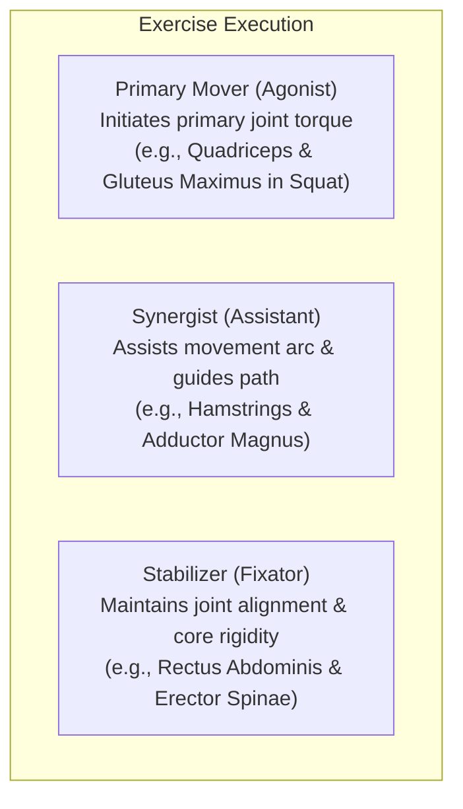
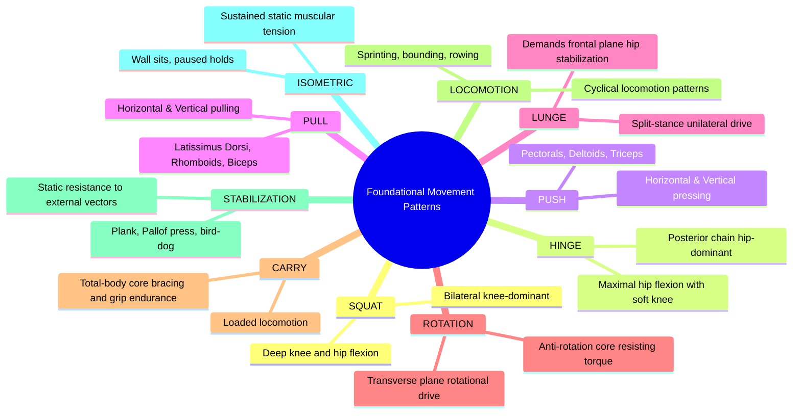
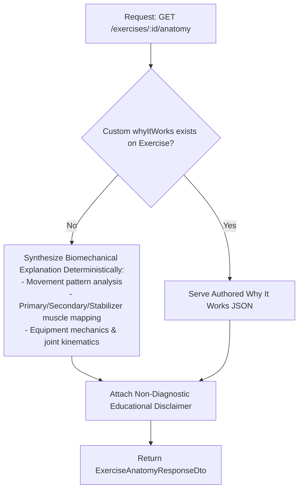

# Exercise Visual Anatomy, Muscle Education & Movement Mechanics Architecture

## 1. Executive Summary & Pedagogical Vision

Across Days 61 to 73, FitBeat established a multi-layered training ecosystem:
- **Days 61–65**: Visual exercise discovery, step-by-step instructions, and multimedia movement players.
- **Days 66–69**: Muscle, equipment, and anatomical metadata intelligence.
- **Days 70–72**: Structured learning paths, progress dashboards, and interactive knowledge checks.
- **Day 73**: Hierarchical Fitness Academy curricula and authoritative fitness terminology glossary.

**Day 74** establishes the deep biomechanical and pedagogical connection between movement, muscle action, and joint mechanics:

$$\begin{aligned}
\text{Exercise} &\longrightarrow \text{Movement Pattern} \longrightarrow \text{Movement Phases} \longrightarrow \text{Muscles Involved} \\
&\longrightarrow \text{Equipment} \longrightarrow \text{Technique} \longrightarrow \text{"Why This Exercise Works"} \\
&\longrightarrow \text{Visual Learning} \longrightarrow \text{Knowledge Check}
\end{aligned}$$

Rather than leaving members to blindly imitate exercises, FitBeat educates them on **force distribution**, **agonists vs. synergists vs. stabilizers**, **joint kinematics**, **tempo pacing**, and **breathing mechanics**.

---

## 2. Anatomical Architecture

### A. Tri-Level Muscle Role Taxonomy

Traditional fitness apps often assign vague tags or fabricated percentages (e.g. "82% Quads") to exercises. FitBeat strictly models muscle involvement through functional kinesiology:



1. **Primary Mover (`PRIMARY`)**: The primary muscle or muscle group generating the necessary kinetic force to move the external load or body weight through the primary joint action.
2. **Synergist (`SECONDARY`)**: Musculature assisting the prime mover, fine-tuning joint trajectory, and preventing unwanted secondary rotation.
3. **Stabilizer (`STABILIZER`)**: Isometric anchors that fix proximate bones or posture (e.g., spinal column, pelvic girdle, scapula) to provide a stable base of support for dynamic joint displacement.

### B. Muscle Groups and Regional Anatomy

FitBeat organizes human musculature into 3 primary anatomical regions containing 20+ specialized muscle groups:

| Region | Muscle Groups | Primary Antagonists | Key Biomechanical Function |
| :--- | :--- | :--- | :--- |
| **Upper Body** | Chest, Lats, Traps, Deltoids (Anterior/Lateral/Posterior), Biceps, Triceps, Forearms, Rotator Cuff | Pectorals $\leftrightarrow$ Lats/Rhomboids; Biceps $\leftrightarrow$ Triceps | Push, pull, overhead press, shoulder horizontal abduction/adduction, elbow flexion/extension. |
| **Core** | Rectus Abdominis, Obliques (Internal/External), Transverse Abdominis, Erector Spinae | Rectus Abdominis $\leftrightarrow$ Erector Spinae | Anti-extension, anti-flexion, anti-lateral flexion, anti-rotation, intra-abdominal pressure generation. |
| **Lower Body** | Quadriceps, Hamstrings, Gluteus Maximus, Gluteus Medius/Minimus, Calves (Gastrocnemius/Soleus), Adductors | Quadriceps $\leftrightarrow$ Hamstrings; Adductors $\leftrightarrow$ Abductors | Hip extension/flexion, knee extension/flexion, ankle plantarflexion, pelvic leveling in gait and unilateral stance. |

---

## 3. Movement Mechanics Architecture

### A. Foundational 10-Pattern Taxonomy

Every human exercise stems from foundational kinesiological patterns:



### B. Five-Phase Movement Cycle

Movement performance is decomposed into 5 distinct sequential phases:

```text
[ SETUP ] ──> [ ECCENTRIC ] ──> [ BOTTOM TRANSITION ] ──> [ CONCENTRIC ] ──> [ LOCKOUT / RESET ]
```

1. **Setup**: Establishing foot/hand position, joint alignment, foundational tension, and intra-abdominal bracing before unrack or movement initiation.
2. **Eccentric**: Controlled lengthening of prime mover under tension. Priming the stretch-shortening cycle while dissipating kinetic shock.
3. **Bottom Transition**: Point of zero velocity between eccentric and concentric actions. Emphasizes maintaining active joint stiffness without bouncing.
4. **Concentric**: Overcoming external resistance via explosive or paced muscle shortening. Rate of force development.
5. **Lockout / Reset**: Reaching full joint extension under control without joint hyperextension, accompanied by intra-abdominal reset or breath exhalation.

### C. Tempo and Breathing Synchronization

- **Tempo Notation**: 4-digit notation (`Eccentric` - `Bottom Pause` - `Concentric` - `Top Pause`).
  - Example: `3-1-1-0` for Squats (3s lowering, 1s active pause at parallel, 1s explosive ascent, 0s pause before next rep).
- **Breathing Cadence**:
  - **Valsalva Maneuver / Diaphragmatic Bracing**: Deep inhale and 360-degree abdominal expansion during setup; hold through eccentric and transition; forceful exhalation past the sticking point of concentric phase.

---

## 4. "Why This Exercise Works" Biomechanical Engine

Each exercise provides an educational synthesis structured into 5 foundational components:

1. **Biomechanical Overview**: High-level explanation of mechanical advantage, moment arms, and force vectors.
2. **Primary Force Drivers**: Key muscle groups providing the motive torque and their specific functional actions.
3. **Joint Actions**: Kinesiological joint movements across planes of motion (sagittal, frontal, transverse).
4. **Stabilization Focus**: Dynamic isometric requirements preventing injury and structural collapse.
5. **Key Benefits**: Hypertrophy, neuromuscular recruitment, athletic performance, and functional daily longevity.
6. **Non-Diagnostic Educational Disclaimer**:
   > *"Educational guidance only. Consult a qualified fitness professional or healthcare provider for personalized training advice or if experiencing pain or discomfort."*

### Authoring vs. Deterministic Fallback



---

## 5. Mobile Visual & Accessible Learning Experience

### A. BodyMapVisualizer (WCAG 2.1 AA Compliant)

The mobile `BodyMapVisualizer` features:
- **Dual Perspective**: Anterior (front) and Posterior (rear) anatomical views.
- **Tri-Color Boundary Highlights**:
  - `PRIMARY`: Solid theme accent boundary with active role tag.
  - `SECONDARY`: Cyan border with synergist tag.
  - `STABILIZER`: Violet dashed boundary with stabilizer tag.
- **Accessible List Mode**: High-contrast, keyboard/screen-reader friendly list categorized into Primary Movers, Synergists, and Stabilizers. Color is never the sole indicator of muscle role.

### B. Interactive Cross-Exploration

- **Muscle Detail Screen (`/muscles/:code`)**:
  - Deep anatomical breakdown, functional actions, and synergist relationships.
  - Categorized exercise library (Exercises where muscle acts as Primary vs. Secondary).
  - Cross-references to Fitness Academy lessons and interactive knowledge checks.
- **Movement Pattern Detail Screen (`/movements/:pattern`)**:
  - Definition, plane of motion, joint actions, and common body positions.
  - All exercises in the gym library belonging to the movement pattern.
  - Associated academy curricula (e.g., *Movement Fundamentals*).

---

## 6. Security, RBAC & Multi-Tenant Isolation

- **Read Access**:
  - System-wide exercises, muscles, and movement patterns are viewable by all authenticated members across all tenants.
  - Custom gym-owned exercises (`organisationId` matched) are accessible only to authenticated users belonging to that organisation. Cross-tenant access is rejected with `404 Not Found`.
- **Write Access (`PATCH /exercises/:id/why-it-works`)**:
  - Restricted to `TRAINER`, `ADMIN`, and `SUPERADMIN` roles.
  - Trainers can only author educational content for exercises belonging to their own organization (or system exercises if superadmin).
  - All authoring modifications generate persistent audit trails via `AuditService`.
