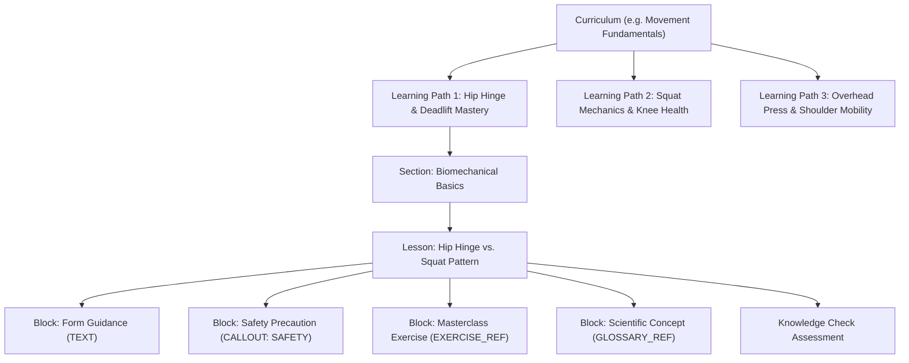

# Fitness Education Curriculum, Exercise Fundamentals & Structured Learning Academy Architecture

## 1. Executive Summary & Vision

Across Days 61 to 72, FitBeat built a state-of-the-art visual exercise discovery, path player, member dashboard, and interactive knowledge check assessment system. However, learning was largely centered around individual exercises or standalone collections ("Find Exercise → Learn Exercise").

Day 73 transforms this foundation into a **Structured Educational Ecosystem**:
$$\text{Understand Fitness} \longrightarrow \text{Understand Movement} \longrightarrow \text{Understand Exercises} \longrightarrow \text{Understand Equipment} \longrightarrow \text{Practice} \longrightarrow \text{Test Knowledge} \longrightarrow \text{Progress}$$

FitBeat now organizes physical education into structured, hierarchical **Curricula** with comprehensive syllabi, modular multi-media lesson blocks (`CALLOUT`, `EXERCISE_REF`, `MOVEMENT_REF`, `GLOSSARY_REF`), and an authoritative **Fitness Terminology & Concepts Glossary**.

---

## 2. Core Architectural Pillars

### A. Hierarchical Taxonomy Model



1. **Curriculum**: The top-level academic umbrella spanning multiple structured learning paths (e.g., *Fitness Fundamentals*, *Movement Fundamentals*, *Exercise Fundamentals*, *Training Principles*, *Warm-Up & Cool-Down*, *Recovery Essentials*).
2. **Learning Path**: A guided sequential track of sections and lessons created in Day 70.
3. **Sections & Lessons**: Modular pedagogical units with learning objectives and time estimates.
4. **Structured Content Blocks**: Granular, typed visual and pedagogical elements embedded inside lessons.
5. **Knowledge Check**: Interactive comprehension verification assessments created in Day 72.
6. **Glossary Term**: Authoritative scientific, biomechanical, and physiological reference definitions linked dynamically to movement patterns, exercises, and lessons.

---

## 3. Database Schema Design (Additive & Multi-Tenant)

### `Curriculum` (`curricula`)
- `id`: Unique identifier (CUID)
- `organisationId`: Multi-tenant gym scope or `null` for system-wide foundational curricula
- `createdById`: Author user reference
- `ownershipType`: `SYSTEM` or `ORGANISATION`
- `title`: Curriculum title
- `slug`: URL and deep-link slug
- `description`: Syllabus overview
- `category`: Enum (12 standard categories including `FITNESS_FUNDAMENTALS`, `MOVEMENT_FUNDAMENTALS`, `EXERCISE_FUNDAMENTALS`, `TRAINING_PRINCIPLES`, `WARMUP_COOLDOWN`, `STRENGTH_TRAINING`, `RECOVERY`)
- `difficulty`: `BEGINNER`, `INTERMEDIATE`, `ADVANCED`, or `ALL_LEVELS`
- `contentStatus`: `DRAFT`, `PUBLISHED`, `ARCHIVED`
- `pathCount` & `lessonCount`: Denormalized counters for fast catalog listing
- `paths`: One-to-many relationship with `LearningPath`

### `GlossaryTerm` (`glossary_terms`)
- `id`: Unique identifier (CUID)
- `organisationId`: Multi-tenant gym scope or `null` for system-wide terms
- `term`: Official name (e.g., "Progressive Overload", "Hip Hinge", "Concentric Contraction")
- `slug`: Web-friendly slug
- `definition`: Full authoritative scientific definition
- `shortExplanation`: Concise, member-friendly 1-2 sentence breakdown
- `category`: Category group (e.g., `MOVEMENT_BIOMECHANICS`, `EXERCISE_PHYSIOLOGY`, `TRAINING_PRINCIPLES`)
- `difficulty`: `BEGINNER`, `INTERMEDIATE`, `ADVANCED`
- `relatedExerciseIds`: String array linking applicable exercises
- `relatedMovementPatterns`: String array linking movement patterns (e.g., `['SQUAT', 'HINGE']`)
- `relatedLessonIds`: String array linking academy lessons that teach this term
- `isSystem`: Boolean flag

### `LearningPathLesson.contentBlocks` (JSON)
Enables rich, modular formatting inside lessons without altering relational foreign keys:
```json
[
  {
    "id": "blk-1",
    "type": "TEXT",
    "title": "Biomechanics of the Stance",
    "content": "Establish a stable base with feet shoulder-width apart..."
  },
  {
    "id": "blk-2",
    "type": "CALLOUT",
    "calloutType": "KEY_POINT",
    "title": "Tripod Foot Contact",
    "content": "Press the big toe, pinky toe, and heel firmly into the floor."
  },
  {
    "id": "blk-3",
    "type": "CALLOUT",
    "calloutType": "SAFETY",
    "title": "Avoid Knee Valgus",
    "content": "Do not allow knees to cave inward on the ascent."
  },
  {
    "id": "blk-4",
    "type": "EXERCISE_REF",
    "exerciseId": "ex-squat-101",
    "exerciseName": "Barbell Back Squat"
  },
  {
    "id": "blk-5",
    "type": "GLOSSARY_REF",
    "termSlug": "eccentric-contraction",
    "termDisplay": "Eccentric Phase",
    "content": "Active muscle lengthening under tension."
  }
]
```

---

## 4. Dual-Tenant & Security Architecture

1. **System Foundational Content (`ownershipType = 'SYSTEM'`)**:
   - FitBeat ships with foundational curricula and glossary terms accessible across all member tenants.
   - Guarded against unauthorized mutation: only users with `SUPERADMIN` role can update or archive `SYSTEM` content.
2. **Organization-Authored Content (`ownershipType = 'ORGANISATION'`)**:
   - Gym owners and trainers can author custom curricula and terminology tailored to their gym's training philosophy.
   - Strict tenant isolation: Tenant A cannot inspect or modify Tenant B's draft or custom curricula.
3. **Publishing Validation Rules**:
   - A curriculum cannot be published in `PUBLISHED` status unless it has at least 1 published learning path and at least 1 lesson.

---

## 5. Mobile Client Architecture

### Presentation Components
- `CurriculumCard`: High-performance card displaying curriculum category, tracks count, lessons count, and member completion percentage.
- `LessonContentBlockView`: Dynamic renderer supporting 7 block types with custom callout styling (`TIP`, `SAFETY`, `KEY_POINT`, `DEFINITION`), interactive exercise reference cards, and deep-linked glossary pills.
- `GlossaryTermModal`: Lightweight bottom modal displaying complete definitions, scientific background, and direct navigation to related exercises and lessons.

### Member Screens
- `FitnessAcademyScreen`: Hub for browsing core curricula by category, searching topics, and continuing active tracks.
- `CurriculumDetailScreen`: Syllabus explorer showing all child tracks, sections, lessons, and progress metrics.
- `GlossaryScreen`: A-Z indexed glossary with search and category filters.
