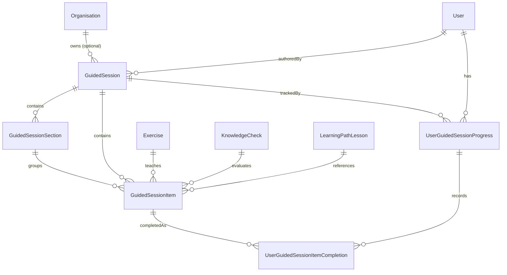
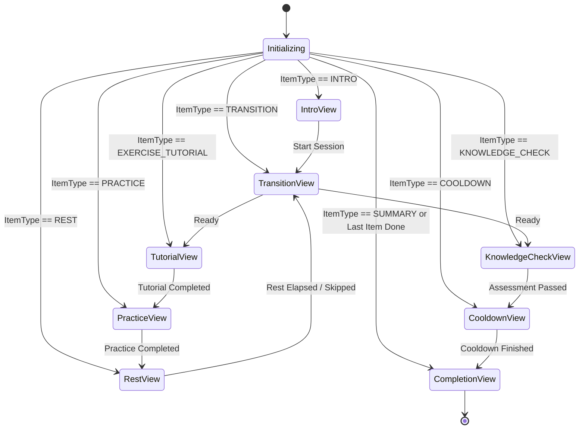

# FitBeat Guided Exercise Sessions & Practice Programs Architecture

## 1. Executive Summary

FitBeat Day 76 extends the Day 75 interactive single-exercise tutorial into a **guided multi-exercise learning and practice session system**. 

While Day 75 established interactive tutorials for single exercises (Visual Demonstration $\to$ Instructions $\to$ Movement Phases $\to$ Coaching Cues $\to$ Common Mistakes $\to$ Practice $\to$ Knowledge Check), Day 76 introduces structured, sequential educational programs that guide members through complete learning curricula:

```text
Guided Learning Program
          ↓
Introduction (Objectives, Prerequisites, Equipment)
          ↓
Warm-Up / Preparation
          ↓
Exercise Tutorial 1 (Interactive Multi-Step Breakdown)
          ↓
Practice (Non-Diagnostic Self-Rehearsal: Timed or Rep Stepper)
          ↓
Rest / Recovery (Timed Countdown with Pause & Adjust)
          ↓
Transition (Next Exercise Preview, Equipment Setup, Movement Cues)
          ↓
Exercise Tutorial 2 (Interactive Multi-Step Breakdown)
          ↓
Practice (Non-Diagnostic Self-Rehearsal)
          ↓
Knowledge Check (Day 72 Assessment Engine Embedded)
          ↓
Cooldown / Restoration (Breathing Cadence & Downregulation)
          ↓
Session Completion & Summary (Mastery Metrics & Next Paths)
```

---

## 2. Core Architectural Principles & Boundaries

### 2.1 Strict Separation: Educational Learning vs Workout Logging Engine

A critical architectural invariant in FitBeat 2.0 is the **complete separation between learning/practice sessions and physical workout logging**:
- **Guided Exercise Sessions** are educational modules that teach motor skills, biomechanics, joint kinematics, movement tempo, and form cues.
- **Physical Workout Sessions** track physical training stress, sets, repetitions performed, actual load lifted, RPE, rest intervals, and volume load stored in `Workout` and `WorkoutExercise` tables.
- **Invariant**: Completing a practice rehearsal or guided session **NEVER** creates phantom entries in `Workout`, `WorkoutExercise`, or physical performance analytics.
- **Practice Tracking**: The practice mode records completion timestamp, duration in seconds, repetitions self-rehearsed, and self-checked technique items within `UserGuidedSessionItemCompletion` for pedagogical progression tracking only.

### 2.2 Pedagogical Boundaries: No AI Pose Estimation or Computer Vision
In alignment with FitBeat's core safety and ethical guidelines:
- FitBeat does **not** employ automated camera computer vision, video stream processing, or automated rep detection.
- Practice is guided via **structured self-reflection**, **explicit biomechanical checklists**, **countdown timers**, and **manual repetition progress incrementation**.
- Disclaimers explicitly inform members that technique rehearsal is educational and non-diagnostic.

---

## 3. Domain Model Architecture (Prisma Schema)



### 3.1 Entity Definitions

1. **`GuidedSession`**:
   - `id`: UUID primary key.
   - `organisationId`: Nullable UUID (SYSTEM sessions have `organisationId = null`).
   - `ownershipType`: `SYSTEM` (global catalog) or `ORGANISATION` (custom tenant programs).
   - `title`, `slug`, `description`: Metadata for discovery and display.
   - `category`: `FUNDAMENTALS`, `STRENGTH_TECHNIQUE`, `MOBILITY_FLOW`, `REHAB_PREHAB`, `WARMUP_COOLDOWN`, `SKILL_ACQUISITION`.
   - `difficulty`: `BEGINNER`, `INTERMEDIATE`, `ADVANCED`.
   - `primaryGoal`: `TECHNIQUE`, `MOBILITY`, `ENDURANCE`, `STRENGTH`, `RECOVERY`.
   - `estimatedDurationMinutes`: Aggregated or author-specified estimated session length.
   - `coverMediaUrl`, `bannerMediaUrl`: Graphic previews.
   - `contentStatus`: `DRAFT`, `PUBLISHED`, `ARCHIVED`.
   - `sortOrder`, `itemCount`, `exerciseCount`: Denormalized aggregation cache.
   - `publishedAt`, `archivedAt`, `createdById`: Audit and lifecycle attributes.

2. **`GuidedSessionSection`**:
   - `id`: UUID primary key.
   - `sessionId`: Parent session relation.
   - `title`, `description`: Pedagogical grouping (e.g., "Warm-Up & Activation", "Core Compound Mastery", "Downregulation").
   - `sortOrder`: Relative index within the session.

3. **`GuidedSessionItem`**:
   - `id`: UUID primary key.
   - `sessionId`: Parent session.
   - `sectionId`: Optional section grouping.
   - `itemType`: `INTRO`, `WARMUP`, `EXERCISE_TUTORIAL`, `PRACTICE`, `REST`, `TRANSITION`, `KNOWLEDGE_CHECK`, `COOLDOWN`, `SUMMARY`.
   - `exerciseId`: Foreign key to `Exercise` (for `EXERCISE_TUTORIAL` and `PRACTICE`).
   - `knowledgeCheckId`: Foreign key to `KnowledgeCheck` (for `KNOWLEDGE_CHECK`).
   - `lessonId`: Optional foreign key to `LearningPathLesson`.
   - `title`, `description`: Step title and instructional notes.
   - `sortOrder`: Sequential order index (0-based) across the entire session.
   - `durationSeconds`: Target duration for timed warmups, practice, or rest intervals.
   - `repetitionCount`: Target non-diagnostic repetitions to rehearse.
   - `isSkippable`: Boolean flag indicating if members can skip this step.
   - `metadata`: JSON storage for dynamic cues, transition tips, and custom checklist items.

4. **`UserGuidedSessionProgress`**:
   - `id`: UUID primary key.
   - `userId`: Member ID.
   - `sessionId`: Session ID.
   - `status`: `NOT_STARTED`, `IN_PROGRESS`, `COMPLETED`, `ABANDONED`.
   - `currentStepIndex`: Deterministic pointer for resuming.
   - `lastActiveItemId`: ID of the item currently or most recently viewed.
   - `completedItemCount`: Count of items marked complete.
   - `percentComplete`: Integer percentage calculated as `Math.round((completedItemCount / itemCount) * 100)`.
   - `startedAt`, `lastActiveAt`, `completedAt`: Timestamp metrics.
   - `totalDurationSeconds`: Total cumulative study and rehearsal time.

5. **`UserGuidedSessionItemCompletion`**:
   - `id`: UUID primary key.
   - `progressId`: Parent user progress link.
   - `itemId`: Specific session item link.
   - `itemType`: Cached item type.
   - `completedAt`: Exact completion timestamp.
   - `durationSpentSeconds`: Time spent on this specific step.
   - `repetitionsCompleted`: Self-reported reps rehearsed.
   - `restSkipped`: Boolean flag indicating if rest timer was skipped.
   - `notes`: Optional member self-reflection notes.

---

## 4. Sequential Player Orchestration & State Machine



### 4.1 Component Embedding Strategy
The master player (`GuidedExerciseSessionScreen`) embeds established Day 75 and Day 72 components:
- **`InteractiveExerciseTutorial` (Day 75)**: Rendered when `itemType === 'EXERCISE_TUTORIAL'`. Receives the full tutorial payload including visual demonstration, instructions, movement phases, and technique coaching cues.
- **`KnowledgeCheckPlayer` (Day 72)**: Rendered when `itemType === 'KNOWLEDGE_CHECK'`. Orchestrates question sequencing, feedback presentation, and score calculation.
- **Native Guided Views**:
  - `GuidedSessionIntroView`: Syllabus overview, prerequisites, and equipment checklist.
  - `GuidedSessionTransitionView`: Biomechanical transition preparation, equipment changes, setup cues.
  - `GuidedSessionRestTimerView`: High-contrast circular rest countdown with +15s, +30s, pause, and skip controls.
  - `GuidedSessionPracticeView`: Non-diagnostic rehearsal mode with timed countdown, rep counter stepper, and technique checklist.
  - `GuidedSessionCompletionView`: Celebratory summary featuring exercises learned, mechanics mastered, study time, and next recommended modules.

---

## 5. Publishing Validation & Authoring Rules

To ensure pedagogical quality, the `validateGuidedSession` service runs strict rules before a session can be published:
1. **Title Requirement**: Title must be at least 3 characters.
2. **Item Count**: Session must contain at least 2 learning items.
3. **Exercise Tutorial Requirement**: Session must contain at least 1 `EXERCISE_TUTORIAL` item.
4. **Valid Exercise Linking**: Every `EXERCISE_TUTORIAL` and `PRACTICE` item must reference a valid, published exercise.
5. **Valid Assessment Linking**: Every `KNOWLEDGE_CHECK` item must reference a valid `KnowledgeCheck`.
6. **Contiguous Sort Order**: All items must have sequential, contiguous `sortOrder` indices without gaps or negative numbers.

---

## 6. Multi-Tenant Isolation & Security Matrix

| Action | Member | Trainer | Admin | SuperAdmin |
| :--- | :--- | :--- | :--- | :--- |
| **List Published Sessions** | View own org + SYSTEM | View own org + SYSTEM | View own org + SYSTEM | View all |
| **View Session Detail** | View own org + SYSTEM | View own org + SYSTEM | View own org + SYSTEM | View all |
| **Start / Progress Session** | Self only (IDOR protected) | Self only | Self only | Any |
| **Create Session Draft** | Denied | Own org only | Own org only | Any (incl SYSTEM) |
| **Update / Reorder Draft** | Denied | Own org draft only | Own org draft only | Any |
| **Publish Session** | Denied | Own org draft only | Own org draft only | Any |
| **Duplicate Session** | Denied | Allowed (to own org) | Allowed (to own org) | Allowed |
| **Modify SYSTEM Session** | Denied | Denied (ForbiddenException) | Denied (ForbiddenException) | Allowed |

---

## 7. Day 77 Readiness & Future Extension

Day 77 will introduce **Enhanced Exercise Demonstrations & Multi-Angle Visual Learning**:
- `GuidedSessionItem` is forward-compatible via its `metadata` JSON field to support multi-angle camera angles, anatomical focus overlays, and interactive playback speeds.
- The player orchestrator architecture supports pluggable media surfaces without modifying the core progression state machine.
