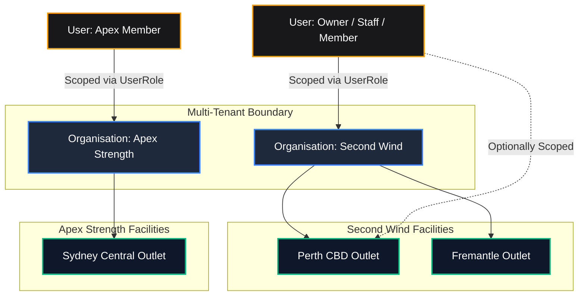
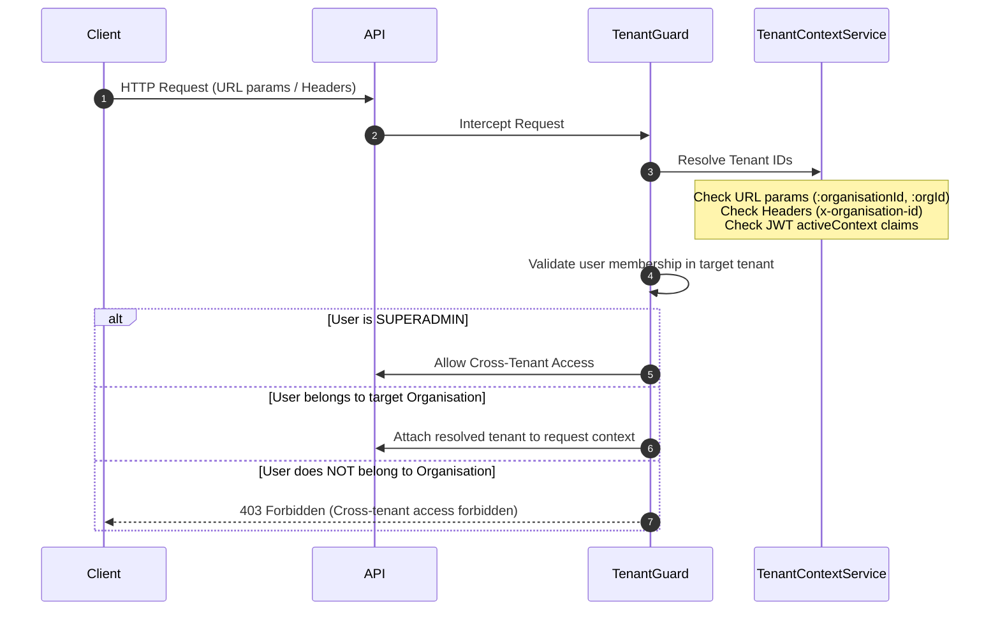

# FitCore Multi-Tenant Identity & Tenancy Architecture

## Overview

FitCore is an enterprise multi-tenant SaaS platform where multiple fitness organizations (e.g. Second Wind Athletic Club, Apex Strength) operate concurrently on a shared database while maintaining strict row-level logical isolation.



---

## 1. Tenancy Model: Row-Level Isolation

FitCore utilizes a **Shared Database, Shared Schema** multi-tenancy pattern with column-based row isolation:
- All tenant entities store an `organisationId` foreign key referencing `organisations(id)`.
- Physical facility records store an `outletId` referencing `outlets(id)`.
- PostgreSQL indexes enforce composite uniqueness per tenant:
  - `[organisationId, slug]`
  - `[organisationId, code]`

---

## 2. Tenant Context Resolution Pipeline

Every HTTP request traverses the `TenantGuard` and `TenantContextService` to establish the active tenant scope:



### Resolution Priority
1. **Route Parameters**: `:organisationId` or `:orgId` (highest precedence for tenant-scoped endpoints).
2. **HTTP Headers**: `x-organisation-id` and `x-outlet-id`.
3. **JWT Claims**: `activeContext.organisationId` and `activeContext.outletId`.

---

## 3. Active Context Switching

Users who belong to multiple organizations or staff who oversee multiple outlets can switch their active context using `POST /api/v1/auth/context`:

### Request
```json
{
  "organisationId": "org_secondwind",
  "outletId": "outlet_perth_cbd"
}
```

### Validation
1. The system verifies that the user possesses a valid `UserRole` or `UserOutlet` binding for the target `organisationId` and `outletId`.
2. If invalid or unauthorized, returns `403 Forbidden`.
3. If valid, generates and returns a new JWT access token containing the updated `activeContext`.

---

## 4. Insecure Direct Object Reference (IDOR) Defense

FitCore applies a multi-layered defense to eliminate IDOR vulnerabilities:

### A. Nested Hierarchical Routing
Endpoints enforce relational nesting:
- `/organisations/:orgId/outlets`
- `/organisations/:orgId/users`
- `/organisations/:orgId/invitations`
- `/organisations/:orgId/users/:userId/roles`

The `TenantGuard` enforces that the authenticated caller holds permissions in the `:orgId` specified in the path.

### B. Flat Endpoint Tenant Verification
For flat endpoints (e.g. `GET /outlets/:id` or `GET /users/:userId`):
1. The domain service queries the entity from the database.
2. The service checks `validateOrgAccess(entity.organisationId, actor)`:
   - If `actor.isSuperAdmin`, access is permitted.
   - If `actor` holds no role in `entity.organisationId`, returns `403 Forbidden`.
   - For outlet-scoped entities, checks if the actor's role is restricted to a different outlet.

### C. Tenant Tamper Protection
- DTOs for resource creation and mutation omit tenant IDs (`UpdateOutletDto` and `UpdateUserDto` explicitly disallow updating `organisationId`).
- `organisationId` is always injected server-side from the verified route or session context.

---

## 5. Soft-Delete & Data Integrity

Critical business and tenant entities utilize soft deletion:
- `deletedAt` timestamp column.
- Queries across `OrganisationsService` and `OutletsService` include `where: { deletedAt: null }`.
- Deleting an organisation soft-deletes the organization record and cascades soft-deletion or inaccessibility to associated outlets and roles.

---

## 6. Audit Trail Integration

All administrative and security actions produce immutable records in `audit_logs`:
- `userId`: Actor who initiated the request.
- `organisationId`: Target tenant organization.
- `outletId`: Target outlet facility (if applicable).
- `action`: Specific operation (`ORGANISATION_CREATED`, `OUTLET_CREATED`, `ROLE_ASSIGNED`, `INVITATION_SENT`, etc.).
- `resource`: Affected domain entity.
- `resourceId`: Entity primary key.
- `metadata`: Changed attributes, previous/new state, or error details.
- `ipAddress`, `userAgent`, `requestId`: Full forensic correlation data.
