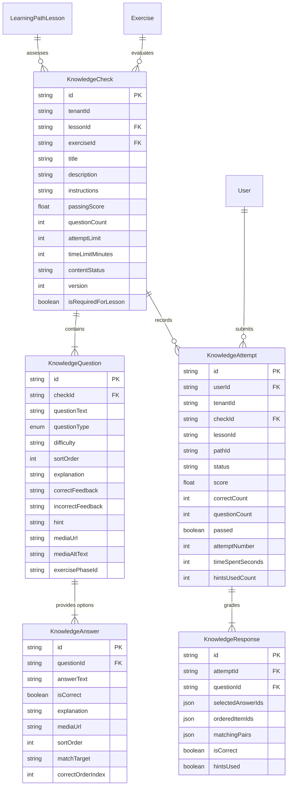
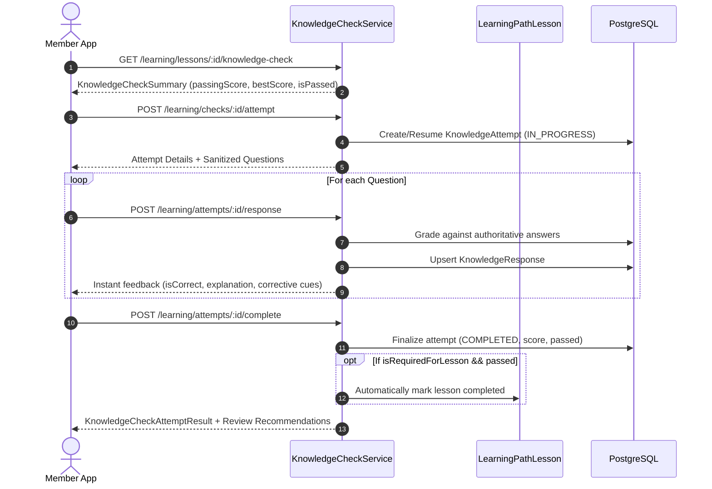

# Architecture: Interactive Fitness Education, Knowledge Checks & Learning Assessments (Day 72)

## 1. System Overview

Day 72 evolves FitBeat's Visual Exercise Learning ecosystem from passive consumption into an active, retention-driven educational journey:
$$\text{Watch} \longrightarrow \text{Read} \longrightarrow \text{Practice} \longrightarrow \text{Understand} \longrightarrow \text{Check} \longrightarrow \text{Continue}$$

The Knowledge Check architecture enables coaches, trainers, and curriculum authors to insert structured comprehension checks into **Learning Path Lessons** and stand-alone **Exercises**. These assessments verify that members truly grasp biomechanics, setup cues, safety caveats, and movement sequencing before advancing.

---

## 2. Core Design Principles

1. **Strict Workout Decoupling**:
   Completing a knowledge check is an educational milestone. It never logs a workout, modifies sets/reps, or interacts with physical exertion tracking.
2. **Zero Non-Deterministic LLM / Generative AI**:
   All questions, answers, hints, explanations, and review suggestions are 100% authored by fitness professionals and graded authoritatively via deterministic server rules.
3. **Zero-Trust Answer Security**:
   The player payload deliberately omits `isCorrect` flags, correct order indices, and matching solutions. All evaluation is server-authoritative; no answer keys can be inspected via client devtools or network sniffers.
4. **Pedagogical Feedback & Targeted Review**:
   Incorrect answers do not merely produce red indicators; they return authored biomechanical explanations and link directly to remedial exercise breakdowns.
5. **Multi-Tenant Isolation & IDOR Protection**:
   Every knowledge check, question, attempt, and response is strictly scoped to `tenantId`. Members cannot access or tamper with attempts belonging to other members or organizations.

---

## 3. Data Model Architecture

The schema introduces 5 additive PostgreSQL models via Prisma:



---

## 4. Question Types & Grading Matrix

The system implements 6 question formats:

| Question Type | Authoring Schema | Client Presentation | Grading Logic |
| :--- | :--- | :--- | :--- |
| **`MULTIPLE_CHOICE`** | Exactly 1 `isCorrect: true` answer | Single-select radio card | `selectedAnswerIds.length === 1 && selectedAnswerIds[0] === correctId` |
| **`MULTI_SELECT`** | $\ge 1$ `isCorrect: true` answers | Multi-select checkboxes | All correct answers selected; zero incorrect selected |
| **`TRUE_FALSE`** | Exactly 2 options: True and False | Large binary toggle cards | Correct boolean answer selected |
| **`IMAGE_CHOICE`** | Answers with visual `mediaUrl` | 2-column image gallery cards | Correct media card selected |
| **`ORDERING`** | Answers with `correctOrderIndex` (0, 1, 2...) | Up/Down sequential step builder | Array comparison of `orderedItemIds` vs sorted answers |
| **`MATCHING`** | Answers with `matchTarget` terms | Term cards + target pill selectors | Every item paired to its exact authored `matchTarget` |

---

## 5. Security & Player Payload Sanitization

When a member calls `GET /learning/checks/:id/player`, `KnowledgeCheckService.buildPlayerDto` executes sanitization:

```typescript
// Server-Side Sanitization Pattern
const sanitizedQuestions = check.questions.map((q) => ({
  id: q.id,
  questionText: q.questionText,
  questionType: q.questionType,
  difficulty: q.difficulty,
  sortOrder: q.sortOrder,
  hint: q.hint,
  mediaUrl: q.mediaUrl,
  mediaAltText: q.mediaAltText,
  answers: q.answers.map((a) => ({
    id: a.id,
    answerText: a.answerText,
    mediaUrl: a.mediaUrl,
    sortOrder: a.sortOrder,
    // EXCLUDED: isCorrect, matchTarget, correctOrderIndex
  })),
  // For matching, unique target pool is returned shuffled without associations
  matchingTargets: q.questionType === 'MATCHING'
    ? shuffle([...new Set(q.answers.map((a) => a.matchTarget).filter(Boolean))])
    : undefined,
}));
```

---

## 6. End-to-End Evaluation Lifecycle


