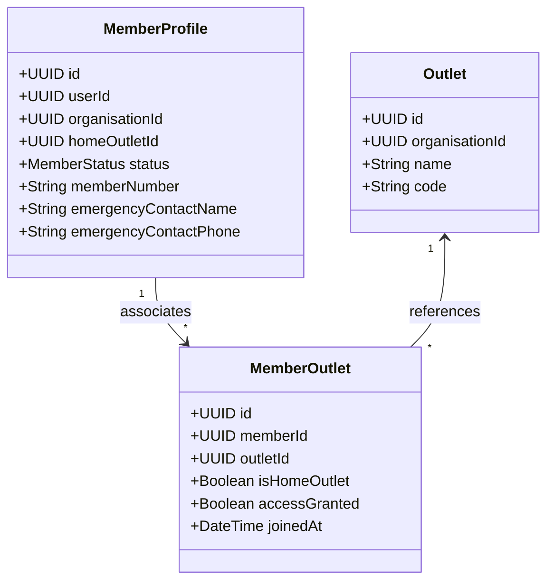
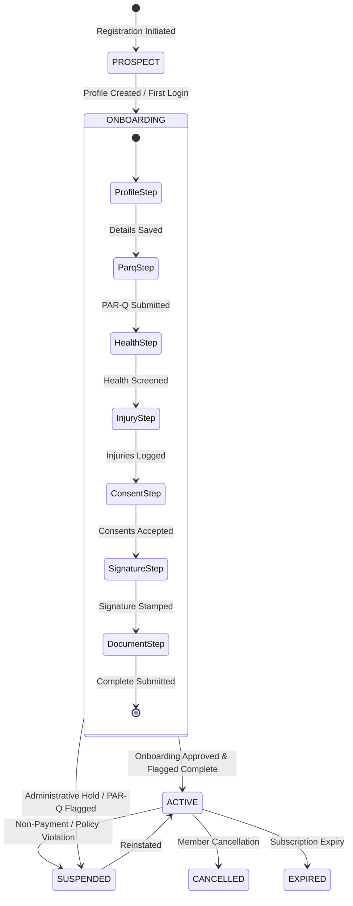

# FitCore Member Domain Architecture

## Overview

The FitCore Member Domain manages the entire lifecycle of fitness club members across multi-tenant organizations and outlets. It decouples the core authentication/identity entity (`User`) from member-specific domain data (`MemberProfile`), enables home and multi-outlet access mapping (`MemberOutlet`), orchestrates progressive onboarding (`MemberOnboarding`), and coordinates health screening, consent compliance, and document records.

```mermaid
graph TD
    User[User (Identity / Auth)] -->|1:1 Optional| MP[MemberProfile]
    MP -->|1:N| MO[MemberOutlet (Home / Accessible)]
    MP -->|1:1| MOB[MemberOnboarding (Workflow State)]
    MP -->|1:N| PS[ParqSubmission (Readiness Questionnaire)]
    MP -->|1:N| HS[HealthScreening (Vitals & Conditions)]
    MP -->|1:N| INJ[Injury (Active / Historical)]
    MP -->|1:N| MC[MedicalClearance (Physician Approval)]
    MP -->|1:N| CR[ConsentRecord (Audited Compliance)]
    MP -->|1:N| SIG[Signature (Cryptographic Audit Trail)]
    MP -->|1:N| MD[MemberDocument (Secure File Storage)]

    classDef core fill:#1e293b,stroke:#3b82f6,stroke-width:2px,color:#fff;
    classDef domain fill:#0f172a,stroke:#10b981,stroke-width:2px,color:#fff;
    classDef compliance fill:#18181b,stroke:#f59e0b,stroke-width:2px,color:#fff;
    class User core;
    class MP,MO,MOB domain;
    class PS,HS,INJ,MC,CR,SIG,MD compliance;
```

---

## 1. Domain Separation: User vs. MemberProfile

In FitCore, identity and club membership are distinctly partitioned:
- **`User` Entity**: Manages email, authentication credentials, system roles (`MEMBER`, `TRAINER`, `OUTLET_MANAGER`, etc.), organisation associations, and session tokens.
- **`MemberProfile` Entity**: Encapsulates fitness-specific attributes, personal biographical data, emergency contact details, primary home outlet, onboarding lifecycle state, and membership status (`PROSPECT`, `ONBOARDING`, `ACTIVE`, `SUSPENDED`, `CANCELLED`, `EXPIRED`).

This separation ensures:
1. Staff members who also train as club members have clean boundary segregation.
2. User identity can persist or transition across outlets without corrupting medical/consent records.
3. Strict row-level tenant isolation is anchored to both `organisationId` and `userId`.

---

## 2. Multi-Outlet Association Model

FitCore members can be registered at a primary "home" outlet while enjoying access privileges to multiple branches within the same organisation:



- **Home Outlet Assignment**: `MemberProfile.homeOutletId` designates the primary billing and facility home.
- **Multi-Branch Privileges**: `MemberOutlet` records grant access per branch with `accessGranted = true` and track join history. Unique constraints `[memberId, outletId]` prevent duplicate mappings.

---

## 3. Member Lifecycle State Machine



### Lifecycle Status Definitions:
- **`PROSPECT`**: Account created via lead capture or guest pass, prior to onboarding.
- **`ONBOARDING`**: Profile created; currently moving through the 8-step mandatory onboarding pipeline.
- **`ACTIVE`**: Full onboarding complete, mandatory consents verified, PAR-Q cleared or physician waiver approved.
- **`SUSPENDED`**: Access temporarily revoked by management or due to pending medical clearance.
- **`CANCELLED`**: Voluntary termination or administrative exit.
- **`EXPIRED`**: Term-based membership reached expiration without renewal.

---

## 4. Tenant & IDOR Protection

All member domain services enforce strict zero-trust boundary verification:
1. **Tenant Context Match**: All queries verify `organisationId` against the authenticated user's active tenant scope.
2. **Member Ownership**: Members can only access and modify their own records (`userId === currentUser.id`).
3. **Staff Scope Checks**:
   - Superadmins & Organisation Admins: Access any member in the organisation.
   - Outlet Managers: Access members whose home outlet or `MemberOutlet` matches their assigned outlet.
   - Reception & Trainers: Read-only access to basic profile; restricted from sensitive medical clearance documents.
