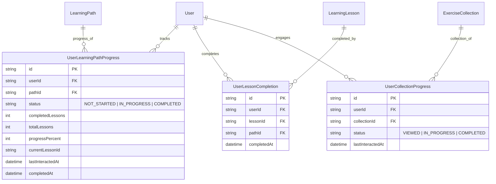

# FitBeat Architecture: Member Learning Dashboard & Progress Intelligence

**Document Version:** 1.0.0  
**Phase:** FitBeat 2.0 — Visual Exercise Learning Platform (Day 71)  
**Status:** Implemented & Verified  

---

## 1. Executive Summary

FitBeat Days 61–70 established the Visual Exercise Learning ecosystem:
- **Days 61–69:** Exercise data foundation, media management, step instructions, biomechanical movement phases, muscles & equipment metadata, visual library, and discovery.
- **Day 70:** Structured exercise collections, guided learning paths, modular sections, bite-sized lessons, interactive lesson player, and progress recording.

**Day 71** elevates the member experience from passive exploration to continuous, structured fitness education by building the **Member Learning Dashboard and Progress Intelligence layer**. It systematically answers five fundamental questions for every gym member:
1. **What am I learning?** (Active, in-progress learning paths and current lesson targets).
2. **What have I completed?** (Verified completed paths, lessons, and curriculum milestones).
3. **What should I continue and where did I stop?** (Deterministic resume intelligence pinpointing exact section and lesson).
4. **What skills and exercises have I learned?** (Exercise mastery status and recently learned exercise library).
5. **What learning areas should I explore next?** (Deterministic, rule-based recommendations aligned with completed paths and goals).

---

## 2. Core Architectural Principles & Guardrails

### 2.1 Strict Decoupling from Workout Logging
Educational learning is fundamentally decoupled from physical workout execution:
- Completing an educational lesson **never** logs a workout session.
- Learning lessons do **not** record sets, reps, weights, or RPE.
- Educational progress does **not** alter training volume or periodization cycles in the workout engine.
- A member may study a Romanian Deadlift lesson to learn hip hinge mechanics without physically performing deadlifts in that moment.

### 2.2 Deterministic, Explainable Recommendations (Zero LLM Dependency)
Curriculum progression and "Next to Learn" suggestions are computed via **deterministic heuristics**:
- **Same-Category Progression:** Suggests unstarted beginner or intermediate paths in categories where the member has completed or started previous paths.
- **Prerequisite / Difficulty Ladder:** Recommends next difficulty level in sequence (`BEGINNER` → `INTERMEDIATE` → `ADVANCED`).
- **Goal & Focus Matching:** Matches paths aligned with user fitness goals and muscle groups.
- Every recommendation includes an explicit `reason` string (e.g., *"Continue your Upper Body mastery"* or *"Recommended beginner technique path"*).

### 2.3 Verified Ground-Truth Metrics (No Synthetic Data)
- **Learning Time:** Computed exclusively from the sum of `estimatedMinutes` of actual completed lessons (`UserLessonCompletion`).
- **Daily Streak:** Timezone-aware streak calculated by scanning consecutive calendar days with at least one verified lesson completion.
- **Mastery Status:** An exercise is marked `LEARNED` if the member completed an educational lesson specifically teaching it or completed its coaching steps.

### 2.4 Multi-Tenant Security & IDOR Protection
All queries and mutations enforce dual tenancy:
- `tenantId` is strictly extracted from the authenticated JWT session (`req.user.tenantId`).
- `userId` is strictly scoped to the caller's verified member ID (`req.user.id`).
- Path and collection access verifies `isPublished = true` or organizational ownership.

---

## 3. Data Model Architecture

---

## 4. API Endpoints & Contract

| Method | Route | Description | Scope |
| :--- | :--- | :--- | :--- |
| `GET` | `/learning/dashboard` | Aggregated dashboard: metrics, resume hero, active paths, activity timeline, recently learned exercises, rule-based recommendations | Authenticated Member |
| `GET` | `/learning/resume` | Deterministic resume intelligence: latest in-progress path, target section, next lesson, progress % | Authenticated Member |
| `GET` | `/learning/progress` | Comprehensive curriculum overview: active paths, completed paths, collections interacted with | Authenticated Member |
| `GET` | `/learning/history` | Paginated chronological lesson completion log with search, filters, and duration metadata | Authenticated Member |
| `GET` | `/learning/exercises/:id/status` | Exercise learning mastery status, checklist flags, and linked learning path | Authenticated Member |
| `POST` | `/learning/collections/:id/interact` | Record member interaction / exploration with an exercise collection | Authenticated Member |

---

## 5. Mobile Client Architecture

### 5.1 Screens
1. **`LearningHomeScreen` (`/learning`)**:
   - Flagship Member Learning Dashboard.
   - Dynamic `ContinueLearningHero` for instant 1-tap lesson continuation.
   - Metrics strip: Total Time Learned (mins), Lessons Finished, Exercises Learned.
   - Dynamic `LearningStreakCard` with flame indicator and active streak count.
   - Active Paths carousel with progress rings and lesson counters.
   - Activity Timeline showing chronological curriculum milestones.
   - Recently Learned Exercises horizontal visual shelf.
   - Curated Recommendations with explainable rule tags.
2. **`LearningProgressScreen` (`/learning/progress`)**:
   - Deep progress breakdown with 4 segmented tabs: `In Progress`, `Completed`, `Collections`, `History`.
   - Paginated completion history with timestamps and path attributions.

### 5.2 Reusable Components
- `ContinueLearningHero`: Flagship resume card with pulsing progress indicator, progress bar, "Next Up" lesson preview, and direct resume button.
- `LearningStatCard`: High-contrast metric display with icon halos and subtitles.
- `LearningStreakCard`: Daily learning streak card with flame icon and status badge.
- `LearningActivityTimeline`: Event stream for path starts, lesson completions, and exercise mastery.

### 5.3 Surface Integrations
- **`MemberHomeScreen`**: Added Day 71 `ContinueLearningHero` widget when active learning is detected, plus dual-action navigation to Learning Dashboard & Exercise Library.
- **`ExerciseDetailScreen`**: Added Day 71 `ExerciseLearningMastery` banner displaying verified mastery badges, step checklists, and direct links to guided paths teaching the exercise.

---

## 6. Verification & Quality Assurance

- **Unit & Integration Tests**: 13 comprehensive E2E tests in `services/api/test/learning-dashboard-progress.e2e-spec.ts`.
- **Regression Suite**: 32 test suites (Days 61–71) passing with 100% success rate.
- **Type Safety**: Fully typed DTOs across backend and frontend clients with strict TypeScript validation.
