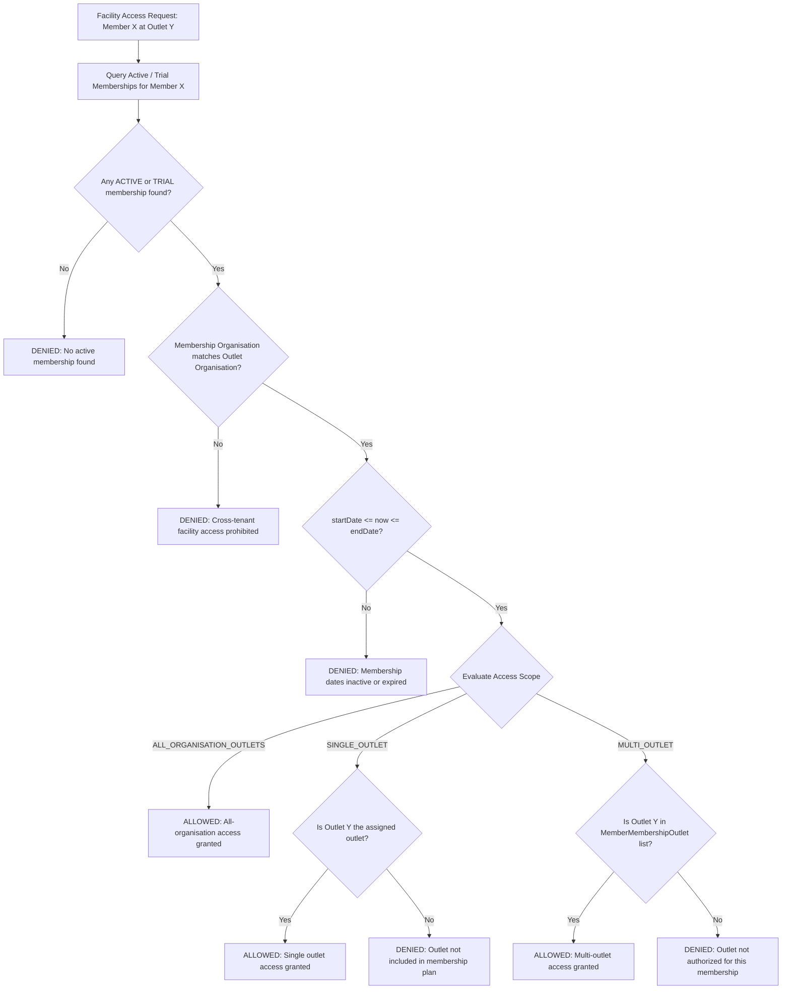
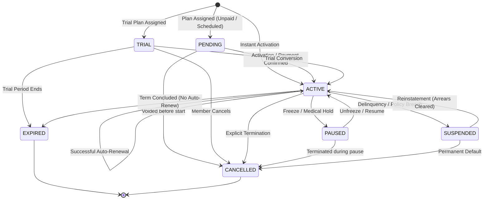

# FitCore Membership & Subscription Architecture

## Overview

The FitCore Membership Domain establishes a commercial subscription and facility access engine for fitness organisations and their member profiles. It decouples plan templates defined at the organisation level from individual member subscriptions, enforces immutable purchase snapshots, evaluates facility access dynamically across multi-outlet scopes, and maintains an auditable lifecycle state machine.

```mermaid
graph TD
    Org[Organisation (Tenant)] -->|1:N| MP[MembershipPlan (Catalog / Commercial Template)]
    Org -->|1:N| Outlets[Outlets (Facilities)]
    MP -->|1:N| MPO[MembershipPlanOutlet (Allowed Facilities)]
    MPO -.->|M:N| Outlets
    MP -->|1:N| ME[MembershipEntitlement (Privileges & Allowances)]

    Member[MemberProfile] -->|1:N| MM[MemberMembership (Active / Historical Subscriptions)]
    MM -->|References Template| MP
    MM -->|1:N| MMO[MemberMembershipOutlet (Explicit Access Facilities)]
    MMO -.->|M:N| Outlets
    MM -->|1:N| MMH[MemberMembershipHistory (Auditable Lifecycle Log)]

    Check[Access Policy Evaluator] -->|Input: Member + Outlet| MM
    Check -->|Validates Status + Dates + Scope| MMO
    Check -->|Output: Allowed / Denied + Reason| Gate[Access Decision Engine]

    classDef org fill:#1e293b,stroke:#3b82f6,stroke-width:2px,color:#fff;
    classDef plan fill:#0f172a,stroke:#10b981,stroke-width:2px,color:#fff;
    classDef sub fill:#18181b,stroke:#f59e0b,stroke-width:2px,color:#fff;
    classDef check fill:#312e81,stroke:#818cf8,stroke-width:2px,color:#fff;
    class Org,Outlets org;
    class MP,MPO,ME plan;
    class Member,MM,MMO,MMH sub;
    class Check,Gate check;
```

---

## 1. Core Principles & Domain Separation

### A. Template vs. Subscription Separation
- **`MembershipPlan`**: Defined at the organisation level. Serves as a commercial product catalog template defining pricing, billing frequency, default access scope, entitlements, and trial periods.
- **`MemberMembership`**: An actual agreement and entitlement grant assigned to a `MemberProfile`. When assigned, the membership snapshots all commercial terms at purchase time so future plan revisions never mutate historical member terms.

### B. MemberOutlet vs. Membership Access
- **`MemberOutlet`**: Represents a member's sociological/administrative relationship to an outlet (e.g. primary home outlet, transfer history, administrative home club).
- **`MemberMembership.accessScope`**: Controls physical facility authorization. Regardless of a member's home outlet, facility entry is derived strictly from active membership entitlements (`SINGLE_OUTLET`, `MULTI_OUTLET`, or `ALL_ORGANISATION_OUTLETS`).

### C. Commercial Term Snapshotting
To ensure financial and legal compliance:
- `planNameAtPurchase` (e.g., "Premium All-Access Monthly")
- `priceAtPurchase` (e.g., 85.00)
- `currencyAtPurchase` (e.g., "USD")
- `billingTypeAtPurchase` (e.g., "RECURRING")
- `durationValueAtPurchase` (e.g., 1)
- `durationUnitAtPurchase` (e.g., "MONTH")

Changes to the underlying catalog plan never alter existing subscriptions.

---

## 2. Access Scope Architecture



---

## 3. Membership Lifecycle State Machine



### Transition Validation Rules

| Current Status | Allowed Target Statuses | Required Context / Preconditions |
| :--- | :--- | :--- |
| `PENDING` | `ACTIVE`, `CANCELLED` | Activation starts coverage; Cancellation voids contract |
| `TRIAL` | `ACTIVE`, `EXPIRED`, `CANCELLED` | Active on plan purchase; Expired on term end |
| `ACTIVE` | `PAUSED`, `SUSPENDED`, `EXPIRED`, `CANCELLED` | Pause requires pause/resume dates; Cancel requires reason |
| `PAUSED` | `ACTIVE`, `CANCELLED` | Resumption clears pause dates |
| `SUSPENDED` | `ACTIVE`, `CANCELLED` | Arrears or conduct resolution required for reinstatement |
| `EXPIRED` | *Terminal* | Requires new membership creation or renewal |
| `CANCELLED` | *Terminal* | Irreversible lifecycle end |

---

## 4. Date & Duration Engine

The `MembershipDateService` provides timezone-aware, month-boundary-safe calculations:
- **`DAY`**: Adds `N * 24` hours.
- **`WEEK`**: Adds `N * 7` days.
- **`MONTH`**: Uses calendar month math to prevent 28/30/31-day drift. (e.g. Jan 31 + 1 month -> Feb 28 in non-leap years).
- **`YEAR`**: Safely offsets calendar year respecting leap years.

## 5. Expiration & Renewal Automation

1. **Auto-Expiration Processor**: Batch scans active/trial memberships where `endDate < now()` and transitions them to `EXPIRED`, recording an auditable lifecycle history entry.
2. **Auto-Renewal Service**: For memberships marked `autoRenew: true`, calculates the next contiguous term (`startDate = previousEndDate`, `endDate = nextTermEnd`), records the new `MemberMembership` snapshot, and marks the prior membership renewed.
