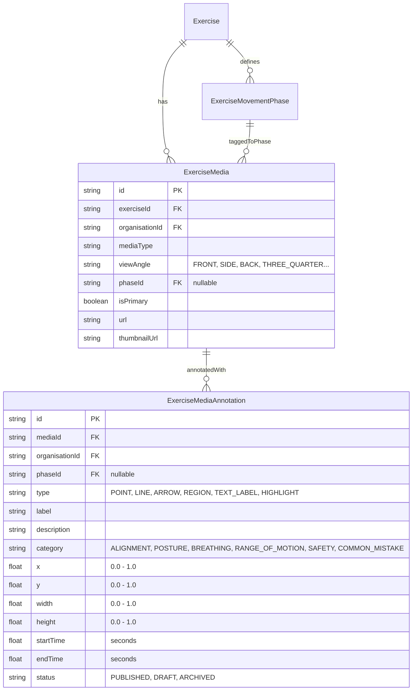

# FitBeat Multi-Angle Exercise Demonstrations & Visual Comparison Architecture

## 1. Executive Summary & Core Objective

FitBeat Day 77 upgrades the visual exercise education system from a single demonstration into a **rich, multi-angle visual demonstration and authored technique comparison system**:

```text
Exercise
   ↓
Visual Demonstration
   ├── Front View
   ├── Side View
   ├── Rear View
   ├── Three-Quarter View
   ├── Close-Up
   └── Phase-Specific View
            ↓
     Visual Comparison
            ↓
      Technique Cues
            ↓
       Learning Practice
```

In strength training, gymnastics, and physical rehabilitation, observing movement from a single fixed angle conceals critical biomechanical planes. For example:
- A **Front View** of a barbell back squat clearly reveals lateral stance width, foot progression angle, and inward knee collapse (valgus deviation), but conceals lumbar flexion (butt wink) or barbell vertical path.
- A **Side View** reveals hip hinge depth, torso-to-shin angle parallelism, and lumbar lordosis preservation, but fails to show asymmetrical lateral weight shifting.
- A **Rear View** exposes unilateral hip drops, pelvic rotation, and scapular retraction discrepancies under axial load.

Day 77 introduces multi-angle media tagging, deterministic view resolution, synchronized side-by-side / stacked compare mode, phase-specific visual angle routing, and authored visual cue annotations with normalized coordinate overlays.

---

## 2. Architectural Boundaries & Ethical Guarantees

### 2.1 Purely Authored Educational Visual Content (No CV / Pose Estimation)
FitBeat explicitly avoids camera computer vision, automated pose estimation algorithms (such as OpenPose or MediaPipe), and automated movement scoring:
- All angle viewpoints, visual cue annotations, and comparison cards are **authored by certified human strength coaches, physical therapists, and sports biomechanists**.
- The system teaches members how to develop proprioceptive self-awareness and visual movement Literacy rather than delegating form evaluation to fallible camera sensors.

### 2.2 Strict Decoupling from Workout Performance Logging
- Browsing demonstration angles, scrubbing timestamps, toggling compare mode, or inspecting technique cues **NEVER** creates phantom entries in `Workout` or `WorkoutExercise` tables.
- Athletic performance logging remains completely isolated to actual workout executions.

### 2.3 Deterministic Angle Fallback Hierarchy
To preserve backward compatibility with legacy media assets created prior to Day 77:
1. Configured primary media angle (`primaryMedia.viewAngle`)
2. `'SIDE'` view if media tagged with `'SIDE'` exists
3. `'FRONT'` view if media tagged with `'FRONT'` exists
4. First available angle in `availableAngles`
5. Legacy un-tagged media fallback

### 2.4 Normalized Responsive Coordinates ($0.0 \le x, y, width, height \le 1.0$)
All authored visual annotations store coordinates as normalized floating-point percentages between $0.0$ and $1.0$. This ensures markers map precisely across all mobile screen densities, tablet viewports, and varying video aspect ratios (16:9, 4:3, 1:1, 9:16).

---

## 3. Database Architecture (Prisma Schema)



### Schema Extensions in `services/api/prisma/schema.prisma`
- `ExerciseMedia`:
  - `viewAngle`: Nullable string indexed for rapid angle retrieval (`FRONT`, `BACK`, `LEFT`, `RIGHT`, `SIDE`, `THREE_QUARTER`, `OVERHEAD`, `CLOSE_UP`, `CUSTOM`).
  - `phaseId`: Nullable UUID foreign key linking media directly to movement phases.
  - `phase`: Optional relation to `ExerciseMovementPhase` via `@relation("PhaseAngleMedia")`.
  - `annotations`: Relation to `ExerciseMediaAnnotation[]`.
- `ExerciseMovementPhase`:
  - `taggedMedia`: Relation to `ExerciseMedia[]` via `@relation("PhaseAngleMedia")`.
- `ExerciseMediaAnnotation`:
  - Full CRUD model capturing normalized spatial coordinates, timestamp windows, educational categories, and publishing workflow states.

---

## 4. API Endpoints & Service Contracts

### 4.1 Angle Views & Grouping
- `GET /exercises/:id/media/views`:
  - Returns `MediaViewsGroupDto` containing `defaultAngle`, list of `availableAngles`, media array grouped by angle (`views: Record<string, ExerciseMedia[]>`), and angle metadata.
- `GET /exercises/:id/media/phases`:
  - Returns `PhaseMediaViewDto[]` grouping media by phase sequence order and available angles for that specific phase.

### 4.2 Authored Visual Annotations Lifecycle
- `GET /exercise-media/:id/annotations?phaseId=&category=&status=`:
  - Retrieves annotations for a media asset. Members only receive `PUBLISHED` annotations; trainers/admins can query all statuses.
- `POST /exercise-media/:id/annotations`:
  - Creates a new visual annotation. Validates coordinate bounds ($0 \le x, y, width, height \le 1$) and timestamp ranges ($startTime \le endTime$).
- `PATCH /exercise-media/:id/annotations/:annotationId`:
  - Updates annotation properties, coordinates, or category.
- `DELETE /exercise-media/:id/annotations/:annotationId`:
  - Permanently removes an annotation with multi-tenant organization boundary checks.

---

## 5. Mobile Experience & Components

### 5.1 `ExerciseAngleViewer.tsx`
- **Horizontal Angle Selector**: Interactive pill bar displaying angles (`Front View`, `Side View`, `Rear View`, `3/4 Angle`, `Close-Up`) with asset count badges.
- **Single View vs Compare Mode**:
  - In Single View: High-resolution demonstration canvas with full controls.
  - In Compare Mode: Stacked dual views (e.g. Front View + Side View) with **synchronized playback timers, play/pause controls, and scrub state**.
- **Phase Synchronization**: When `activePhase` changes, the viewer highlights the phase watermark and auto-focuses on the phase's designated demonstration media.
- **Authored Annotation Overlay**:
  - Renders pins, lines, arrows, bounding boxes, labels, and glow highlights using normalized percentages.
  - Tapping an annotation opens an educational detail card displaying the cue's anatomical rationale and timing.
  - Category filter chips (`Alignment`, `Posture`, `Breathing`, `Range of Motion`, `Safety`, `Common Mistake`).
- **Playback Controls**: Play/pause, scrub slider, speed selector (0.5x, 0.75x, 1x, 1.25x, 1.5x, 2x), and phase looping.
- **Graceful Fallback**: Video $\to$ Animation $\to$ High-Res Image $\to$ Illustrated Guide Card.
- **Trainer Authoring Mode**: When `isTrainer=true`, tapping on the canvas captures normalized coordinates and opens the authoring modal.

### 5.2 `TechniqueComparison.tsx`
- **Cross-Angle Biomechanical Analysis**: Side-by-side comparison cards illustrating what each perspective reveals (e.g. Stance & knee tracking from Front vs Hip hinge & spine curvature from Side).
- **Correct Technique vs Common Mistake**:
  - Green / Accent card detailing optimal biomechanics and constructive mental cues.
  - Warning / Amber card explaining common deviations with neutral educational language (explaining the anatomical risk and why the deviation occurs).
- **Visual Cue Legend**: Explains each color-coded category and icon convention.

### 5.3 `ExerciseMediaAnnotationEditorModal.tsx`
- Interactive coach authoring modal with tap-to-place normalized coordinate preview ($x\%, y\%$), category picker, marker type selection, timestamp inputs, and validation feedback.

### 5.4 Screen Integrations
- `InteractiveExerciseTutorial.tsx`: Members can switch angles directly inside the interactive tutorial player without losing step or phase position.
- `ExerciseDetailScreen.tsx`: Overview tab contains a direct launch banner to the Multi-Angle Technique Studio; Visuals tab embeds the full interactive viewer and technique comparison suite.

---

## 6. Verification & Automated Testing

### Backend E2E Test Suite (`services/api/test/exercise-multi-angle.e2e-spec.ts`)
- **Multi-Angle Creation & Tagging**: Verified `viewAngle` and `phaseId` assignment and filtering.
- **Deterministic Resolution**: Verified default angle resolution (Primary $\to$ Side $\to$ Front $\to$ Available).
- **Phase Organization**: Verified multi-phase angle grouping.
- **Annotation Validation**: Verified rejection of out-of-bounds coordinates ($x > 1.0$) and inverted timestamps ($startTime > endTime$).
- **Multi-Tenant Security**: Verified cross-tenant modification prevention.

### Mobile TypeScript Validation
- `apps/mobile`: Type check confirmed **0 errors in `src/features/exercises`**.

---

## 7. Day 78 Readiness (Future Expansion)

Day 77 provides the foundational visual infrastructure for Day 78:
- **Biomechanical Angle Presets**: Curated camera angles for Olympic weightlifting, gymnastics, and powerlifting.
- **Phase Marker Interpolation**: Smooth scrubbing between movement phases synced across multi-angle views.
- **Trainer Video Voiceover Cues**: Audio synchronization aligned with specific angle time-stamps.
- **Interactive Stance & Grip Calibrator**: Authoring tool for measuring grip width and foot stance angles visually.
