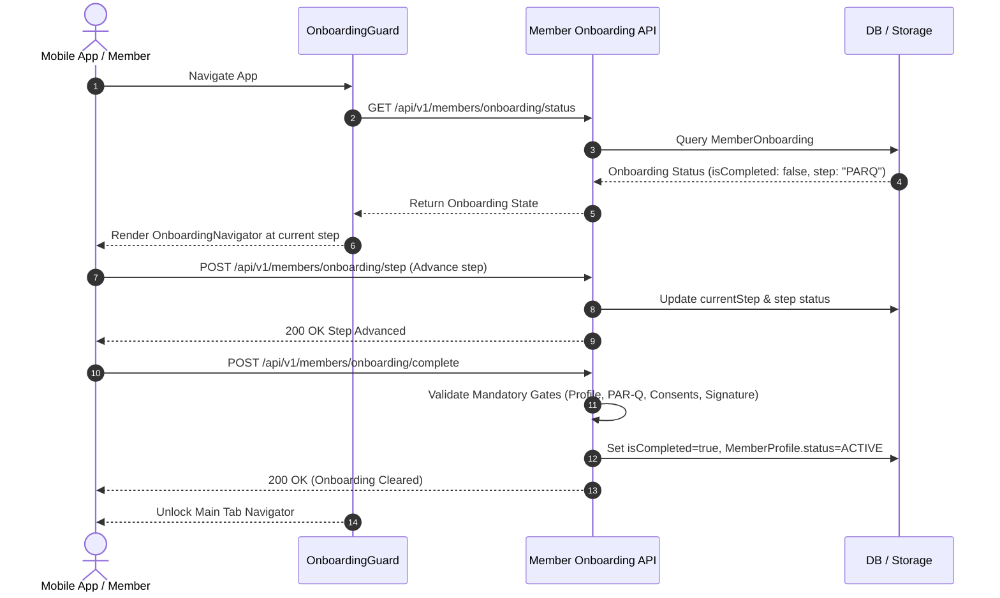

# FitCore Member Onboarding Workflow Architecture

## Overview

The FitCore Member Onboarding engine orchestrates a comprehensive, compliant onboarding sequence designed to capture profile details, assess physical exercise readiness (PAR-Q), collect health screenings and injury histories, legally record consent agreements, cryptographically capture digital signatures, and securely archive compliance documentation.



---

## 1. The 10 Mobile Onboarding Steps

| Step # | Route / Step Name | Purpose | Gate Condition |
|---|---|---|---|
| 0 | `Welcome` | Introduces club values, onboarding journey, and privacy assurances | User clicks "Get Started" |
| 1 | `Profile` | Captures preferred name, emergency contact name & phone | Both emergency fields required |
| 2 | `PARQ` | Standard Physical Activity Readiness Questionnaire (7 items) | All questions answered; risk flagged if any "Yes" |
| 3 | `HealthScreening` | Records medical conditions, allergies, medications, and vitals | Optional or declared |
| 4 | `Injuries` | Captures active or prior injuries with body area, severity & notes | Structured logging |
| 5 | `Consent` | Presents Terms, Privacy, Health Data, Wearables & AI terms | Mandatory consents must be explicitly accepted |
| 6 | `DocumentUpload`| Allows uploading physician clearance or ID document | Required if high-risk PAR-Q flagged |
| 7 | `Signature` | Digital signature canvas with touch/stylus capturing base64 data | Valid signature path required |
| 8 | `Review` | Consolidated review of profile, PAR-Q, consents & signature | Confirmation by member |
| 9 | `Complete` | Congratulatory confirmation unlocking facility access | State committed to backend |

---

## 2. Onboarding State Tracking (`MemberOnboarding`)

The backend tracks onboarding progress via `MemberOnboarding`:

```prisma
model MemberOnboarding {
  id                  String           @id @default(uuid())
  memberId            String           @unique
  currentStep         OnboardingStep   @default(PROFILE)
  isCompleted         Boolean          @default(false)
  completedAt         DateTime?
  stepProfileCompleted   Boolean       @default(false)
  stepParqCompleted      Boolean       @default(false)
  stepHealthCompleted    Boolean       @default(false)
  stepInjuriesCompleted  Boolean       @default(false)
  stepConsentCompleted   Boolean       @default(false)
  stepSignatureCompleted Boolean       @default(false)
  stepDocumentsCompleted Boolean       @default(false)
}
```

- Each step can be saved progressively without losing draft state.
- Members who close the mobile app resume at their exact `currentStep`.

---

## 3. Mandatory Completion Validation Gate

Calling `POST /api/v1/members/onboarding/complete` performs a strict backend validation check:

```typescript
// Verification Checklist:
1. MemberProfile exists with valid emergencyContactName and emergencyContactPhone.
2. PAR-Q questionnaire submission exists with status 'SUBMITTED' or 'APPROVED'.
3. All mandatory ConsentTypes (TERMS_AND_CONDITIONS, PRIVACY_POLICY, HEALTH_DATA_PROCESSING) have accepted ConsentRecords on the current active version.
4. An ONBOARDING_AGREEMENT Signature record exists.
```

If any check fails, the API responds with `400 Bad Request` citing the specific missing prerequisites. Upon success, `isCompleted` is set to `true`, `completedAt` is recorded, and `MemberProfile.status` transitions from `ONBOARDING` to `ACTIVE`.

---

## 4. Mobile OnboardingGuard

The mobile application architecture wraps all authenticated screens in an `OnboardingGuard`:

```tsx
export const OnboardingGuard: React.FC<OnboardingGuardProps> = ({ children }) => {
  const { isCompleted, isLoading } = useOnboardingStore();
  
  if (isLoading) return <LoadingScreen />;
  if (!isCompleted) return <OnboardingNavigator />;
  return <>{children}</>;
};
```

This guarantees that unverified or non-consented members cannot view or interact with gym facilities, QR door codes, or class schedules until compliance requirements are met.
