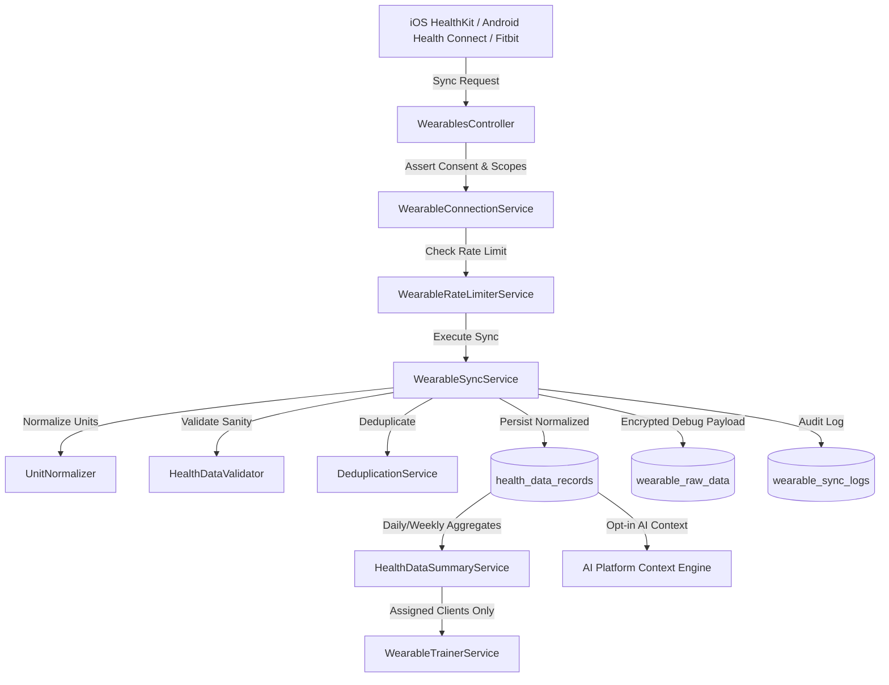

# FitCore Wearables Integration Architecture

## Overview
The Wearables Integration Foundation (Day 23) enables members to connect personal health telemetry devices and platforms (Apple Health, Google Health Connect, Fitbit) directly to their FitCore member profile.

## Key Architectural Principles
1. **Member Ownership**: Data is owned strictly by the member profile, decoupled from outlet, staff, or membership lifecycles.
2. **Provider-Neutral Design**: Core services interact through the generic `IWearableProvider` interface, allowing unified sync mechanics across native OS SDKs and cloud APIs.
3. **Canonical Normalization**: All incoming metrics are normalized into canonical FitCore units (`km`, `kcal`, `steps`, `minutes`, `bpm`).
4. **Idempotency & Deduplication**: Every record is fingerprinted (SHA-256) and deduplicated against `[connectionId, dataType, sourceRecordId]`.
5. **Scoped Coach Access**: Personal trainers can only view aggregated daily activity metrics for assigned clients (`TrainerClientAssignment`), with zero raw sensor telemetry exposed.

## System Topology & Flow

## Data Models
- **`WearableConnection`**: Connection metadata, encrypted tokens, authorization scopes, status (`CONNECTED`, `SYNCING`, `DISCONNECTED`, `ERROR`, `REVOKED`).
- **`HealthDataRecord`**: Normalized telemetry records with UTC timestamps, canonical units, timezone, and source device metadata.
- **`WearableSyncLog`**: Full audit log of sync executions, durations, record counts, and failure reasons.
- **`WearableRawData`**: Short-term (7-day retention) encrypted provider payloads for debugging.
