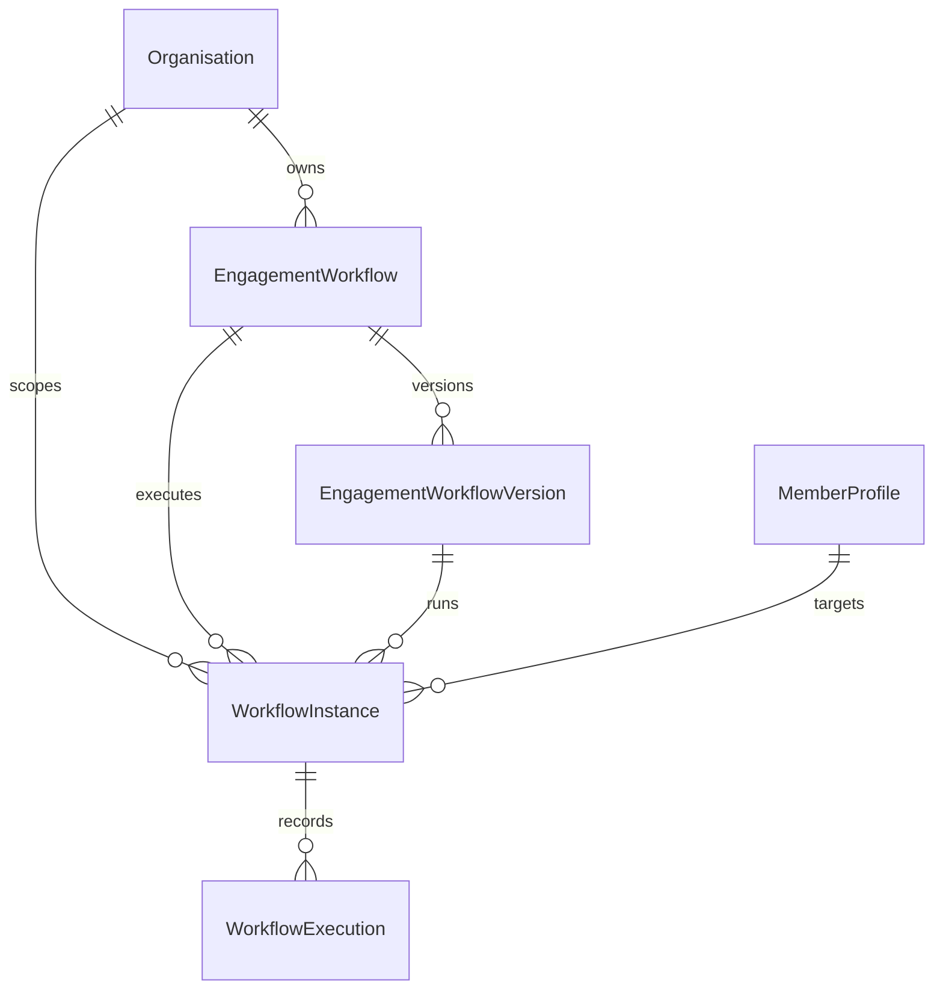

# Automated Engagement Workflows Architecture

## Overview

The FitCore **Automated Engagement Workflows Engine** provides an event-driven, deterministic automation system designed for fitness facilities. It transforms member signals and telemetry into safe, contextual engagement touchpoints.

```text
EVENT → RULE → ELIGIBILITY → SAFETY → ACTION → APPROVAL → EXECUTION → OUTCOME
```

---

## 1. Engine Pipeline Stages

### 1. EVENT (Trigger Ingestion)
Workflows are triggered by normalized domain events (`WorkflowTriggerEvent`). Supported triggers include:
- `INACTIVITY_DAYS_REACHED`: Member has not checked in for $N$ consecutive days.
- `ATTENDANCE_DROP_PERCENT`: Member's 4-week attendance dropped by $\ge X\%$.
- `CLASS_MISSED`: Member missed a booked group fitness session.
- `MULTIPLE_SESSIONS_MISSED`: Member missed 2+ consecutive personal training or class bookings.
- `MEMBERSHIP_EXPIRING`: Membership expiration date is within $N$ days.
- `MEMBER_REENGAGED`: Member checks in after $\ge 14$ days of inactivity.
- `WORKOUT_MILESTONE_REACHED`: Member completes their 25th, 50th, or 100th workout.
- `ONBOARDING_STEP_COMPLETED`: New member completes an onboarding milestone.

### 2. RULE (Condition Evaluation)
The `ConditionEvaluatorService` evaluates declarative leaf and compound (`AND` / `OR`) conditions against:
- Trigger payload
- Member profile attributes
- Day 29 canonical retention metrics (`inactivityDays`, `attendanceDropPercent`, etc.)

Supported operators:
`EQUALS`, `NOT_EQUALS`, `GREATER_THAN`, `GREATER_THAN_OR_EQUAL`, `LESS_THAN`, `LESS_THAN_OR_EQUAL`, `IN`, `NOT_IN`, `CONTAINS`, `NOT_CONTAINS`, `BETWEEN`, `IS_TRUE`, `IS_FALSE`, `IS_NULL`, `IS_NOT_NULL`.

### 3. ELIGIBILITY (Audience Filtering)
`EligibilityService` checks:
- Multi-tenant boundary: Organisation match and Outlet scoping.
- Membership status and tier (`ACTIVE`, `EXPIRED`, etc.).
- Member tenure: Minimum and maximum days since join date.
- Trainer client scoping: Confirms trainer client assignments.
- Member tags and custom conditions.

### 4. SAFETY (Guardrails & Limits)
`WorkflowSafetyService` & `CooldownService` enforce:
- **Prohibited Action Blockers**: Zero autonomous cancellations, price adjustments, discounts, or gate lockout changes.
- **Cooldown Scopes**: `MEMBER`, `WORKFLOW`, `MEMBER_AND_WORKFLOW`, `ORGANISATION`.
- **Quiet Hours**: Communications respect local gym timezone (default 22:00 to 07:00), automatically rescheduling to next daylight window.
- **Anti-Shaming Content Filter**: Prohibits toxic, shaming, or guilt-inducing copy (`lazy`, `fat`, `failure`, `disgrace`).

### 5. ACTION (Step Routing)
Supported actions:
- `SEND_COMMUNICATION`: Dispatches exclusively through the Day 28 Centralized Communication Engine (`CommunicationOrchestratorService`).
- `CREATE_STAFF_TASK`: Dispatches task to staff queue (`RetentionOutreach`).
- `SEND_IN_APP_NOTIFICATION`: In-app push notification for member.
- `NOTIFY_ASSIGNED_TRAINER`: In-app alert to member's assigned coach.
- `NOTIFY_MANAGER`: Escalation notification to outlet manager.
- `ADD_ENGAGEMENT_NOTE`: Auditable timeline record.
- `ADD_MEMBER_TAG` / `REMOVE_MEMBER_TAG`: Member tagging.
- `DELAY`: Scheduled delay before next step.

### 6. APPROVAL (Human-in-the-Loop)
If a workflow is configured with `approvalMode: ALWAYS_REQUIRED` or an action has `requireApproval: true`:
- The instance pauses in `AWAITING_APPROVAL`.
- An entry is placed in the staff review queue.
- Staff can **Approve** (resumes execution) or **Reject** with an audit reason (cancels instance).

### 7. EXECUTION (Audit & Tracking)
- Every step is recorded in `WorkflowExecution` with input payload, execution output, timestamp, and retry/failure status.

### 8. OUTCOME (Non-Causal Post-Workflow Telemetry)
The engine records subsequent member behavior following workflow execution:
- `subsequentVisitsFollowingWorkflow`: Visits observed after completion.
- `subsequentBookingsFollowingWorkflow`: Bookings made after completion.
- `engagementTrendFollowingWorkflow`: Non-causal trend classification (`INCREASED`, `STABLE`, `DECREASED`, `INSUFFICIENT_DATA`).
- **Critical Principle**: Metrics are strictly framed as **"FOLLOWING WORKFLOW"**, never **"CAUSED BY WORKFLOW"**.

---

## 2. Database Schema Relationships



---

## 3. Communication & AI Integration Boundaries

1. **Centralized Communication Routing**:
   Workflow actions never call Twilio, SendGrid, or WhatsApp directly. All communications route through `CommunicationOrchestratorService.submitCommunication(...)` to respect opt-outs, templates, and delivery logging.

2. **AI Platform Boundary**:
   Workflow generation and drafting utilize `AIOrchestratorService` with feature `AUTOMATION_ASSISTANT`. The AI assistant is strictly a drafter/recommender; all executions remain deterministic.
