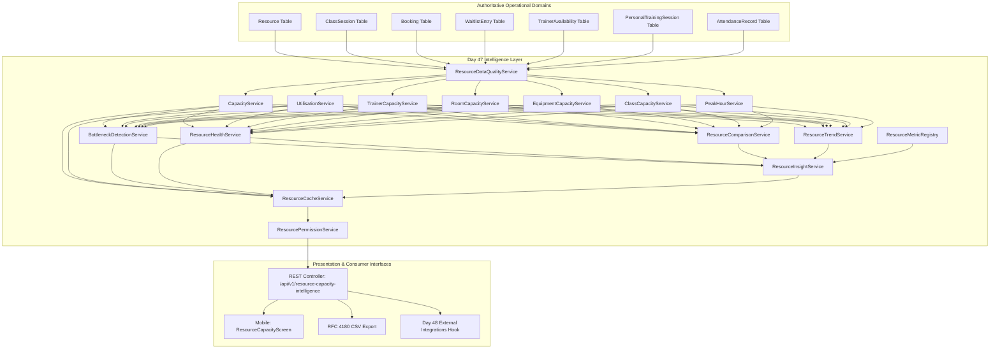

# Resource & Capacity Intelligence Architecture

## 1. Objective & Purpose
FitCore Day 47 establishes an authoritative **Resource & Capacity Intelligence Layer** across all organisation facilities. It provides executive management, outlet operations leads, and fitness directors with unified visibility into:
- Physical space utilization across studios, rooms, courts, and training zones.
- Trainer availability, client allocations, class schedules, and burn-out risks.
- Equipment demand, maintenance lifecycle status, and booking frequencies.
- Group fitness class fill velocity versus actual physical attendance utilisation.
- Uncaptured member demand signaled through waitlist queues.
- Timezone-aware 24x7 peak hour matrices (168 hourly time slots per outlet).
- Explainable operational bottlenecks with concrete evidence and suggested human interventions.

---

## 2. Core Architectural Principles

### 2.1 Authoritative Operational Truth
This layer is strictly an **intelligence, measurement, and advisory system**.
- It consumes operational data exclusively from authoritative FitCore tables: `Resource`, `ClassSession`, `Booking`, `WaitlistEntry`, `TrainerAvailability`, `PersonalTrainingSession`, and `AttendanceRecord`.
- It **never** duplicates scheduling state or creates a shadow database.

### 2.2 Strict Human Decision Safeguard
- **No Autonomous Scheduling Alterations**: AI agents and automated services are explicitly forbidden from canceling sessions, reassigning instructors, modifying capacities, or booking resources.
- **Workflow Mandate**: `OBSERVE → MEASURE → COMPARE → IDENTIFY BOTTLENECK → EXPLAIN → RECOMMEND → HUMAN DECISION`.
- Every bottleneck and insight surfaces an explicit `humanDecisionRequired` flag.

### 2.3 Explicit Metric Separation
To eliminate deceptive reporting, the architecture disentangles:
1. **Booking Fill Rate**:
   $$\text{Fill Rate (\%)} = \left(\frac{\text{Confirmed Bookings}}{\text{Configured Capacity}}\right) \times 100$$
2. **Attendance Utilisation**:
   $$\text{Attendance Utilisation (\%)} = \left(\frac{\text{Physical Check-ins}}{\text{Configured Capacity}}\right) \times 100$$
3. **No-Show Rate**:
   $$\text{No-Show Rate (\%)} = \left(\frac{\text{Confirmed Bookings} - \text{Physical Check-ins}}{\text{Confirmed Bookings}}\right) \times 100$$

A class session can register 100% Booking Fill Rate while suffering an Attendance Utilisation of only 25% due to a 75% No-Show Rate. FitCore makes this divergence visible to management.

---

## 3. High-Level System Architecture

---

## 4. Multi-Tenant Isolation & Role-Based Scope
Every query passes through `ResourcePermissionService.resolveScope`:
- **SUPERADMIN / OWNER / ADMIN**: Unrestricted organisation-wide visibility or filtered to any outlet.
- **OUTLET_MANAGER / STAFF**: Strictly constrained to their assigned `outletId`. Attempting to access cross-outlet data triggers `403 Forbidden`.
- **TRAINER**: Allowed access only to their own operational trainer capacity; blocked from executive overview and comparative matrices.
- **MEMBER**: Completely blocked (`403 Forbidden`) from accessing resource intelligence endpoints.
