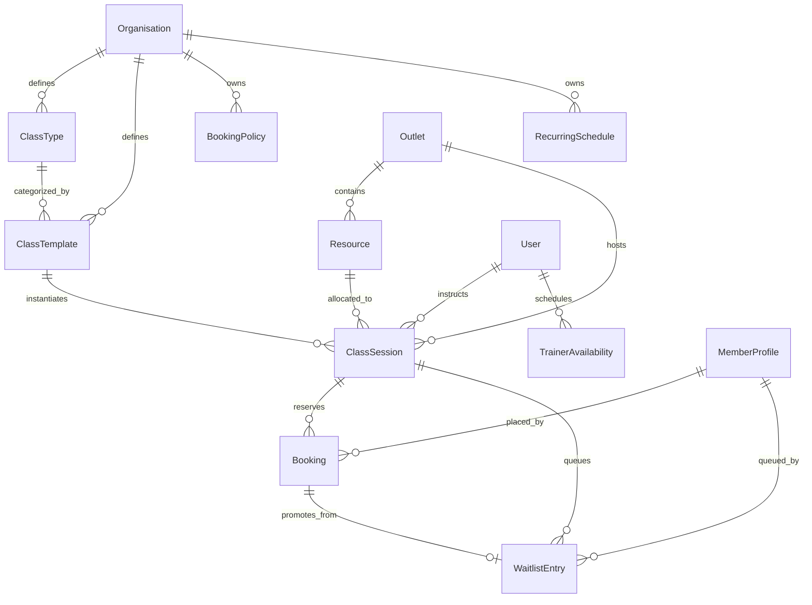

# FitCore Booking & Scheduling Database Model (Day 8)

## 1. Relational Schema Architecture

The Day 8 schema integrates tightly with the multi-tenant architecture established in Days 1–7.

### Entity Relationship Diagram (ERD)

---

## 2. Models & Data Dictionary

### 2.1 `ClassType`
Categorical workout definitions owned by the Organisation.
- `id`: UUID, Primary Key
- `organisationId`: UUID, Foreign Key (`Organisation.id`)
- `name`: String (e.g., "HIIT Blast", "Power Yoga")
- `code`: String, unique per organisation
- `category`: Enum (`HIIT`, `YOGA`, `STRENGTH`, `SPIN`, `PILATES`, `BOXING`, `MOBILITY`, `RECOVERY`, `DANCE`)
- `description`: String (optional)
- `durationMinutes`: Int (default: 45)
- `defaultCapacity`: Int (default: 20)
- `defaultWaitlistCapacity`: Int (default: 5)
- `color`: String (hex color code for UI calendars)
- `isActive`: Boolean (default: true)
- `createdAt`, `updatedAt`: DateTime

### 2.2 `ClassTemplate`
Predefined session blueprints combining a `ClassType`, default duration, and capacity.
- `id`: UUID, Primary Key
- `organisationId`: UUID, Foreign Key (`Organisation.id`)
- `classTypeId`: UUID, Foreign Key (`ClassType.id`)
- `name`: String
- `description`: String (optional)
- `durationMinutes`: Int
- `capacity`: Int
- `waitlistCapacity`: Int
- `isActive`: Boolean

### 2.3 `BookingPolicy`
Organisation-level rules governing cancellation windows, open lead times, and no-show restrictions.
- `id`: UUID, Primary Key
- `organisationId`: UUID, Foreign Key (`Organisation.id`)
- `name`: String (e.g., "Standard Org Policy")
- `cancellationCutoffMinutes`: Int (e.g., 120 minutes prior to session)
- `bookingWindowOpenDays`: Int (e.g., 7 days in advance)
- `bookingWindowCloseMinutes`: Int (e.g., 10 minutes prior to start)
- `maxActiveBookingsPerMember`: Int (e.g., 3)
- `maxDailyBookingsPerMember`: Int (e.g., 2)
- `allowWaitlist`: Boolean (default: true)
- `isDefault`: Boolean (default: false)

### 2.4 `Resource`
Physical spaces within an Outlet (rooms, studios, pool lanes, cages).
- `id`: UUID, Primary Key
- `outletId`: UUID, Foreign Key (`Outlet.id`)
- `name`: String (e.g., "Studio 1", "Spin Room")
- `type`: Enum (`STUDIO`, `ROOM`, `LANE`, `CAGE`, `COURT`, `EQUIPMENT`)
- `capacity`: Int
- `isActive`: Boolean
- Unique index on `[outletId, name]`

### 2.5 `ClassSession`
An actual scheduled occurrence of a class at an Outlet.
- `id`: UUID, Primary Key
- `outletId`: UUID, Foreign Key (`Outlet.id`)
- `classTypeId`: UUID, Foreign Key (`ClassType.id`)
- `classTemplateId`: UUID, Foreign Key (`ClassTemplate.id`, optional)
- `resourceId`: UUID, Foreign Key (`Resource.id`, optional)
- `trainerId`: UUID, Foreign Key (`User.id`, optional)
- `bookingPolicyId`: UUID, Foreign Key (`BookingPolicy.id`, optional)
- `name`: String
- `startsAt`: DateTime
- `endsAt`: DateTime
- `capacity`: Int
- `waitlistCapacity`: Int
- `status`: Enum (`SCHEDULED`, `ACTIVE`, `COMPLETED`, `CANCELLED`)
- `cancellationReason`: String (optional)
- Indexes: `[outletId, startsAt]`, `[trainerId, startsAt]`, `[resourceId, startsAt]`

### 2.6 `Booking`
Member reservation for a session spot.
- `id`: UUID, Primary Key
- `classSessionId`: UUID, Foreign Key (`ClassSession.id`)
- `memberProfileId`: UUID, Foreign Key (`MemberProfile.id`)
- `status`: Enum (`CONFIRMED`, `WAITLISTED`, `CANCELLED`, `ATTENDED`, `NO_SHOW`)
- `bookedByStaffId`: UUID (optional, for front-desk bookings)
- `confirmedAt`: DateTime (optional)
- `cancelledAt`: DateTime (optional)
- `cancellationReason`: String (optional)
- `attendedAt`: DateTime (optional)
- `idempotencyKey`: String (optional, unique per session)
- Unique Index: `[memberProfileId, classSessionId]` (prevents multiple active bookings for same session)

### 2.7 `WaitlistEntry`
Queue position tracking for over-capacity sessions.
- `id`: UUID, Primary Key
- `classSessionId`: UUID, Foreign Key (`ClassSession.id`)
- `memberProfileId`: UUID, Foreign Key (`MemberProfile.id`)
- `bookingId`: UUID, Foreign Key (`Booking.id`, unique 1:1)
- `position`: Int (1-based FIFO position)
- `status`: Enum (`PENDING`, `PROMOTED`, `EXPIRED`, `CANCELLED`)
- `promotedAt`: DateTime (optional)
- `expiredAt`: DateTime (optional)
- Indexes: `[classSessionId, status, position]`

### 2.8 `TrainerAvailability`
Weekly availability and time-off blocks for instructors.
- `id`: UUID, Primary Key
- `trainerId`: UUID, Foreign Key (`User.id`)
- `dayOfWeek`: Int (0=Sunday ... 6=Saturday)
- `startTime`: String (HH:mm)
- `endTime`: String (HH:mm)
- `isSpecificDate`: Boolean
- `specificDate`: DateTime (optional)
- `isBlocked`: Boolean (default: false)

### 2.9 `RecurringSchedule`
RRule-based generation of recurring sessions.
- `id`: UUID, Primary Key
- `organisationId`: UUID, Foreign Key (`Organisation.id`)
- `outletId`: UUID, Foreign Key (`Outlet.id`)
- `classTemplateId`: UUID, Foreign Key (`ClassTemplate.id`)
- `resourceId`: UUID, Foreign Key (`Resource.id`, optional)
- `trainerId`: UUID, Foreign Key (`User.id`, optional)
- `rrule`: String (e.g., "FREQ=WEEKLY;BYDAY=MO,WE,FR")
- `startTime`: String (HH:mm)
- `durationMinutes`: Int
- `startDate`: DateTime
- `endDate`: DateTime (optional)
- `isActive`: Boolean

---

## 3. Database Indexes & Performance Strategy
1. **Pessimistic Concurrency**:
   - `SELECT ... FOR UPDATE` on `ClassSession.id` locks only the target session record during capacity acquisition.
2. **Session Lookup Indexes**:
   - Composite index `[outletId, startsAt]` guarantees instant filtering by day and outlet without full table scans.
3. **Waitlist FIFO Promotion Index**:
   - Composite index `[classSessionId, status, position]` allows `O(1)` index seek of candidate #1 (`WHERE status = 'PENDING' ORDER BY position ASC LIMIT 1`).
4. **Duplicate Booking Prevention**:
   - Unique composite constraint on `(memberProfileId, classSessionId)` prevents race-condition double-booking.
