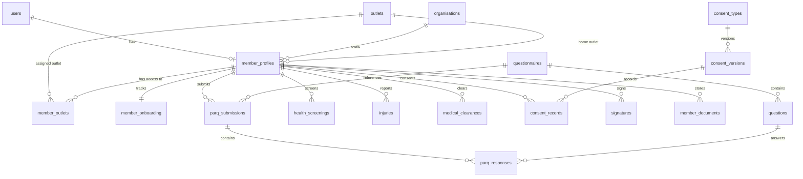

# FitCore Member Domain Database Schema

## Overview

The Day 4 schema introduces 12 relational models to support member profiles, multi-outlet mappings, onboarding state machines, PAR-Q surveys, health profiles, injury tracking, compliance consents, and digital signatures.

---

## 1. Entity Relationship Diagram

---

## 2. Table Specifications

### `member_profiles`
| Column | Type | Constraints | Description |
|---|---|---|---|
| `id` | UUID | PK, default `uuid()` | Unique member profile identifier |
| `user_id` | UUID | UNIQUE, FK `users(id)` | Identity user mapping |
| `organisation_id` | UUID | FK `organisations(id)` | Multi-tenant organization scope |
| `home_outlet_id` | UUID | FK `outlets(id)` | Primary facility branch |
| `member_number` | VARCHAR(50) | UNIQUE | Organization-unique member code |
| `status` | ENUM | Default `ONBOARDING` | `PROSPECT`, `ONBOARDING`, `ACTIVE`, `SUSPENDED`, `CANCELLED`, `EXPIRED` |
| `preferred_name` | VARCHAR(100) | NULL | Optional preferred nickname |
| `date_of_birth` | DATE | NULL | Date of birth for age-based restrictions |
| `gender` | VARCHAR(50) | NULL | Self-identified gender |
| `phone_number` | VARCHAR(30) | NULL | Contact telephone |
| `emergency_contact_name` | VARCHAR(100) | NULL | Mandatory before onboarding completion |
| `emergency_contact_phone` | VARCHAR(30) | NULL | Mandatory before onboarding completion |
| `emergency_contact_relation`| VARCHAR(50) | NULL | Relationship to member |
| `created_at` | TIMESTAMP | Default `now()` | Audit creation timestamp |
| `updated_at` | TIMESTAMP | Auto-update | Audit update timestamp |

### `member_outlets`
| Column | Type | Constraints | Description |
|---|---|---|---|
| `id` | UUID | PK | Outlet mapping identifier |
| `member_id` | UUID | FK `member_profiles(id)` | Member reference |
| `outlet_id` | UUID | FK `outlets(id)` | Outlet facility reference |
| `is_home_outlet`| BOOLEAN | Default `false` | True if this is the member's primary club |
| `access_granted`| BOOLEAN | Default `true` | Gate access permission flag |
| `joined_at` | TIMESTAMP | Default `now()` | Branch association date |

*Indexes*: `UNIQUE(member_id, outlet_id)`

### `member_onboarding`
| Column | Type | Constraints | Description |
|---|---|---|---|
| `id` | UUID | PK | Onboarding record identifier |
| `member_id` | UUID | UNIQUE, FK `member_profiles(id)` | Member reference |
| `current_step` | ENUM | Default `PROFILE` | `PROFILE`, `PARQ`, `HEALTH_SCREENING`, `INJURIES`, `CONSENT`, `DOCUMENT_UPLOAD`, `SIGNATURE`, `REVIEW`, `COMPLETE` |
| `is_completed` | BOOLEAN | Default `false` | Overall onboarding completion flag |
| `completed_at` | TIMESTAMP | NULL | Time of completion |
| `step_*_completed`| BOOLEAN | Default `false` | Per-step completion indicators |

### `questionnaires` & `questions`
- **`questionnaires`**: Defines survey instruments (e.g. `PAR_Q`, `MEDICAL_HISTORY`) with version code and active state (`isActive = true`).
- **`questions`**: Individual question prompts with type (`YES_NO`, `TEXT`, `MULTIPLE_CHOICE`), display order, and `isRiskFlag` indicator.

### `parq_submissions` & `parq_responses`
- Records member responses to questionnaires. Automatically calculates `riskFlagged = true` if any risk-flagged question evaluates to `YES`.

### `health_screenings`, `injuries`, & `medical_clearances`
- **`health_screenings`**: Records medical conditions, medications, allergies, lifestyle flags, and optional vitals (BP, resting HR).
- **`injuries`**: Captures injury history, body area, severity (`MILD`, `MODERATE`, `SEVERE`), ongoing restrictions, and recovery status.
- **`medical_clearances`**: Tracks physician waivers and fitness clearances with approval status (`PENDING`, `APPROVED`, `REJECTED`), physician credentials, and expiration dates.

### `consent_types`, `consent_versions`, & `consent_records`
- Versioned legal contracts with immutable consent acceptance logs capturing member ID, version ID, IP address, user agent, and timestamps.

### `signatures` & `member_documents`
- **`signatures`**: Cryptographic storage of digital touch signatures, signature type (`ONBOARDING_AGREEMENT`, `PARQ_DECLARATION`, `MEDICAL_WAIVER`), and audit metadata.
- **`member_documents`**: Metadata for uploaded member documents (IDs, physician letters, agreements) linked to secure storage file keys.
