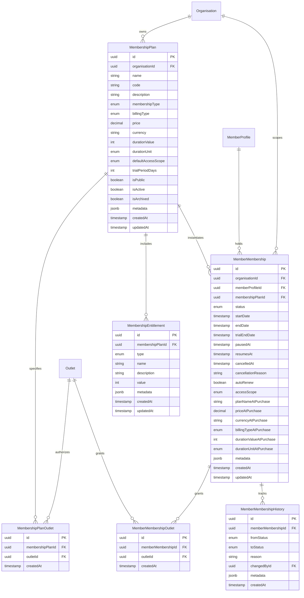

# FitCore Membership Database Schema

## Overview

The FitCore database schema for the Membership Domain establishes 6 core relational models designed for PostgreSQL, managed via Prisma ORM.

---

## 1. Relational Models

### `MembershipPlan`
Defines the commercial product catalog templates owned by an `Organisation`.

| Column | Type | Constraints | Description |
| :--- | :--- | :--- | :--- |
| `id` | `UUID` | Primary Key, default `gen_random_uuid()` | Unique plan identifier |
| `organisationId` | `UUID` | Foreign Key -> `Organisation.id`, indexed | Multi-tenant tenant identifier |
| `name` | `VARCHAR(100)` | Not Null | User-facing plan name |
| `code` | `VARCHAR(50)` | Not Null | Internal catalog code (e.g. `SW-PREM-MO`) |
| `description` | `TEXT` | Nullable | Detailed benefits and terms |
| `membershipType` | `MembershipType` | Enum (`STANDARD`, `TRIAL`, `CORPORATE`, `COMPLIMENTARY`, `STUDENT`) | Categorization |
| `billingType` | `BillingType` | Enum (`RECURRING`, `UPFRONT_FIXED_TERM`, `PAYG`) | Payment billing model |
| `price` | `DECIMAL(10,2)` | Not Null | Catalog price |
| `currency` | `VARCHAR(3)` | Default `'USD'` | ISO 4217 currency code |
| `durationValue` | `INTEGER` | Not Null | Duration quantity |
| `durationUnit` | `DurationUnit` | Enum (`DAY`, `WEEK`, `MONTH`, `YEAR`) | Time interval |
| `defaultAccessScope` | `MembershipAccessScope` | Enum (`SINGLE_OUTLET`, `MULTI_OUTLET`, `ALL_ORGANISATION_OUTLETS`) | Access level default |
| `trialPeriodDays` | `INTEGER` | Nullable | Grace trial duration in days |
| `isPublic` | `BOOLEAN` | Default `true` | Exposed on consumer mobile app |
| `isActive` | `BOOLEAN` | Default `true` | Available for purchase |
| `isArchived` | `BOOLEAN` | Default `false` | Soft-deleted / retired from catalog |
| `metadata` | `JSONB` | Nullable | Extensible custom properties |

**Unique Constraint**: `@@unique([organisationId, code])` prevents duplicate plan codes within a tenant.

---

### `MembershipEntitlement`
Defines specific service allowances attached to a `MembershipPlan`.

| Column | Type | Constraints | Description |
| :--- | :--- | :--- | :--- |
| `id` | `UUID` | Primary Key, default `gen_random_uuid()` | Unique entitlement identifier |
| `membershipPlanId` | `UUID` | Foreign Key -> `MembershipPlan.id`, Cascade Delete | Parent plan template |
| `type` | `EntitlementType` | Enum (`FACILITY_ACCESS`, `CLASSES_PER_WEEK`, `CLASSES_PER_MONTH`, `PT_SESSIONS`, `GUEST_PASSES`, `RECOVERY_ZONE`, `SAUNA`, `LOCKER`, `TOWEL_SERVICE`, `DISCOUNT_PERCENT`) | Entitlement category |
| `name` | `VARCHAR(100)` | Not Null | Display name (e.g. "Unlimited Guest Passes") |
| `description` | `TEXT` | Nullable | Benefit details |
| `value` | `INTEGER` | Nullable | Quantitative allowance (e.g., 2 PT sessions) |
| `metadata` | `JSONB` | Nullable | Configuration parameters |

---

### `MemberMembership`
The core commercial agreement between a `MemberProfile` and an `Organisation`.

| Column | Type | Constraints | Description |
| :--- | :--- | :--- | :--- |
| `id` | `UUID` | Primary Key, default `gen_random_uuid()` | Unique subscription identifier |
| `organisationId` | `UUID` | Foreign Key -> `Organisation.id`, indexed | Tenant boundary |
| `memberProfileId` | `UUID` | Foreign Key -> `MemberProfile.id`, indexed | Subscribed member |
| `membershipPlanId` | `UUID` | Foreign Key -> `MembershipPlan.id` | Source catalog template |
| `status` | `MembershipStatus` | Enum (`PENDING`, `ACTIVE`, `TRIAL`, `PAUSED`, `SUSPENDED`, `EXPIRED`, `CANCELLED`) | Lifecycle state |
| `startDate` | `TIMESTAMPTZ` | Not Null | Coverage inception |
| `endDate` | `TIMESTAMPTZ` | Nullable | Term expiration date |
| `trialEndDate` | `TIMESTAMPTZ` | Nullable | Trial termination date |
| `pausedAt` | `TIMESTAMPTZ` | Nullable | Freeze initiation timestamp |
| `resumesAt` | `TIMESTAMPTZ` | Nullable | Scheduled resume timestamp |
| `cancelledAt` | `TIMESTAMPTZ` | Nullable | Cancellation execution timestamp |
| `cancellationReason` | `TEXT` | Nullable | Reason for cancellation |
| `autoRenew` | `BOOLEAN` | Default `false` | Auto-renewal eligibility |
| `accessScope` | `MembershipAccessScope` | Not Null | Facility access authorization |
| `planNameAtPurchase` | `VARCHAR(100)` | Not Null | Immutable snapshot of plan name |
| `priceAtPurchase` | `DECIMAL(10,2)` | Not Null | Immutable snapshot of price |
| `currencyAtPurchase` | `VARCHAR(3)` | Not Null | Immutable snapshot of currency |
| `billingTypeAtPurchase` | `BillingType` | Not Null | Immutable snapshot of billing type |
| `durationValueAtPurchase` | `INTEGER` | Not Null | Immutable snapshot of duration value |
| `durationUnitAtPurchase` | `DurationUnit` | Not Null | Immutable snapshot of duration unit |
| `metadata` | `JSONB` | Nullable | Extensible subscription attributes |

---

### `MemberMembershipHistory`
Audit log recording all lifecycle status transitions for a `MemberMembership`.

| Column | Type | Constraints | Description |
| :--- | :--- | :--- | :--- |
| `id` | `UUID` | Primary Key, default `gen_random_uuid()` | History record ID |
| `memberMembershipId` | `UUID` | Foreign Key -> `MemberMembership.id`, Cascade Delete | Subscribed membership |
| `fromStatus` | `MembershipStatus` | Not Null | Prior lifecycle state |
| `toStatus` | `MembershipStatus` | Not Null | New lifecycle state |
| `reason` | `TEXT` | Nullable | Justification for change |
| `changedById` | `UUID` | Foreign Key -> `User.id` | User executing transition |
| `metadata` | `JSONB` | Nullable | Contextual metadata |
| `createdAt` | `TIMESTAMPTZ` | Default `now()` | Timestamp of state transition |
