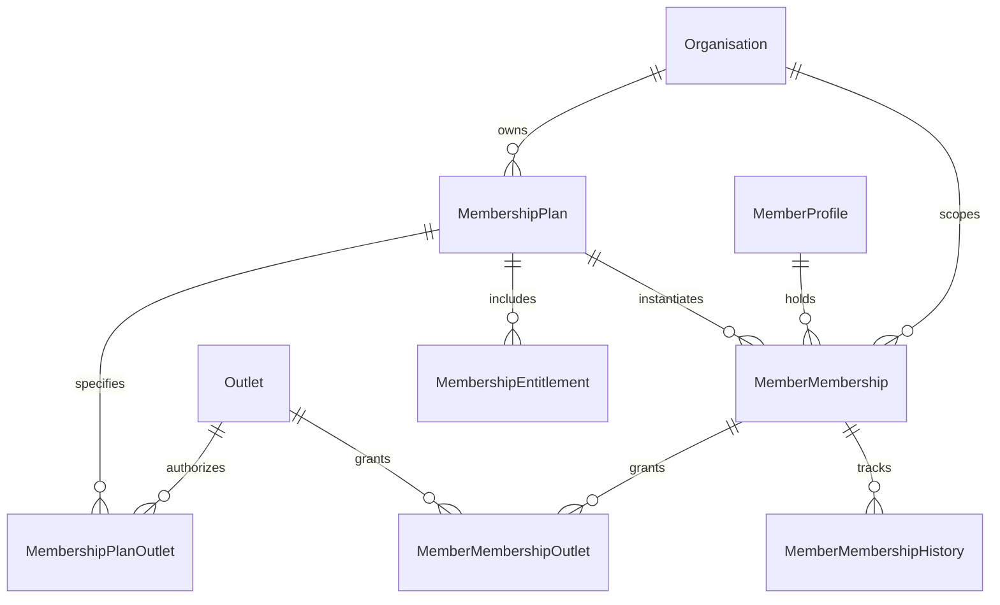

# FitCore Membership Database Documentation

## Overview

The FitCore Membership Domain establishes an auditable, multi-tenant database architecture in PostgreSQL, managed through Prisma ORM.



---

## 1. Locked Ownership Model

### A. Organisation Owns MembershipPlan
```text
Organisation (1) ─── owns ─── (N) MembershipPlan
```
- A `MembershipPlan` belongs exclusively to an `Organisation` (`MembershipPlan.organisationId`).
- A plan is never owned by an `Outlet`.
- `MembershipPlanOutlet` merely defines which facilities are permitted to offer or sell that plan.

### B. Organisation Scopes MemberMembership
```text
Organisation (1) ─── scopes ─── (N) MemberMembership (N) ─── assigned to ─── (1) MemberProfile
```
- `MemberMembership` is an organisation-scoped commercial agreement assigned to a member.
- Invariant: `MemberMembership.organisationId === MemberProfile.organisationId === MembershipPlan.organisationId`.
- Cross-tenant plan assignment is prevented at both database and service layers.

### C. MemberOutlet ≠ Membership Access
- `MemberOutlet` stores administrative affiliation and sociological club history (e.g. home gym, transfer history).
- `MemberMembership` via `accessScope` (`SINGLE_OUTLET`, `MULTI_OUTLET`, `ALL_ORGANISATION_OUTLETS`) and `MemberMembershipOutlet` strictly governs physical access control.

### D. Origin Outlet vs Ownership
- `originOutletId` on `MemberMembership` is an optional foreign key pointing to the outlet where the subscription was created or sold.
- **Informational Provenance Only**: It does NOT own the membership, does NOT restrict the member, and does NOT determine facility access.

---

## 2. Relational Schema & Models

### `membership_plans`
| Column | Type | Constraints | Description |
| :--- | :--- | :--- | :--- |
| `id` | `VARCHAR(30)` | PK, cuid | Unique plan identifier |
| `organisationId` | `VARCHAR(30)` | FK -> `organisations.id`, Cascade | Owning organisation |
| `name` | `VARCHAR(100)` | Not Null | Plan catalog display name |
| `description` | `TEXT` | Nullable | Marketing and contractual description |
| `code` | `VARCHAR(50)` | Not Null | Unique catalog code (e.g., `SW-PREM-M`) |
| `status` | `VARCHAR(20)` | Default `'ACTIVE'` | `'DRAFT'`, `'ACTIVE'`, `'PAUSED'`, `'ARCHIVED'` |
| `membershipType` | `VARCHAR(30)` | Default `'STANDARD'` | `'STANDARD'`, `'TRIAL'`, `'INTRODUCTORY'`, `'CORPORATE'`, `'STUDENT'`, `'FAMILY'`, `'CUSTOM'` |
| `billingType` | `VARCHAR(30)` | Default `'RECURRING'` | `'ONE_TIME'`, `'RECURRING'` |
| `durationValue` | `INTEGER` | Default `1` | Interval magnitude |
| `durationUnit` | `VARCHAR(20)` | Default `'MONTH'` | `'DAY'`, `'WEEK'`, `'MONTH'`, `'YEAR'` |
| `price` | `DOUBLE PRECISION`| Default `0` | Plan price |
| `currency` | `VARCHAR(3)` | Default `'AUD'` | Currency code |
| `trialDuration` | `INTEGER` | Nullable | Trial period in days |
| `isPublic` | `BOOLEAN` | Default `true` | Publicly browsable |
| `requiresApproval`| `BOOLEAN` | Default `false` | Requires staff approval |
| `createdAt` | `TIMESTAMPTZ` | Default `now()` | Inception timestamp |
| `updatedAt` | `TIMESTAMPTZ` | Updated at | Modification timestamp |
| `archivedAt` | `TIMESTAMPTZ` | Nullable | Soft-delete timestamp |

**Constraints & Indexes**:
- `@@unique([organisationId, code])`: Enforces unique plan codes per tenant.
- `@@index([organisationId])`, `@@index([status])`, `@@index([membershipType])`.

---

### `member_memberships`
| Column | Type | Constraints | Description |
| :--- | :--- | :--- | :--- |
| `id` | `VARCHAR(30)` | PK, cuid | Unique membership subscription ID |
| `organisationId` | `VARCHAR(30)` | FK -> `organisations.id`, Cascade | Tenant boundary |
| `memberProfileId` | `VARCHAR(30)` | FK -> `member_profiles.id`, Cascade | Subscribed member |
| `membershipPlanId` | `VARCHAR(30)` | FK -> `membership_plans.id`, Restrict | Source catalog template |
| `status` | `VARCHAR(20)` | Default `'PENDING'` | `'PENDING'`, `'ACTIVE'`, `'TRIAL'`, `'PAUSED'`, `'SUSPENDED'`, `'EXPIRED'`, `'CANCELLED'` |
| `accessScope` | `VARCHAR(30)` | Default `'SINGLE_OUTLET'` | `'SINGLE_OUTLET'`, `'MULTI_OUTLET'`, `'ALL_ORGANISATION_OUTLETS'` |
| `originOutletId` | `VARCHAR(30)` | FK -> `outlets.id`, SetNull | Sales origin (informational only) |
| `startDate` | `TIMESTAMPTZ` | Not Null | Coverage inception |
| `endDate` | `TIMESTAMPTZ` | Not Null | Coverage expiration |
| `activatedAt` | `TIMESTAMPTZ` | Nullable | Activation timestamp |
| `pausedAt` | `TIMESTAMPTZ` | Nullable | Pause timestamp |
| `suspendedAt` | `TIMESTAMPTZ` | Nullable | Administrative hold timestamp |
| `cancelledAt` | `TIMESTAMPTZ` | Nullable | Termination timestamp |
| `cancelledReason` | `TEXT` | Nullable | Reason for cancellation |
| `autoRenew` | `BOOLEAN` | Default `false` | Auto-renewal eligibility |
| `trialEndsAt` | `TIMESTAMPTZ` | Nullable | Trial termination date |
| `planNameAtPurchase` | `VARCHAR(100)` | Not Null | **Commercial Snapshot**: Frozen plan name |
| `priceAtPurchase` | `DOUBLE PRECISION`| Not Null | **Commercial Snapshot**: Frozen price |
| `currencyAtPurchase` | `VARCHAR(3)` | Not Null | **Commercial Snapshot**: Frozen currency |
| `billingTypeAtPurchase`| `VARCHAR(30)` | Not Null | **Commercial Snapshot**: Frozen billing type |
| `durationValueAtPurchase`| `INTEGER` | Not Null | **Commercial Snapshot**: Frozen duration value |
| `durationUnitAtPurchase` | `VARCHAR(20)` | Not Null | **Commercial Snapshot**: Frozen duration unit |

**Constraints & Indexes**:
- `@@index([organisationId])`, `@@index([memberProfileId])`, `@@index([membershipPlanId])`.
- `@@index([status])`, `@@index([startDate])`, `@@index([endDate])`.

---

### `member_membership_outlets`
Authoritative join table specifying which outlets a member can access under `SINGLE_OUTLET` and `MULTI_OUTLET` memberships.
- `@@unique([memberMembershipId, outletId])`
- `@@index([memberMembershipId])`, `@@index([outletId])`

---

### `member_membership_history`
Append-only state machine audit trail recording:
- `memberMembershipId`: Foreign key to subscription.
- `fromStatus`: Previous status.
- `toStatus`: New status.
- `action`: `'CREATE'`, `'ACTIVATE'`, `'PAUSE'`, `'RESUME'`, `'SUSPEND'`, `'CANCEL'`, `'RENEW'`, `'EXPIRE'`.
- `reason`: Justification text.
- `actorId`, `actorRole`: Identification of the user who executed the transition.
- `metadata`: Extensible JSON context.
- `createdAt`: Timestamp of transition.
