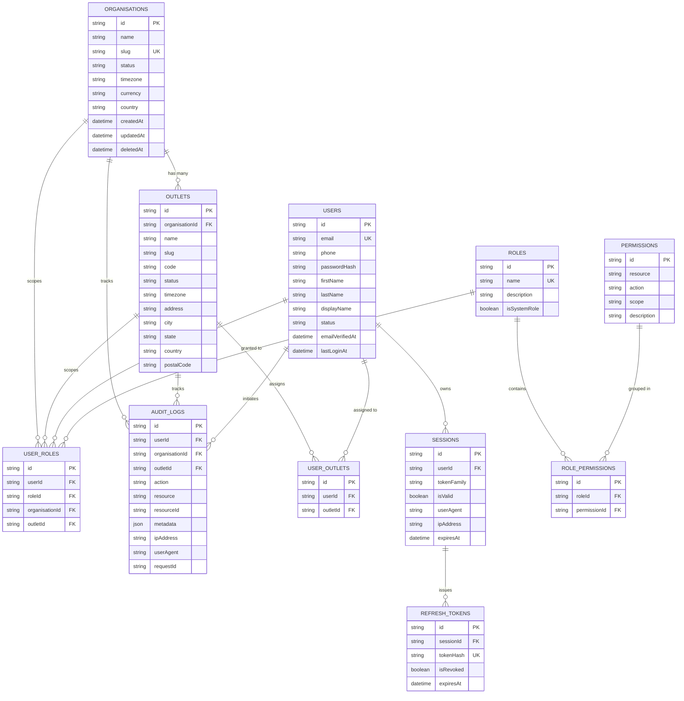

# FitCore Database Schema & ER Design

## Entity-Relationship Diagram

---

## Core Tables & Indexing Strategy

1. **`organisations`**:
   - Primary key: `id` (cuid).
   - Unique: `slug` (for subdomain / custom slug resolution).
   - Indexes: `[slug]`, `[status]` for fast lookup during tenant resolution.
2. **`outlets`**:
   - Composite unique constraints: `[organisationId, slug]`, `[organisationId, code]`.
   - Foreign key: `organisationId` references `organisations(id)` with cascade deletion.
   - Indexes: `[organisationId]`, `[status]` ensures queries like "find all active outlets for Org A" run in sub-millisecond time.
3. **`users`**:
   - Unique: `email` (case-insensitive indexed).
   - Indexes: `[email]`, `[phone]`, `[status]`.
4. **`roles` & `permissions`**:
   - System-defined roles: `SUPERADMIN`, `ORGANISATION_OWNER`, `OUTLET_MANAGER`, `RECEPTION`, `TRAINER`, `FINANCE`, `MEMBER`.
   - Permissions composite unique key: `[resource, action, scope]` ensures deterministic RBAC policies without duplicates.
5. **`user_roles`**:
   - Scopes role assignments to an `organisationId` and optionally an `outletId`.
   - Indexes: `[userId]`, `[organisationId]`, `[outletId]`.
6. **`sessions` & `refresh_tokens`**:
   - `sessions.tokenFamily`: Tracks rotated token generations for compromise detection.
   - `refresh_tokens.tokenHash`: SHA-256 hash indexed uniquely.
7. **`audit_logs`**:
   - Indexes: `[userId]`, `[organisationId]`, `[outletId]`, `[createdAt]`.
   - Read-heavy audit queries filter by tenant and time window efficiently.
