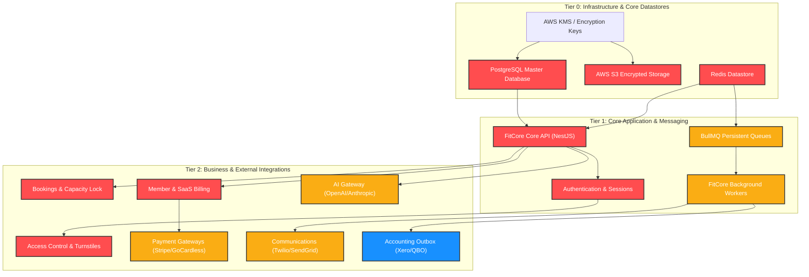

# Disaster Recovery Dependency Map

The following topological dependency tree defines recovery prerequisites and dependencies across the FitCore platform. Components must be restored in strict ascending tier order.



---

## Authoritative Recovery Order

```text
1. AWS KMS & Secret Decryption Keys
2. PostgreSQL Primary Database (Restore + Migration Verification)
3. Redis Primary Instance (AOF/RDB reload)
4. S3 Object Storage Access & IAM Roles
5. BullMQ Queues (Redis stream hydration)
6. NestJS Core API Instances
7. Background Worker Pool (Payment, Notification, Analytics consumers)
8. Public DNS & Ingress Routing
9. External Provider Gateways & Reconciliation Jobs
10. Observability Probes & Continuous Health Monitors
```
