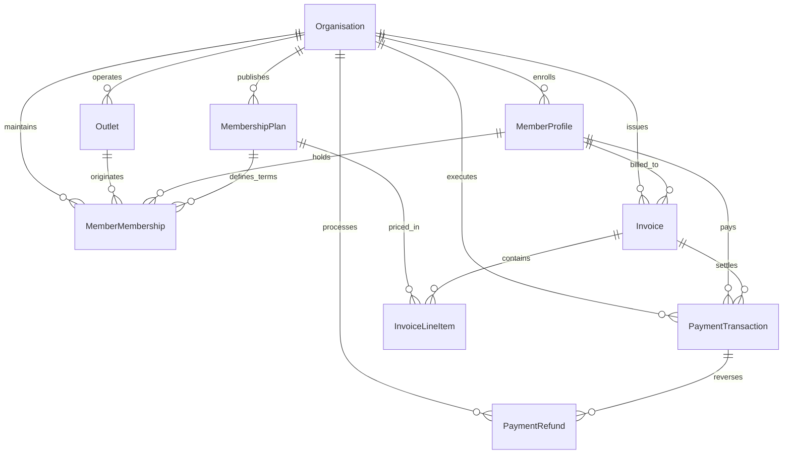

# Day 41 — Existing Financial Architecture & Implementation Mapping

## 1. Executive Summary

This document maps the authoritative financial and billing foundation established across **Day 5 (Memberships)** and **Day 6 (Payments & Invoicing)** to the read-oriented **Day 41 Financial Intelligence Foundation**.

The core invariant of Day 41 is:
$$\text{AUTHORITATIVE PAYMENT DATA} \longrightarrow \text{NORMALIZATION} \longrightarrow \text{METRICS} \longrightarrow \text{AGGREGATION} \longrightarrow \text{PERMISSIONS/FILTERS} \longrightarrow \text{INTELLIGENCE API}$$

Financial intelligence is strictly an observational, analytical, and audit layer. It **never** acts as a secondary transaction ledger, never creates a duplicate billing system, and never overrides authoritative source-of-truth records.

---

## 2. Existing Financial Entities (Days 5 & 6)

| Entity | Schema Table | Primary Responsibility | Key Fields |
| :--- | :--- | :--- | :--- |
| **PaymentCustomer** | `payment_customers` | Links a FitCore `MemberProfile` to an external payment processor identity (e.g., Stripe customer ID, Mock provider). | `id`, `organisationId`, `memberProfileId`, `provider`, `providerCustomerId`, `status`, `currency` |
| **PaymentMethod** | `payment_methods` | Stored tokenized payment method (Card, Bank Transfer, Cash, POS, Direct Debit). | `id`, `organisationId`, `memberProfileId`, `type`, `status`, `brand`, `last4`, `expiryMonth`, `expiryYear`, `isDefault` |
| **Invoice** | `invoices` | Commercial billing document issued to a member for memberships, personal training, or retail. | `id`, `organisationId`, `memberProfileId`, `memberMembershipId`, `invoiceNumber`, `status`, `currency`, `subtotalMinor`, `discountMinor`, `taxMinor`, `feeMinor`, `totalMinor`, `amountPaidMinor`, `amountDueMinor`, `dueDate`, `paidAt`, `voidedAt` |
| **InvoiceLineItem** | `invoice_line_items` | Individual line items comprising an invoice. | `id`, `invoiceId`, `description`, `quantity`, `unitAmountMinor`, `discountMinor`, `taxMinor`, `totalMinor`, `membershipPlanId`, `memberMembershipId` |
| **PaymentTransaction** | `payment_transactions` | Authoritative record of payment attempts and settlements. | `id`, `organisationId`, `memberProfileId`, `invoiceId`, `memberMembershipId`, `amountMinor`, `currency`, `status`, `paymentMethodType`, `provider`, `providerTransactionId`, `processedAt` |
| **PaymentRefund** | `payment_refunds` | Authoritative record of funds returned to a customer. | `id`, `organisationId`, `paymentTransactionId`, `amountMinor`, `currency`, `status`, `providerRefundId`, `reason`, `requestedById`, `processedAt` |
| **Discount** | `discounts` | Commercial coupons and promotional discounts. | `id`, `organisationId`, `code`, `type`, `valueMinor`, `percentage`, `active`, `usageLimit`, `usedCount` |
| **PaymentWebhookEvent** | `payment_webhook_events` | Inbound provider webhooks for idempotent event ingestion. | `id`, `provider`, `providerEventId`, `eventType`, `processingStatus`, `payload` |
| **IdempotencyRecord** | `idempotency_records` | Concurrency and duplicate-request protection for charges. | `id`, `organisationId`, `idempotencyKey`, `resourceType`, `statusCode`, `responseBody` |
| **MemberMembership** | `member_memberships` | Active or historical subscription linking a member to a membership plan and originating club outlet. | `id`, `organisationId`, `memberProfileId`, `membershipPlanId`, `originOutletId`, `status`, `priceAtPurchase`, `currencyAtPurchase`, `billingTypeAtPurchase` |
| **MembershipPlan** | `membership_plans` | Catalogue definition of membership pricing, billing frequency, and duration. | `id`, `organisationId`, `name`, `code`, `price`, `currency`, `billingType`, `status` |

---

## 3. Source of Truth for Each Financial Fact

| Financial Fact | Authoritative Source of Truth | Permitted Analytics Role | Prohibited Operations |
| :--- | :--- | :--- | :--- |
| **Cash Inflow / Collected Payment** | `PaymentTransaction` with `status: 'SUCCEEDED'` | Aggregate sum into `grossRevenueMinor` for designated period. | Never count `PENDING`, `FAILED`, or `CANCELLED` payments as revenue. |
| **Refunds Issued** | `PaymentRefund` with `status: 'SUCCEEDED'` | Deduct sum from gross revenue to calculate `netRevenueMinor`. | Never count failed or rejected refunds. |
| **Invoiced Receivables** | `Invoice` (`totalMinor`, `status`) | Aggregate invoices issued, paid, open, and overdue. | Never treat uncollected invoices as recognized cash revenue. |
| **Outstanding Balance** | `Invoice` where `status IN ('OPEN', 'OVERDUE', 'PARTIALLY_PAID')` | Sum `amountDueMinor` across non-void invoices. | Never count `VOID` invoices as outstanding debt. |
| **Membership Revenue** | `PaymentTransaction` linking to `memberMembershipId` OR `Invoice` with line items linking to `membershipPlanId` | Attribute recognized revenue to specific plans and subscriptions. | Never derive revenue by multiplying `MembershipPlan.price` by member count. |
| **Outlet Financial Attribution** | Explicit `outletId` on transaction reference OR derived via `memberMembership.originOutletId` | Attribute revenue and invoices to club outlets. | Never guess outlet from trainer assignment or attendance records. If unknown, output `UNATTRIBUTED`. |

---

## 4. Entity Relationships

---

## 5. Current Lifecycle States

### 5.1 Invoice Lifecycle (Day 6)
$$\text{DRAFT} \longrightarrow \text{OPEN} \longrightarrow \begin{cases} \text{PAID} & \text{(Settled fully)} \\ \text{PARTIALLY\_PAID} & \text{(Partial settlement)} \\ \text{OVERDUE} & \text{(Past due date)} \\ \text{VOID} & \text{(Cancelled / unbilled)} \\ \text{UNCOLLECTIBLE} & \text{(Written off)} \end{cases}$$

### 5.2 Payment Transaction Lifecycle (Day 6)
$$\text{PENDING} \longrightarrow \text{PROCESSING} \longrightarrow \begin{cases} \text{SUCCEEDED} & \longrightarrow \begin{cases} \text{PARTIALLY\_REFUNDED} \\ \text{REFUNDED} \\ \text{DISPUTED} \end{cases} \\ \text{FAILED} \\ \text{CANCELLED} \\ \text{REQUIRES\_ACTION} \end{cases}$$

### 5.3 Payment Refund Lifecycle (Day 6)
$$\text{PENDING} \longrightarrow \text{PROCESSING} \longrightarrow \begin{cases} \text{SUCCEEDED} \\ \text{FAILED} \\ \text{CANCELLED} \end{cases}$$

---

## 6. Existing APIs (Day 6)

* `POST /api/v1/invoices` — Generate invoice with line items, tax, and discount calculation.
* `GET /api/v1/invoices/:id` — Retrieve single invoice by ID.
* `POST /api/v1/payments/charge` — Execute payment charge against vaulted method or one-time token.
* `POST /api/v1/payments/manual` — Record offline cash/POS payment against an invoice.
* `POST /api/v1/payments/refunds` — Issue full or partial refund against a succeeded transaction.
* `POST /api/v1/payments/methods` — Attach vaulted payment method to customer.
* `GET /api/v1/payments/methods` — List vaulted payment methods for a member.

---

## 7. Gaps Identified Prior to Day 41

1. **No Financial Intelligence / Reporting API**: Operators could not query aggregate gross revenue, net revenue, or payment success rates.
2. **Missing Time-Series Aggregations**: No daily, weekly, or monthly bucketed revenue trends.
3. **No Multi-Currency Isolation**: No mechanism to view revenue partitioned by currency ($AUD, USD, NPR$).
4. **Indirect Outlet Attribution**: Invoices and payments do not store a direct `outletId`; outlet was accessible only by traversing `memberMembership.originOutletId`.
5. **No Reconciliation Tooling**: No automated validation comparing authoritative payment rows with analytical projections.
6. **No Data Quality Assessment**: No automated detection of missing outlet linkages, invalid amounts, or overdue invoice anomalies.
7. **No Sanitized CSV Export**: No export pipeline masking customer PII and generating audit trails for financial data.

---

## 8. Day 41 Additions

To close these gaps without compromising the source of truth, Day 41 introduces:
1. **`FinancialTransactionReference`**: Read-optimized projection mapping every transaction and refund to a standardized schema with explicit outlet attribution.
2. **`FinancialDailySummary`**: Materialized daily summaries per organisation, outlet, and currency.
3. **`FinancialMetricService`**: Canonical formulas with safe zero division ($0 \div 0 = \text{null}$).
4. **`FinancialAnalyticsService`**: High-performance database queries powering 12 dedicated endpoints.
5. **`FinancialReconciliationService`**: Discrepancy detector comparing source of truth against analytics projections.
6. **`FinancialDataQualityService`**: Continuous anomaly and completeness scorer.
7. **`FinancialContextService`**: Grounded structured financial context provider for Day 44 AI Assistant.
8. **`FinancialExportService`**: RFC 4180-compliant CSV export with PII masking and audit logs.
