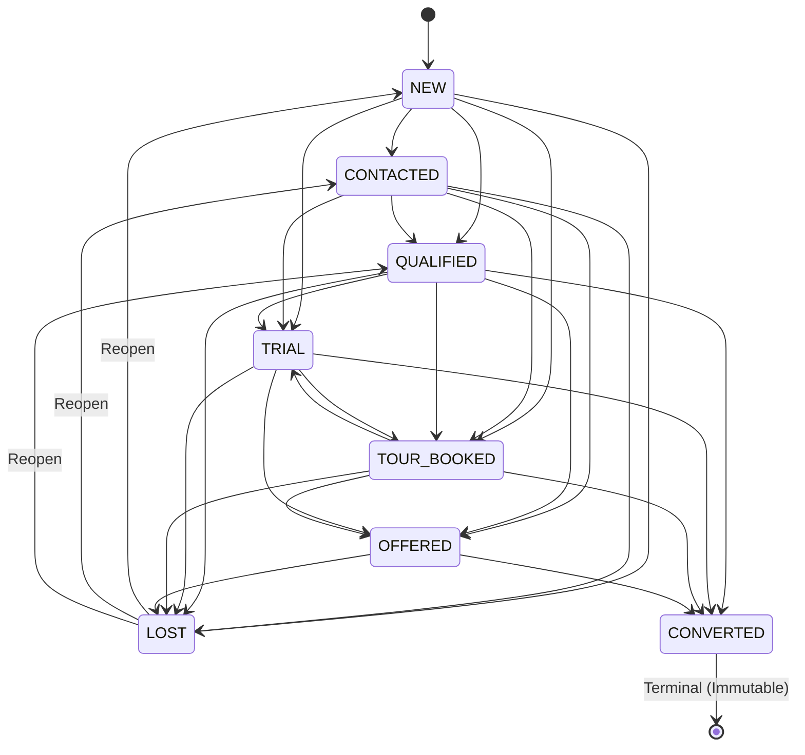

# Sales Pipeline Stage Model & State Machine

## 1. Canonical 8-Stage Definition

| Stage Type | Position | Display Name | Color | Default SLA | Terminal? | Description |
|---|---|---|---|---|---|---|
| `NEW` | 0 | New Lead | `#3B82F6` | 2 hours | No | Inbound inquiry captured; awaiting first touch. |
| `CONTACTED` | 1 | Contacted | `#8B5CF6` | 24 hours | No | Initial dialogue made via voice, WhatsApp, SMS, or chat. |
| `QUALIFIED` | 2 | Qualified | `#10B981` | 48 hours | No | Prospect goals, readiness, and schedule verified. |
| `TRIAL` | 3 | Trial Booked / Active | `#F59E0B` | 72 hours | No | Complimentary trial pass or class issued/completed. |
| `TOUR_BOOKED` | 4 | Tour Scheduled | `#EC4899` | 48 hours | No | In-facility walk-through or meeting scheduled. |
| `OFFERED` | 5 | Offer Extended | `#6366F1` | 48 hours | No | Formal proposal, agreement, or pricing option delivered. |
| `CONVERTED` | 6 | Converted Member | `#059669` | N/A | **Yes** | Active member joined; backed by verifiable domain proof. |
| `LOST` | 7 | Lost / Closed | `#EF4444` | N/A | **Yes** | Deal closed unsuccessfully with structured loss reason. |

---

## 2. Permitted State Machine Transitions

---

## 3. Loss Reasons Taxonomy
Transitions to `LOST` mandate a structured reason:
- `PRICE`: Membership or fee perceived as too high.
- `NO_RESPONSE`: Ghosted after repeated multi-channel attempts.
- `NOT_INTERESTED`: Expressed clear disinterest during consultation.
- `CHOSE_COMPETITOR`: Selected a rival club or fitness brand.
- `LOCATION`: Facility too distant from home or work.
- `SCHEDULE`: Class or gym opening hours do not match routine.
- `SERVICE_MISMATCH`: Seeking amenities not provided (e.g. pool, sauna, MMA).
- `TIMING`: Unready to commit now; future re-engagement.
- `FAILED_TRIAL`: Attended trial workout but had negative experience.
- `FAILED_TOUR`: Attended tour but declined to proceed.
- `COULD_NOT_CONTACT`: Invalid or disconnected telephone/email.
- `DUPLICATE`: Redundant duplicate inquiry.
- `INVALID_LEAD`: Prank, spam, or out-of-territory inquiry.
- `OTHER`: Exceptional rationale detailed in notes.
