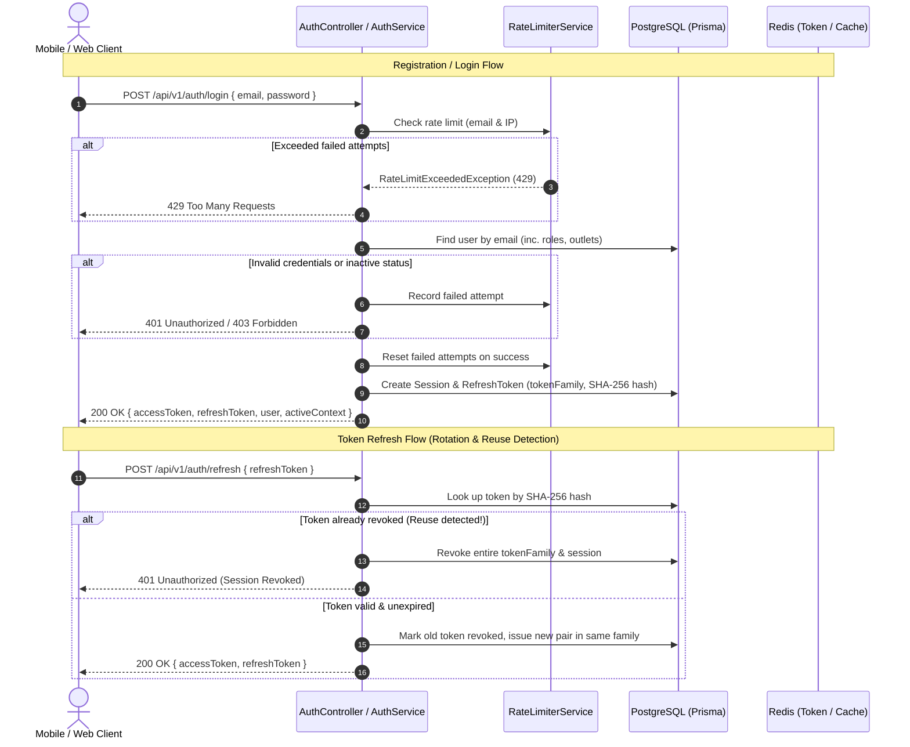

# FitCore Authentication & Session Architecture

## Overview

FitCore uses an enterprise-grade, zero-trust authentication architecture designed for multi-tenant isolation, cross-platform mobile and web clients, and high-security compliance.



---

## 1. Authentication Endpoints

All endpoints are versioned under `/api/v1/auth`.

| Method | Endpoint | Access | Description |
|---|---|---|---|
| `POST` | `/auth/register` | Public | Self-registration for members (assigns `MEMBER` role). |
| `POST` | `/auth/login` | Public | Authenticates credentials, checks status, returns tokens & context. |
| `POST` | `/auth/refresh` | Public | Rotates refresh token and issues new access token. |
| `POST` | `/auth/logout` | Authenticated | Revokes current session and refresh token. |
| `POST` | `/auth/logout-all` | Authenticated | Revokes all active sessions for the user across all devices. |
| `GET` | `/auth/me` | Authenticated | Returns authenticated user profile, roles, outlets, and effective permissions. |
| `POST` | `/auth/context` | Authenticated | Switches active tenant/outlet context for multi-role users. |
| `POST` | `/auth/invitations/accept` | Public | Accepts staff invitation token and activates user credentials. |

---

## 2. Token Architecture & Rotation

FitCore uses a dual-token strategy with cryptographically secure rotation:

### Access Token (JWT)
- **Algorithm**: HMAC-SHA256 (`HS256`).
- **Expiry**: 15 minutes (`ACCESS_TOKEN_TTL=900s`).
- **Payload**:
  ```json
  {
    "sub": "user_cuid",
    "email": "owner@secondwind.com.au",
    "status": "ACTIVE",
    "activeContext": {
      "organisationId": "org_secondwind",
      "outletId": "outlet_perth_cbd"
    },
    "iat": 1741300000,
    "exp": 1741300900
  }
  ```

### Refresh Token (Opaque + SHA-256 Storage)
- **Entropy**: Cryptographically secure 64-byte hex string (`crypto.randomBytes(32).toString('hex')`).
- **Expiry**: 7 days (`REFRESH_TOKEN_TTL=604800s`).
- **Storage**: Raw refresh tokens are **never** stored in the database. The database stores `tokenHash = SHA256(rawToken)`.
- **Token Family & Reuse Detection**:
  - Each login creates a new `tokenFamily` UUID.
  - When a refresh token is exchanged, it is marked `isRevoked = true`, and a new child token is generated within the same family.
  - If a revoked token is presented again (indicating token theft or replay attack), the system automatically revokes **all** tokens in the family and terminates the session.

---

## 3. Session Management & Multi-Device Control

Each login generates a row in the `sessions` table:
- `id`: Unique session identifier.
- `userId`: Reference to the user.
- `tokenFamily`: Links all rotated refresh tokens to this session.
- `isValid`: Active state flag.
- `userAgent`: Client User-Agent string.
- `ipAddress`: Originating client IP.
- `lastUsedAt`: Timestamp updated on each refresh or authenticated activity.
- `expiresAt`: Absolute expiration of the session.

### Revocation Options
- **Single Logout (`POST /auth/logout`)**: Invalidates the current session and marks active refresh tokens as revoked.
- **Global Logout (`POST /auth/logout-all`)**: Sets `isValid = false` on all sessions for `userId`, immediately locking out all other devices.

---

## 4. Brute-Force & Rate Limiting Protection

Login endpoints are shielded by `RateLimiterService`:
- **Storage**: Redis-backed with automatic in-memory fallback if Redis is unreachable.
- **Failed Attempt Tracking**:
  - Key format: `ratelimit:login:fail:<email>` and `ratelimit:login:fail:<ip>`.
  - Maximum failed attempts: **5 attempts** per 15-minute window.
  - Exceeding the threshold returns `429 Too Many Requests`.
- **Reset**: Successful authentication immediately clears the failed attempt counter.

---

## 5. Account Lifecycle & Status Gates

User accounts contain a `status` field:
- `ACTIVE`: Normal access permitted.
- `SUSPENDED`: Access blocked with `403 Forbidden` (`User account is suspended`).
- `DISABLED`: Access blocked with `403 Forbidden` (`User account is disabled`).
- `INVITED`: User has been invited but has not yet accepted; login blocked until invitation is accepted.

---

## 6. Staff Invitation Flow

Staff members (Owners, Managers, Trainers, Reception, Finance) are onboarded via the Invitation system:
1. An administrator calls `POST /organisations/:orgId/invitations` specifying `email`, `role`, and optional `outletId`.
2. A cryptographically random invitation token is generated.
3. The database stores `tokenHash = SHA256(token)` with an expiration of **7 days**.
4. The user receives the raw invitation token (via email or onboarding link).
5. The user calls `POST /auth/invitations/accept` with `{ token, password, firstName, lastName }`.
6. The user is created/activated, assigned the specified role and tenant context, and the invitation status is set to `ACCEPTED`.
