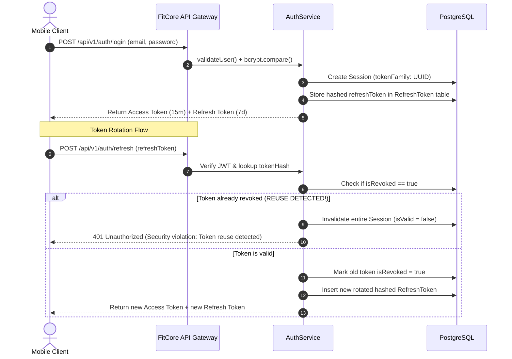

# FitCore Backend Security Architecture

## Authentication & Token Architecture

FitCore implements a stateless access token and stateful refresh token architecture designed according to OAuth 2.0 Security Best Current Practice (BCP / RFC 6819).

---

## 1. Refresh Token Rotation & Compromise Detection

- **Short-Lived Access Tokens**: Signed with `JWT_SECRET`, expiring in 15 minutes.
- **Single-Use Refresh Tokens**: Each refresh token is strictly valid for a single exchange.
- **Family Invalidation on Reuse**:
  - When a client presents a refresh token that has already been consumed (`isRevoked: true`), the server infers that the token was intercepted by a malicious third party.
  - The server immediately invalidates the entire `Session` (`isValid: false`) and rejects all subsequent requests from that session family, protecting the legitimate user from token theft.

---

## 2. Structured Logging & PII Redaction

To maintain compliance with privacy regulations (Australian Privacy Principles / GDPR / HIPAA) and prevent credential leakage:

- **Automatic Field Sanitization**: The `StructuredLogger` intercepts all log messages and recursively redacts sensitive fields:
  - `password`, `passwordHash`
  - `token`, `refreshToken`, `accessToken`
  - `authorization` headers
  - `creditCard`, `cardNumber`, `cvv`
  - Sensitive member biometric/health records
- **Output Format**: All logs are emitted as single-line structured JSON records containing `timestamp`, `level`, `context`, `message`, and sanitized metadata.

---

## 3. Role-Based Access Control (RBAC) Matrix

| Role | Target Scope | Key Allowed Operations |
| :--- | :--- | :--- |
| **SUPERADMIN** | Platform (Global) | Manage all organisations, platform configs, global audits |
| **ORGANISATION_OWNER** | Organisation-wide | Manage all club outlets, view consolidated reports & audits |
| **OUTLET_MANAGER** | Assigned Outlet | Manage branch staff, branch attendance, operational schedules |
| **RECEPTION** | Assigned Outlet | Member check-in, turnstile access, desk inquiries |
| **TRAINER** | Assigned Clients | Client workout tracking, program assignment, appointment logs |
| **FINANCE** | Organisation-wide | View billing, invoices, revenue streams, Xero sync |
| **MEMBER** | Self | View personal profile, personal workout logs, book sessions |
