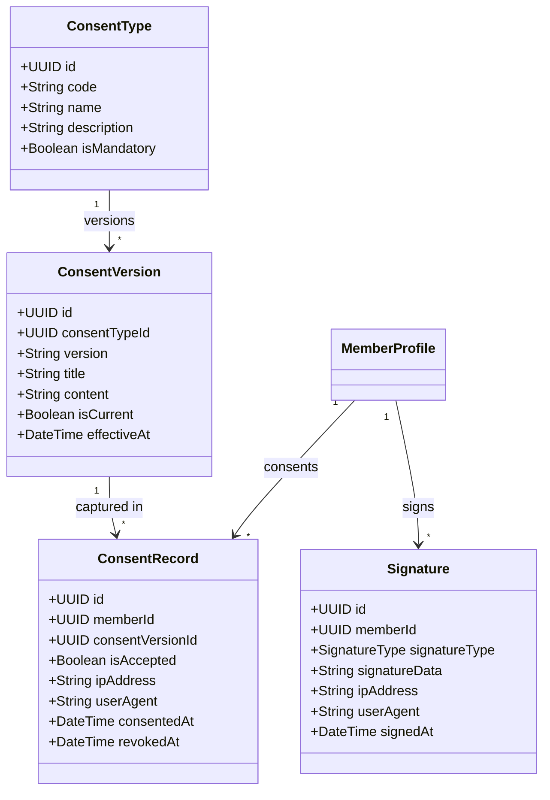

# FitCore Consent Management & Legal Audit Architecture

## Overview

FitCore implements a legally robust, versioned consent architecture that captures explicit, informed consent across privacy, terms of service, biometric/health data processing, wearable integrations, and AI fitness recommendations.

---

## 1. Consent Types

FitCore defines 5 standard consent types:

| Code | Type Name | Mandatory | Scope & Legal Requirement |
|---|---|---|---|
| `TERMS_AND_CONDITIONS` | Club Terms & Conditions | **Yes** | Facility access terms, code of conduct, membership rules |
| `PRIVACY_POLICY` | Privacy Policy | **Yes** | Personal data collection, storage, and processing disclosure |
| `HEALTH_DATA_PROCESSING` | Health Data Consent | **Yes** | Explicit consent for sensitive health, PAR-Q, and injury storage |
| `WEARABLE_INTEGRATIONS` | Wearable Device Sync | No | Permission to query Apple HealthKit, Google Fit, Garmin data |
| `AI_COACHING_RECOMMENDATIONS` | AI Fitness & Nutrition | No | Consent for algorithmic workout and diet tailoring |

---

## 2. Versioning & Immutability

1. **Active Version Designation**: Only one `ConsentVersion` per `ConsentType` can have `isCurrent = true` at any given time.
2. **Re-Consent Triggers**: When a gym updates legal terms or policies, a new version is published (`isCurrent = true`, previous version set to `isCurrent = false`). Upon subsequent login or app launch, the member's profile reflects missing consent for the new version, prompting required re-affirmation.
3. **Immutable History**: Consent records are strictly immutable. Once accepted, records cannot be deleted. If consent is withdrawn for an optional type, a revocation timestamp (`revokedAt = now()`) and `isAccepted = false` are recorded to preserve audit integrity.

---

## 3. Cryptographic Signature Capture & Audit Evidence

Every digital signature captures:
- **`signatureData`**: Vector path data or base64 rasterized image of the member's physical touch stroke.
- **`ipAddress`**: Captured at the API gateway from client network headers.
- **`userAgent`**: Mobile operating system, device model, or browser identity.
- **`signedAt`**: High-precision UTC timestamp.
- **`documentHash`**: SHA-256 digest of the agreed agreement terms at the precise moment of execution.

This audit trail ensures non-repudiation in the event of insurance claims, contract disputes, or compliance audits.
