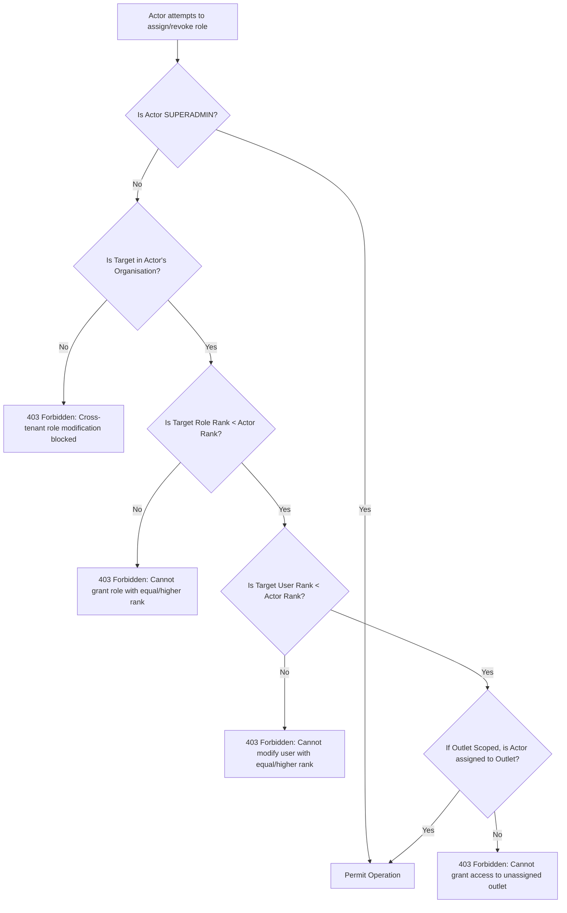

# FitCore Role-Based Access Control (RBAC) & Permissions

## Overview

FitCore implements a multi-tenant, hierarchical Role-Based Access Control (RBAC) system with granular permission scoping. Access is evaluated by combining the user's role hierarchy, assigned tenant/outlet scopes, and resource-action-scope permission rules.

---

## 1. Role Hierarchy & Weight System

Roles carry strict numerical weights that dictate authority levels and enforce privilege escalation boundaries:

| Role | Weight | Primary Scope | Capabilities |
|---|---|---|---|
| `SUPERADMIN` | 100 | `PLATFORM` (Global) | Unrestricted platform-wide access, cross-tenant management, system role configuration. |
| `ORGANISATION_OWNER` | 80 | `ORGANISATION` | Full tenant administration, outlet creation, staff invitation, role assignment within organization. |
| `OUTLET_MANAGER` | 60 | `OUTLET` | Management of assigned outlets, staff scheduling, local user management. |
| `FINANCE` | 50 | `ORGANISATION` / `OUTLET` | Financial reports, invoices, payment audits, membership subscriptions. |
| `RECEPTION` | 40 | `OUTLET` | Front-desk check-in, member assistance, booking management at assigned outlets. |
| `TRAINER` | 40 | `OUTLET` | Class schedules, client training programs, assigned member consultations. |
| `MEMBER` | 10 | `OWN` / `OUTLET` | Personal profile management, class booking, workout tracking, membership review. |

---

## 2. Granular Permissions Model

Every permission in FitCore is defined by a triplet: `(resource, action, scope)`.

### Resources
- `organisations`: Tenant organizations.
- `outlets`: Gym branches / facilities.
- `users`: User accounts and member profiles.
- `roles`: Role definitions and user-role bindings.
- `invitations`: Staff onboarding invitations.
- `audit_logs`: Security and operational audit trails.

### Actions
- `create`, `read`, `update`, `delete`, `manage`, `invite`, `assign`.

### Scopes
- `global`: Applicable across all organizations (restricted to `SUPERADMIN`).
- `organisation`: Applicable to all entities within the actor's tenant organization.
- `outlet`: Applicable only to entities within the actor's explicitly assigned outlet(s).
- `own`: Applicable only to the authenticated user's own records.

---

## 3. Permission Matrix

| Role | Resource | Permitted Actions | Scopes |
|---|---|---|---|
| **SUPERADMIN** | `organisations` | `create`, `read`, `update`, `delete`, `manage` | `global` |
| | `outlets` | `create`, `read`, `update`, `delete`, `manage` | `global` |
| | `users` | `create`, `read`, `update`, `delete`, `manage` | `global` |
| | `roles` | `create`, `read`, `update`, `delete`, `manage`, `assign` | `global` |
| | `invitations` | `create`, `read`, `delete` | `global` |
| | `audit_logs` | `read` | `global` |
| **ORGANISATION_OWNER** | `organisations` | `read`, `update` | `organisation` |
| | `outlets` | `create`, `read`, `update`, `delete` | `organisation` |
| | `users` | `read`, `update` | `organisation` |
| | `roles` | `read`, `assign` | `organisation` |
| | `invitations` | `create`, `read`, `delete` | `organisation` |
| | `audit_logs` | `read` | `organisation` |
| **OUTLET_MANAGER** | `organisations` | `read` | `organisation` |
| | `outlets` | `read`, `update` | `outlet` |
| | `users` | `read`, `update` | `outlet` |
| | `roles` | `read`, `assign` (≤ OUTLET_MANAGER) | `outlet` |
| | `invitations` | `create`, `read` | `outlet` |
| | `audit_logs` | `read` | `outlet` |
| **TRAINER / RECEPTION** | `organisations` | `read` | `organisation` |
| | `outlets` | `read` | `outlet` |
| | `users` | `read` | `outlet` |
| **MEMBER** | `users` | `read`, `update` | `own` |
| | `outlets` | `read` | `outlet` |

---

## 4. Privilege Escalation Protection

FitCore enforces rigorous anti-escalation validation in `PermissionsService.validateRoleAssignment()`:

### Key Security Guarantees
1. **Self-Promotion Blocked**: A user cannot assign themselves or any peer a role of equal or higher weight. For example, an `ORGANISATION_OWNER` (rank 80) cannot grant `SUPERADMIN` (rank 100), and an `OUTLET_MANAGER` (rank 60) cannot grant `ORGANISATION_OWNER` or `OUTLET_MANAGER`.
2. **Cross-Tenant Guarding**: An administrator of Tenant A cannot view, assign, or revoke roles for users belonging to Tenant B.
3. **Outlet Boundary Scoping**: Outlet Managers can only assign roles (`TRAINER`, `RECEPTION`, `MEMBER`) strictly within their assigned outlet IDs.
4. **Owner Protection**: Non-superadmin users cannot revoke or alter the roles of an `ORGANISATION_OWNER`.
